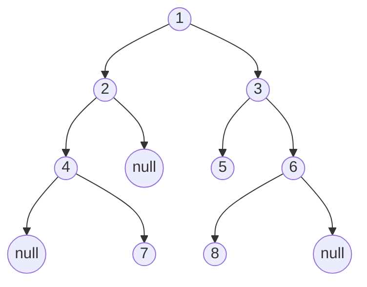

### 算法做题家

#### 笔试前戏

##### 审题逻辑

```。
1.思考普适规律，尤其是返回值为单一值时，要思考数学公式
2.思考递归，递归要从递推公式（n和n+1的关系）出发，即从宏观推出公式，从不可再分的情况推出递推出口。
3.动态规划基于递推公式，循环过程中用dp记录和更新前n项的计算结果。「自顶向下的递归」改为「自底向上的递推」。直接从小问题到大问题。
```

##### 常见名词解释

###### 等差数列

```
通项公式 an=a1+(n−1)*d
前n项和 Sn=n*(a1+an)/2=n*a1+n(n−1)*d/2
```

###### 等比数列

```
通项公式 an=a1*q^(n−1)
前n项和 Sn=a1*(1−q^n)/(1−q)=(a1−an*q)/(1−q)  (q≠1)
```

###### 逆序对

```
设 A 为一个有 n 个数字的有序集 (n>1)，其中所有数字各不相同。如果存在正整数 i, j 使得 1 ≤ i < j ≤ n 而且 A[i] > A[j]，则 <A[i], A[j]> 这个有序对称为 A 的一个逆序对，也称作逆序数。
通俗讲就是前面的比后面的值大就是逆序对
```

###### 哈夫曼树

```
步骤1.从最小的两个权值开始搭建树
该数作为新权值与剩下的权值重复步骤1
直到所有权值都在树中，哈夫曼树构建完毕

权值就是频率
节点访问路径可为表示为 左0右1 访问路径即编码
```

##### 时间复杂度

[时间复杂度参考](https://www.baidu.com/link?url=t_ys635eA86uvZM_Q5MQvtPWkU7hwaIL4PdsT9WFEqLQR5W3SiprejCzlB5MBj03PEyTJLIdgjV9pp0Rp7EQTDq8MBKp1H7oIhPU2FZfPDG&ck=779.5.63.425.146.428.299.286&shh=www.baidu.com&sht=98010089_dg&wd=&eqid=dffc78250002655a000000065f1f9faf)

```
基本操作函数T(n)
渐进时间复杂度，简称时间复杂度。可通过T(n)推导出时间复杂度。渐进时间复杂度用大写O来表示，所以也被称为大O表示法。
转换规则：
如果运行时间是常数量级，用常数1表示；
只保留时间函数中的最高阶项；
如果最高阶项存在，则省去最高阶项前面的系数。
```

|   分类   |          T(n)          |                        流程                         |     时间复杂度     |
| :------: | :--------------------: | :-------------------------------------------------: | :----------------: |
| 线性时间 |        T(n)=3n         |    最高阶项为3n，省去系数3，转化的时间复杂度为：    |  T（n） = O（n）   |
| 对数时间 |     T（n） = 5logn     |  最高阶项为5logn，省去系数5，转化的时间复杂度为：   | T（n） = O（logn） |
| 常数时间 |       T（n） = 2       |         只有常数量级，转化的时间复杂度为：          |  T（n） = O（1）   |
| 指数时间 | T（n） = 0.5n^2 + 0.5n | 最高阶项为0.5n^2，省去系数0.5，转化的时间复杂度为： | T（n） = O（n^2）  |

#### 剑指offer题Java

##### 1.二维数组中的查找

> 在一个二维数组中（每个一维数组的长度相同），每一行都按照从左到右递增的顺序排序，每一列都按照从上到下递增的顺序排序。请完成一个函数，输入这样的一个二维数组和一个整数，判断数组中是否含有该整数。

```java
public boolean Find(int target, int [][] array) {
    //可从左下角开始找
    int row = array.length-1;//行
    int column = 0;//列
	//当行数大于0，当前列数小于总列数时循环条件成立
	while((row >= 0)&& (column< array[0].length)){
		if(array[row][column] > target){
			row--;
		}else if(array[row][column] < target){
			column++;
		}else{
			return true;
		}
	}
	return false;
}
```

##### 2.替换空格

> 请实现一个函数，将一个字符串中的每个空格替换成“%20”。例如，当字符串为We Are Happy.则经过替换之后的字符串为We%20Are%20Happy。

```java
public String replaceSpace(StringBuffer str) {
	StringBuffer out=new StringBuffer();
	for (int i = 0; i < str.toString().length(); i++) {
		char b=str.charAt(i);
		if(String.valueOf(b).equals(" ")){
			out.append("%20");
		}else{
			out.append(b);
		}
	}
	return out.toString();     
}

public String replaceSpace(StringBuffer str) {
    //return str.toString().replaceAll(" ", "%20");
    //public String replaceAll(String regex,String replacement)
    //正则表达式
    return str.toString().replaceAll("\\s", "%20");
}
```

##### 3.从尾到头打印链表

> 输入一个链表，按链表从尾到头的顺序返回一个ArrayList。

```java
对于递归来说，参数和返回类型是同一个的话可以递归
//递归的方式要逆序打印链表 1->2->3（3,2,1)，可以先逆序打印链表 2->3(3,2)，最后再打印第一个节点 1。而链表 2->3 可以看成一个新的链表，要逆序打印该链表可以继续使用求解函数，也就是在求解函数中调用自己
public ArrayList<Integer> printListFromTailToHead(ListNode listNode) {
    ArrayList<Integer> ret = new ArrayList<>();
    if (listNode != null) {
        ret.addAll(printListFromTailToHead(listNode.next));//分治
        //递归完成后再自底而上将节点添加到ret里
        ret.add(listNode.val);
    }
    return ret;
}
//头插法
//栈stack
```

##### 4.重建二叉树

>输入某二叉树的前序遍历和中序遍历的结果，请重建出该二叉树。假设输入的前序遍历和中序遍历的结果中都不含重复的数字。例如输入前序遍历序列{1,2,4,7,3,5,6,8}和中序遍历序列{4,7,2,1,5,3,8,6}，则重建二叉树并返回。

###### 1.树



###### 取巧版本(不建议记忆)

```
操作数租下标
public class Solution {
    public TreeNode reConstructBinaryTree(int [] pre,int [] in) {
        TreeNode root=reConstructBinaryTree(pre,0,pre.length-1,in,0,in.length-1);
        return root;
    }
    //前序遍历{1,2,4,7,3,5,6,8}和中序遍历序列{4,7,2,1,5,3,8,6}
    private TreeNode reConstructBinaryTree(int [] pre,int startPre,int endPre,int [] in,int startIn,int endIn) {    
        if(startPre>endPre||startIn>endIn)
            return null;
        TreeNode root=new TreeNode(pre[startPre]);         
        for(int i=startIn;i<=endIn;i++)
            if(in[i]==pre[startPre]){
                root.left=reConstructBinaryTree(pre,startPre+1,startPre+(i-startIn)  ,  in,startIn,i-1);
                //两个迭代分支，之间的参数没关系
                root.right=reConstructBinaryTree(pre,(i-startIn)+startPre+1,endPre   ,  in,i+1,endIn);
                break;
            }              
        return root;
    }
}
```

###### 逻辑易懂版本

```java
前序遍历的第一个为根节点的值，以此分开中序遍历
import java.util.Arrays;
public class Solution {
	public TreeNode reConstructBinaryTree(int [] pre,int [] in) {
		//数组长度为0的时候要处理
    if(pre.length == 0){
     	return null;
    }
	int rootVal = pre[0];//每次迭代的根节点的值
	//pre[]长度仅为1的时候直接返回该节点
	if(pre.length == 1){
		return new TreeNode(rootVal);
	}
	//我们先找到root所在的位置，确定好前序和中序中左子树和右子树序列的范围
    TreeNode root = new TreeNode(rootVal);
    int rootIndex = 0;
    for(int i=0;i<in.length;i++){
        if(rootVal == in[i]){
            rootIndex = i;
            break;
        }
    }
    //递归，假设root的左右子树都已经构建完毕，那么只要将左右子树赋值到root左右即可
    //对于in[]来说root节点左边就是左子树，右边是右子树
    //这里注意Arrays.copyOfRange(int[],start,end)是[)的区间
    //假设总共三个节点{123}，先序遍历为{123}，中序遍历为{213}则前一个参数为{23}后一个参数为{21}以root节点作为界限，
	root.left = reConstructBinaryTree(Arrays.copyOfRange(pre,1,rootIndex+1),
				Arrays.copyOfRange(in,0,rootIndex));
    //假设总共三个节点{123}，先序遍历为{123}，中序遍历为{213}则前一个参数为{3}后一个参数为{13}以root节点作为界限，    
	root.right = reConstructBinaryTree(Arrays.copyOfRange(pre,rootIndex+1,pre.length),
			 	 Arrays.copyOfRange(in,rootIndex+1,in.length));
	return root;
	}
}
```

##### 5.双栈实现队列

> 用两个栈来实现一个队列，完成队列的Push和Pop操作。 队列中的元素为int类型。

```java
//数据存栈一里，一pop就全pop到栈二里
import java.util.Stack;
public class Solution {
    Stack<Integer> stack1 = new Stack<Integer>();
    Stack<Integer> stack2 = new Stack<Integer>();  
    public void push(int node) {
    stack1.push(node);
}
public int pop(){
    if (stack2.isEmpty())
        while (!stack1.isEmpty())
            stack2.push(stack1.pop());
    return stack2.pop();
    }
}
```

##### 6.旋转数组的最小数

>`二分查找法`
>
>把一个数组最开始的若干个元素搬到数组的末尾，我们称之为数组的旋转。
>输入一个非递减排序的数组的一个旋转，输出旋转数组的最小元素。
>例如数组{3,4,5,1,2}为{1,2,3,4,5}的一个旋转，该数组的最小值为1。
>NOTE：给出的所有元素都大于0，若数组大小为0，请返回0。

```java
public int minNumberInRotateArray(int[] nums) {
    if (nums.length == 0)
        return 0;
    int l = 0, h = nums.length - 1;
    while (l < h) {
        //m为下标为中间的值
        int m = l + (h - l) / 2;
        //极端情况为除最小数外所有的数都相等
        if (nums[l] == nums[m] && nums[m] == nums[h])
            return minNumber(nums, l, h);
        //满足此条件则前半段为排序的，否则为后半段
        else if (nums[m] <= nums[h])
            h = m;
        else
            l = m + 1;
    }
    return nums[l];
}
//顺序查找的方法
private int minNumber(int[] nums, int l, int h) {
    for (int i = l; i < h; i++)
        if (nums[i] > nums[i + 1])
            return nums[i + 1];
    return nums[l];
}
```

##### 7.斐波那契数列

>`递归`-->`动态规划`解决递归带来的空间复杂度高的问题
>
>大家都知道斐波那契数列，现在要求输入一个整数n，请你输出斐波那契数列的第n项（从0开始，第0项为0，第1项是1）。n<=39

```java
public class Solution {
    //不适用递归，将每次计算量存在数组里
    private int[] fib = new int[40];
    public Solution() {
        fib[1] = 1;
        for (int i = 2; i < fib.length; i++)
            fib[i] = fib[i - 1] + fib[i - 2];
    }
    public int Fibonacci(int n) {
        return fib[n];
    }
}
```

##### 8.跳台阶

> `递归之前应该先求递归公式`
>
> 一只青蛙一次可以跳上1级台阶，也可以跳上2级。求该青蛙跳上一个n级的台阶总共有多少种跳法（先后次序不同算不同的结果）。

```java
/*
跳 n 阶台阶，可以先跳 1 阶台阶，再跳 n-1 阶台阶；或者先跳 2 阶台阶，再跳 n-2 阶台阶。而 n-1 和 n-2 阶台阶的跳法可以看成子问题
*/
public int JumpFloor(int n) {
    if (n <= 2)
        return n;
    int pre2 = 1, pre1 = 2;
    int result = 0;
    for (int i = 2; i < n; i++) {
        result = pre2 + pre1;
        pre2 = pre1;
        pre1 = result;//等价于把之前的加起来循环以后再做一次 result = pre2 + pre1;
    }
    return result;
}
```

##### 9.跳台阶变种

> 一只青蛙一次可以跳上1级台阶，也可以跳上2级……它也可以跳上n级。求该青蛙跳上一个n级的台阶总共有多少种跳法。

```java
//动态规划版本
public int JumpFloorII(int target) {
    int[] dp = new int[target];
    Arrays.fill(dp, 1);
    for (int i = 1; i < target; i++)
        for (int j = 0; j < i; j++)
            dp[i] += dp[j];
    return dp[target - 1];
}
/*
数学归纳法
跳上 n-1 级台阶，可以从 n-2 级跳 1 级上去，也可以从 n-3 级跳 2 级上去...，那么
f(n-1) = f(n-2) + f(n-3) + ... + f(0)
同样，跳上 n 级台阶，可以从 n-1 级跳 1 级上去，也可以从 n-2 级跳 2 级上去... ，那么
f(n) = f(n-1) + f(n-2) + ... + f(0)
综上可得
f(n) - f(n-1) = f(n-1) 即f(n) = 2*f(n-1)
所以 f(n) 是一个等比数列
*/
public int JumpFloorII(int target) {
    return (int) Math.pow(2, target - 1);
}

```

##### 10.矩形覆盖

>`递归`我们可以用2乘1的小矩形横着或者竖着去覆盖更大的矩形。请问用n个2乘1的小矩形无重叠地覆盖一个2乘n的大矩形，总共有多少种方法？比如n=3时，2乘3的矩形块有3种覆盖方法

```java
当 n 为 1 时，只有一种覆盖方法
当 n 为 2 时，有两种覆盖方法
要覆盖 2*n 的大矩形，可以先覆盖 2*1 的矩形，再覆盖 2*(n-1) 的矩形；或者先覆盖 2*2 的矩形，再覆盖 2*(n-2) 的矩形。而覆盖 2*(n-1) 和 2*(n-2) 的矩形可以看成子问题。可得递归公式
public int RectCover(int n) {
    if (n <= 2)
        return n;
    int pre2 = 1, pre1 = 2;
    int result = 0;
    for (int i = 3; i <= n; i++) {
        result = pre2 + pre1;
        pre2 = pre1;
        pre1 = result;
    }
    return result;
}
```

##### 11.二进制中1的个数

> 输入一个整数，输出该数32位二进制表示中1的个数。其中负数用补码表示。

```java
方法一:用n&(n-1)可以将最低的1置为0
n       : 10110100
n-1     : 10110011
n&(n-1) : 10110000
public int NumberOf1(int n) {
    int cnt = 0;
    while (n != 0) {
        cnt++;
        n &= (n - 1);
    }
    return cnt;
}
方法二:Integer.bitCount()
public int NumberOf1(int n) {
    return Integer.bitCount(n);
}
```

##### 12.数值的整数次方

>`递归`给定一个double类型的浮点数base和int类型的整数exponent。求base的exponent次方。保证base和exponent不同时为0

```java
每次递归都要使exponent变为他的一半
public double Power(double base, int exponent) {
    if (exponent == 0)
        return 1;
    if (exponent == 1)
        return base;
    boolean isNegative = false;
    if (exponent < 0) {
        exponent = -exponent;
        isNegative = true;
    }
    double pow = Power(base * base, exponent / 2);//int值会四舍五入，所以n是奇数则/2变偶数
    if (exponent % 2 != 0)
        pow = pow * base;
    return isNegative ? (1 / pow) : pow;//由于返回值是pow所以会阻塞返回
}
```

##### 13.调整数组顺序使奇数位于偶数前面

> `冒泡` `数组遍历`输入一个整数数组，实现一个函数来调整该数组中数字的顺序，使得所有的奇数位于数组的前半部分，所有的偶数位于数组的后半部分，并保证奇数和奇数，偶数和偶数之间的相对位置不变。

```java
方法一：创建一个新数组，以奇数的个数为下标将新数组分为两段再遍历旧数组按条件放入新数组，时间复杂度 O(N)，空间复杂度 O(N)。
public void reOrderArray(int[] nums) {
    // 奇数个数
    int oddCnt = 0;
    for (int x : nums)
        if (!isEven(x))
            oddCnt++;
    int[] copy = nums.clone();
    int i = 0, j = oddCnt;
    for (int num : copy) {
        if (num % 2 == 1)
            nums[i++] = num;
        else
            nums[j++] = num;
    }
}
private boolean isEven(int x) {
    return x % 2 == 0;
}
方法二：使用冒泡思想，每次都进行一次冒泡，冒泡过程中只是交换相邻奇偶数的位置。时间复杂度 O(N2)，空间复杂度 O(1)，时间换空间。
public void reOrderArray(int[] nums) {
    int N = nums.length;
    for (int i = N - 1; i > 0; i--) {
        //每轮冒泡
        for (int j = 0; j < i; j++) {
            if (isEven(nums[j]) && !isEven(nums[j + 1])) {
                swap(nums, j, j + 1);
            }
        }
    }
}
private boolean isEven(int x) {
    return x % 2 == 0;
}
private void swap(int[] nums, int i, int j) {
    int t = nums[i];
    nums[i] = nums[j];
    nums[j] = t;
}
```

##### 14.链表中倒数第k个节点

>输入一个链表，输出该链表中倒数第k个结点。

```java
利用指针移动的时间差为k得到位置。设链表的长度为 N。设置两个指针 P1 和 P2，先让 P1 移动 K 个节点，则还有 N - K 个节点可以移动。此时让 P1 和 P2 同时移动，可以知道当 P1 移动到链表结尾时，P2 移动到第 N - K 个节点处，该位置就是倒数第 K 个节点。
public ListNode FindKthToTail(ListNode head, int k) {
    if (head == null)
        return null;//长度为0
    ListNode P1 = head;
    while (P1 != null && k-- > 0)
        P1 = P1.next;
    if (k > 0)
        return null;//长度短与k
    ListNode P2 = head;
    while (P1 != null) {//直到p1到达终点
        P1 = P1.next;
        P2 = P2.next;
    }
    return P2;
}
```

##### 15.反转链表

> 输入一个链表，反转链表后，输出新链表的表头。

```java
递归，相当于通过线程栈对链表进行了一次逆序，把节点分到每个线程里
public ListNode ReverseList(ListNode head) {
    if (head == null || head.next == null)
        return head;//直到最后一个返回他自己
    ListNode next = head.next;
    head.next = null;//删除当前头结点释放空间
    ListNode newHead = ReverseList(next);//分治，先解决后面的倒序问题
    next.next = head;
    return newHead;
}
头插法
public ListNode ReverseList(ListNode head) {
    ListNode newList = new ListNode(-1);//方便操作而创建
    while (head != null) {
        ListNode next = head.next;
        head.next = newList.next;
        newList.next = head;
        head = next;
    }
    return newList.next;//返回辅助节点指向的节点
}
```

##### 16.合并两个排序的链表

> 输入两个单调递增的链表，输出两个链表合成后的链表，当然我们需要合成后的链表满足单调不减规则。

```java
//递归，总是寻找规律，分配任务给线程然后从最后一个线程开始到第一个线程
public ListNode Merge(ListNode list1, ListNode list2) {
    if (list1 == null)
        return list2;
    if (list2 == null)
        return list1;
    if (list1.val <= list2.val) {
        list1.next = Merge(list1.next, list2);
        return list1;
    } else {
        list2.next = Merge(list1, list2.next);
        return list2;
    }
}
//迭代
public ListNode Merge(ListNode list1, ListNode list2) {
    ListNode head = new ListNode(-1);
    ListNode cur = head;
    while (list1 != null && list2 != null) {
        if (list1.val <= list2.val) {
            cur.next = list1;
            list1 = list1.next;
        } else {
            cur.next = list2;
            list2 = list2.next;
        }
        cur = cur.next;
    }
    if (list1 != null)
        cur.next = list1;
    if (list2 != null)
        cur.next = list2;
    return head.next;
}
```

##### 17.判断树的子结构

> 输入两棵二叉树A，B，判断B是不是A的子结构。（ps：我们约定空树不是任意一个树的子结构）

```
//递归
public boolean HasSubtree(TreeNode root1, TreeNode root2) {
    if (root1 == null || root2 == null)
        return false;
    return isSubtreeWithRoot(root1, root2) 
    	|| HasSubtree(root1.left, root2) 
    	|| HasSubtree(root1.right, root2);//同一根节点||左子树||右子树
}

private boolean isSubtreeWithRoot(TreeNode root1, TreeNode root2) {
    if (root2 == null)
        return true;
    if (root1 == null)
        return false;
    if (root1.val != root2.val)
        return false;
    return isSubtreeWithRoot(root1.left, root2.left) && isSubtreeWithRoot(root1.right, root2.right);
}
```

##### 18.二叉树的镜像

> `迭代`操作给定的二叉树，将其变换为源二叉树的镜像。
>
> ```
> 二叉树的镜像定义：源二叉树 
>  	    8
>  	   /  \
>  	  6   10
>  	 / \  / \
>  	5  7 9 11
>  	镜像二叉树
>  	    8
>  	   /  \
>  	  10   6
>  	 / \  / \
>  	11 9 7  5
> ```

```java
public void Mirror(TreeNode root) {
    if (root == null)
        return;//不需要转换
    swap(root);//交换当前根节点的左右节点
    Mirror(root.left);
    Mirror(root.right);
}

private void swap(TreeNode root) {
    TreeNode t = root.left;
    root.left = root.right;
    root.right = t;
}
```

##### 19.顺时针打印矩阵

> 输入一个矩阵，按照从外向里以顺时针的顺序依次打印出每一个数字，例如，如果输入如下4 X 4矩阵： 1 2 3 4 5 6 7 8 9 10 11 12 13 14 15 16 则依次打印出数字1,2,3,4,8,12,16,15,14,13,9,5,6,7,11,10.

```
public ArrayList<Integer> printMatrix(int[][] matrix) {
    ArrayList<Integer> ret = new ArrayList<>();
    int r1 = 0, r2 = matrix.length - 1, c1 = 0, c2 = matrix[0].length - 1;
    while (r1 <= r2 && c1 <= c2) {
        for (int i = c1; i <= c2; i++)
            ret.add(matrix[r1][i]);
        for (int i = r1 + 1; i <= r2; i++)
            ret.add(matrix[i][c2]);
        if (r1 != r2)
            for (int i = c2 - 1; i >= c1; i--)
                ret.add(matrix[r2][i]);
        if (c1 != c2)
            for (int i = r2 - 1; i > r1; i--)
                ret.add(matrix[i][c1]);
        r1++; r2--; c1++; c2--;
    }
    return ret;
}
```

##### 20.包含min函数的栈

> 定义栈的数据结构，请在该类型中实现一个能够得到栈中所含最小元素的min函数（时间复杂度应为O（1））。

```
private Stack<Integer> dataStack = new Stack<>();
private Stack<Integer> minStack = new Stack<>();

public void push(int node) {
    dataStack.push(node);
    //每次push都会更新minStack里的值
    minStack.push(minStack.isEmpty() ? node : Math.min(minStack.peek(), node));
}
public void pop() {
    dataStack.pop();
    minStack.pop();
}
public int top() {
    return dataStack.peek();
}
public int min() {
    return minStack.peek();
}
```

##### 21.栈的压入弹出序列

> 输入两个整数序列，第一个序列表示栈的压入顺序，请判断第二个序列是否可能为该栈的弹出顺序。假设压入栈的所有数字均不相等。例如序列1,2,3,4,5是某栈的压入顺序，序列4,5,3,2,1是该压栈序列对应的一个弹出序列，但4,3,5,1,2就不可能是该压栈序列的弹出序列。（注意：这两个序列的长度是相等的）

```
//通过模拟栈的操作
public boolean IsPopOrder(int[] pushSequence, int[] popSequence) {
    int n = pushSequence.length;
    Stack<Integer> stack = new Stack<>();
    for (int pushIndex = 0, popIndex = 0; pushIndex < n; pushIndex++) {
        stack.push(pushSequence[pushIndex]);
        while (popIndex < n && !stack.isEmpty() 
                && stack.peek() == popSequence[popIndex]) {
            stack.pop();
            popIndex++;
        }
    }
    return stack.isEmpty();
}
```

##### 22.从上往下打印二叉树

> `层序遍历`从上往下打印出二叉树的每个节点，同层节点从左至右打印。

```
public ArrayList<Integer> PrintFromTopToBottom(TreeNode root) {
    Queue<TreeNode> queue = new LinkedList<>();//同于遍历的队列
    ArrayList<Integer> ret = new ArrayList<>();//存储遍历结果
    queue.add(root);
    while (!queue.isEmpty()) {
        int cnt = queue.size();
        //下面的循环结束后会将下层节点加入到队列中后面，而上层节点在上层节点之前出队。保证了次序
        while (cnt-- > 0) {
            TreeNode t = queue.poll();
            if (t == null)
                continue;
            ret.add(t.val);
            queue.add(t.left);
            queue.add(t.right);
        }
    }
    return ret;
}
```

##### 23.二叉搜索树的后续遍历序列

> 输入一个整数数组，判断该数组是不是某二叉搜索树的后序遍历的结果。如果是则输出Yes,否则输出No。假设输入的数组的任意两个数字都互不相同。

```java
public boolean VerifySquenceOfBST(int[] sequence) {
    if (sequence == null || sequence.length == 0)
        return false;
    return verify(sequence, 0, sequence.length - 1);
}
//利用规律进行递归判断
private boolean verify(int[] sequence, int first, int last) {
    if (last - first <= 1)
        return true;
    int rootVal = sequence[last];
    int cutIndex = first;
    while (cutIndex < last && sequence[cutIndex] <= rootVal)
        cutIndex++;
    for (int i = cutIndex; i < last; i++)
        if (sequence[i] < rootVal)
            return false;
    return verify(sequence, first, cutIndex - 1) && verify(sequence, cutIndex, last - 1);
}
```

##### 24.二叉树中和为某一值的路径

> 输入一颗二叉树的根节点和一个整数，按字典序打印出二叉树中结点值的和为输入整数的所有路径。路径定义为从树的根结点开始往下一直到叶结点所经过的结点形成一条路径。

```java
//全局变量，存储所有的路径
private ArrayList<ArrayList<Integer>> ret = new ArrayList<>();

public ArrayList<ArrayList<Integer>> FindPath(TreeNode root, int target) {
    backtracking(root, target, new ArrayList<>());
    return ret;
}

private void backtracking(TreeNode node, int target, ArrayList<Integer> path) {
    if (node == null)
        return;
    path.add(node.val);
    target -= node.val;
    if (target == 0 && node.left == null && node.right == null) {
        ret.add(new ArrayList<>(path));//满足条件才会将路径保存到ret
    } else {
        backtracking(node.left, target, path);
        backtracking(node.right, target, path);
    }
    path.remove(path.size() - 1);//删除最后一个值为null的节点
}
```

##### 25.复杂链表的复制

> 输入一个复杂链表（每个节点中有节点值，以及两个指针，一个指向下一个节点，另一个特殊指针random指向一个随机节点），请对此链表进行深拷贝，并返回拷贝后的头结点。（注意，输出结果中请不要返回参数中的节点引用，否则判题程序会直接返回空）

```java
//链表元素
public class RandomListNode {
    int label;
    RandomListNode next = null;
    RandomListNode random = null;

    RandomListNode(int label) {
        this.label = label;
    }
}
//思路第一步，在每个节点的后面插入复制的节点。第二步，对复制节点的 random 链接进行赋值。第三步，拆分。
public RandomListNode Clone(RandomListNode pHead) {
    if (pHead == null)
        return null;
    // 插入新节点
    RandomListNode cur = pHead;
    while (cur != null) {
        //插入新节点
        RandomListNode clone = new RandomListNode(cur.label);
        clone.next = cur.next;
        cur.next = clone;
        //下一个节点来复制
        cur = clone.next;
    }
    // 建立 random 链接
    cur = pHead;
    while (cur != null) {
        RandomListNode clone = cur.next;
        if (cur.random != null)
            clone.random = cur.random.next;
        cur = clone.next;
    }
    // 拆分，指向间隔1个
    cur = pHead;
    RandomListNode pCloneHead = pHead.next;
    while (cur.next != null) {
        RandomListNode next = cur.next;
        cur.next = next.next;
        cur = next;
    }
    return pCloneHead;
}
```

##### 26.二叉搜索树与双向链表

> 输入一棵二叉搜索树，将该二叉搜索树转换成一个排序的双向链表。要求不能创建任何新的结点，只能调整树中结点指针的指向。

```
//全局变量
private TreeNode pre = null;
private TreeNode head = null;

public TreeNode Convert(TreeNode root) {
    inOrder(root);
    return head;
}

private void inOrder(TreeNode node) {
    if (node == null)
        return;
    inOrder(node.left);
    node.left = pre;
    if (pre != null)
        pre.right = node;
    pre = node;
    if (head == null)
        head = node;
    inOrder(node.right);
}
```

##### 27.字符串的排列

> 输入一个字符串,按字典序打印出该字符串中字符的所有排列。例如输入字符串abc,则按字典序打印出由字符a,b,c所能排列出来的所有字符串abc,acb,bac,bca,cab和cba。

```java
private ArrayList<String> ret = new ArrayList<>();

public ArrayList<String> Permutation(String str) {
    if (str.length() == 0)
        return ret;
    char[] chars = str.toCharArray();
    Arrays.sort(chars);
    backtracking(chars, new boolean[chars.length], new StringBuilder());
    return ret;
}

private void backtracking(char[] chars, boolean[] hasUsed, StringBuilder s) {
    if (s.length() == chars.length) {
        ret.add(s.toString());
        return;
    }
    for (int i = 0; i < chars.length; i++) {
        if (hasUsed[i])
            continue;
        if (i != 0 && chars[i] == chars[i - 1] && !hasUsed[i - 1]) /* 保证不重复 */
            continue;
        hasUsed[i] = true;
        s.append(chars[i]);
        backtracking(chars, hasUsed, s);
        s.deleteCharAt(s.length() - 1);
        hasUsed[i] = false;
    }
}
```

##### 28.数组中出现次数超过一半的数字

> `多数投票问题`数组中有一个数字出现的次数超过数组长度的一半，请找出这个数字。例如输入一个长度为9的数组{1,2,3,2,2,2,5,4,2}。由于数字2在数组中出现了5次，超过数组长度的一半，因此输出2。如果不存在则输出0。

```java
/*
多数投票问题，可以利用 Boyer-Moore Majority Vote Algorithm 来解决这个问题，使得时间复杂度为 O(N)。
使用 cnt 来统计一个元素出现的次数，当遍历到的元素和统计元素相等时，令 cnt++，否则令 cnt--。如果前面查找了 i 个元素，且 cnt == 0，说明前 i 个元素没有 majority，或者有 majority，但是出现的次数少于 i / 2 ，因为如果多于 i / 2 的话 cnt 就一定不会为 0 。此时剩下的 n - i 个元素中，majority 的数目依然多于 (n - i) / 2，因此继续查找就能找出 majority。
*/
public int MoreThanHalfNum_Solution(int[] nums) {
    int majority = nums[0];
    for (int i = 1, cnt = 1; i < nums.length; i++) {
        cnt = (nums[i] == majority) ? (cnt + 1) : (cnt - 1);
        if (cnt == 0) {
            majority = nums[i];
            cnt = 1;
        }
    }
    //找到最多的数字，然后看是否超过一半
    int cnt = 0;
    for (int val : nums)
        if (val == majority)
            cnt++;
    return cnt > nums.length / 2 ? majority : 0;
}
```

##### 29.最小的k个数

> 输入n个整数，找出其中最小的K个数。例如输入4,5,1,6,2,7,3,8这8个数字，则最小的4个数字是1,2,3,4。

```java
public ArrayList<Integer> GetLeastNumbers_Solution(int[] nums, int k) {
    if (k > nums.length || k <= 0)
        return new ArrayList<>();
    PriorityQueue<Integer> maxHeap = new PriorityQueue<>((o1, o2) -> o2 - o1);
    for (int num : nums) {
        maxHeap.add(num);
        if (maxHeap.size() > k)
            maxHeap.poll();//由于PriorityQueue是排序的，所以队列最后一个是最大的
    }
    return new ArrayList<>(maxHeap);
}
```

##### 30.连续子数组的最大和

> HZ偶尔会拿些专业问题来忽悠那些非计算机专业的同学。今天测试组开完会后,他又发话了:在古老的一维模式识别中,常常需要计算连续子向量的最大和,当向量全为正数的时候,问题很好解决。但是,如果向量中包含负数,是否应该包含某个负数,并期望旁边的正数会弥补它呢？例如:{6,-3,-2,7,-15,1,2,2},连续子向量的最大和为8(从第0个开始,到第3个为止)。给一个数组，返回它的最大连续子序列的和，你会不会被他忽悠住？(子向量的长度至少是1)

```java
public int FindGreatestSumOfSubArray(int[] nums) {
    if (nums == null || nums.length == 0)
        return 0;
    int greatestSum = Integer.MIN_VALUE;
    int sum = 0;
    for (int val : nums) {
        sum = (sum <= 0) ? val : (sum + val);//规律为当有一个数使得之前的和小于0，则从该数开始重新加
        greatestSum = Math.max(greatestSum, sum);
    }
    return greatestSum;
}
```

##### 31.整数中1出现的次数，无视位数

>求出1到13的整数中1出现的次数,并算出100到1300的整数中1出现的次数？为此他特别数了一下1~13中包含1的数字有1、10、11、12、13因此共出现6次,但是对于后面问题他就没辙了。ACMer希望你们帮帮他,并把问题更加普遍化,可以很快的求出任意非负整数区间中1出现的次数（从1 到 n 中1出现的次数）。

```java
//看不懂规律可以背下来
public int NumberOf1Between1AndN_Solution(int n) {
    int cnt = 0;
    for (int m = 1; m <= n; m *= 10) {
        int a = n / m, b = n % m;
        cnt += (a + 8) / 10 * m + (a % 10 == 1 ? b + 1 : 0);
    }
    return cnt;
}
```

##### 32.把数组排成一个最小的数

> 输入一个正整数数组，把数组里所有数字拼接起来排成一个数，打印能拼接出的所有数字中最小的一个。例如输入数组{3，32，321}，则打印出这三个数字能排成的最小数字为321323。

```java
/*
可以看成是一个排序问题，在比较两个字符串 S1 和 S2 的大小时，应该比较的是 S1+S2 和 S2+S1 的大小，如果 S1+S2 < S2+S1，那么应该把 S1 排在前面，否则应该把 S2 排在前面。
*/
public String PrintMinNumber(int[] numbers) {
    if (numbers == null || numbers.length == 0)
        return "";
    int n = numbers.length;
    String[] nums = new String[n];
    for (int i = 0; i < n; i++)
        nums[i] = numbers[i] + "";//可以避免使用stringbuffer而添加的""
    Arrays.sort(nums, (s1, s2) -> (s1 + s2).compareTo(s2 + s1));
    String ret = "";
    for (String str : nums)
        ret += str;
    return ret;
}
```

##### 33.找丑数

> `枚举` `动态规划`把只包含质因子2、3和5的数称作丑数（Ugly Number）。例如6、8都是丑数，但14不是，因为它包含质因子7。 习惯上我们把1当做是第一个丑数。求按从小到大的顺序的第N个丑数。

```java
public int GetUglyNumber_Solution(int N) {
    if (N <= 6)
        return N;
    int i2 = 0, i3 = 0, i5 = 0;
    int[] dp = new int[N];
    dp[0] = 1;
    for (int i = 1; i < N; i++) {
        int next2 = dp[i2] * 2, next3 = dp[i3] * 3, next5 = dp[i5] * 5;
        dp[i] = Math.min(next2, Math.min(next3, next5));
        //动态更新分别是235的倍数，每次循环都向丑数逼近
        if (dp[i] == next2)
            i2++;
        if (dp[i] == next3)
            i3++;
        if (dp[i] == next5)
            i5++;
    }
    return dp[N - 1];
}
```

##### 34.第一个只出现一次的数

> 在一个字符串(0<=字符串长度<=10000，全部由字母组成)中找到第一个只出现一次的字符,并返回它的位置, 如果没有则返回 -1（需要区分大小写）.（从0开始计数）

```java
public int FirstNotRepeatingChar(String str) {
    int[] cnts = new int[256];//字符可存为int类型
    for (int i = 0; i < str.length(); i++)
        cnts[str.charAt(i)]++;//该字符的个数+1
    for (int i = 0; i < str.length(); i++)
        if (cnts[str.charAt(i)] == 1)
            return i;
    return -1;
}
```

##### 35.数组中的逆序对

> 在数组中的两个数字，如果前面一个数字大于后面的数字，则这两个数字组成一个逆序对。输入一个数组,求出这个数组中的逆序对的总数P。并将P对1000000007取模的结果输出。 即输出P%1000000007

```java
private long cnt = 0;
private int[] tmp;  // 在这里声明辅助数组，而不是在 merge() 递归函数中声明

public int InversePairs(int[] nums) {
    tmp = new int[nums.length];
    mergeSort(nums, 0, nums.length - 1);
    return (int) (cnt % 1000000007);
}

private void mergeSort(int[] nums, int l, int h) {
    if (h - l < 1)
        return;
    int m = l + (h - l) / 2;
    mergeSort(nums, l, m);
    mergeSort(nums, m + 1, h);
    merge(nums, l, m, h);
}

private void merge(int[] nums, int l, int m, int h) {
    int i = l, j = m + 1, k = l;
    while (i <= m || j <= h) {
        if (i > m)
            tmp[k] = nums[j++];
        else if (j > h)
            tmp[k] = nums[i++];
        else if (nums[i] <= nums[j])
            tmp[k] = nums[i++];
        else {
            tmp[k] = nums[j++];
            this.cnt += m - i + 1;  // nums[i] > nums[j]，说明 nums[i...mid] 都大于 nums[j]
        }
        k++;
    }
    for (k = l; k <= h; k++)
        nums[k] = tmp[k];
}
```

##### 36.两个链表的公共节点

> 输入两个链表，找出它们的第一个公共结点。（注意因为传入数据是链表，所以错误测试数据的提示是用其他方式显示的，保证传入数据是正确的）

```java
//当访问链表 A 的指针访问到链表尾部时，令它从链表 B 的头部重新开始访问链表 B；同样地，当访问链表 B 的指针访问到链表尾部时，令它从链表 A 的头部重新开始访问链表 A。这样就能控制访问 A 和 B 两个链表的指针能同时访问到交点。
//A:4-->5-->3-->2-->1 
//B:    6-->3-->2-->1
A连B 453216321
B连A 632145321
public ListNode FindFirstCommonNode(ListNode pHead1, ListNode pHead2) {
    ListNode l1 = pHead1, l2 = pHead2;
    while (l1 != l2) {
        l1 = (l1 == null) ? pHead2 : l1.next;
        l2 = (l2 == null) ? pHead1 : l2.next;
    }
    return l1;
}
```

##### 37.数字在排序数组中出现的次数

> 统计一个数字在排序数组中出现的次数。

```java
public int GetNumberOfK(int[] nums, int K) {
    //找到连续区间的下标
    int first = binarySearch(nums, K);
    int last = binarySearch(nums, K + 1);
    //找不到k或者没有连续的
    return (first == nums.length || nums[first] != K) ? 0 : last - first;
}

//二分查找
private int binarySearch(int[] nums, int K) {
    int l = 0, h = nums.length;
    while (l < h) {
        int m = l + (h - l) / 2;
        if (nums[m] >= K)
            h = m;
        else
            l = m + 1;//找不到的话，l到最后会变成数组的长度
    }
    return l;
}
//写不出来就遍历统计
```

##### 38.二叉树的深度

>`递归`输入一棵二叉树，求该树的深度。从根结点到叶结点依次经过的结点（含根、叶结点）形成树的一条路径，最长路径的长度为树的深度。

```java
public int TreeDepth(TreeNode root) {
    return (root == null) ? 0 : 1 + Math.max(TreeDepth(root.left), TreeDepth(root.right));
}
```

##### 39.平衡二叉树

>`递归`输入一棵二叉树，判断该二叉树是否是平衡二叉树。在这里，我们只需要考虑其平衡性，不需要考虑其是不是排序二叉树

```
//全局变量
private boolean isBalanced = true;

public boolean IsBalanced_Solution(TreeNode root) {
    height(root);
    return isBalanced;
}

private int height(TreeNode root) {
    if (root == null || !isBalanced)
        return 0;
    int left = height(root.left);
    int right = height(root.right);
    if (Math.abs(left - right) > 1)//取绝对值，integer.min_value即-2147483648不会处理
        isBalanced = false;
    return 1 + Math.max(left, right);//将自己这层也加入
}
```

##### 40.数组中只出现一次的数字

>两个不相等的元素在位级表示上必定会有一位存在不同，将数组的所有元素异或得到的结果为不存在重复的两个元素异或的结果。diff &= -diff 得到出 diff 最右侧不为 0 的位，也就是不存在重复的两个元素在位级表示上最右侧不同的那一位，利用这一位就可以将两个元素区分开来。

```
public void FindNumsAppearOnce(int[] nums, int num1[], int num2[]) {
    int diff = 0;
    for (int num : nums)
        diff=diff^num;//将所有的数异或，两个相同的数异或会抵消等效于0
    diff = diff&(-diff);//diff的取值为最右侧不为0的位的int值
    for (int num : nums) {
        if ((num & diff) == 0)
            num1[0] ^= num;
        else
            num2[0] ^= num;
    }
}
建议背
```

##### 41.和为S的连续正数序列

> 小明很喜欢数学,有一天他在做数学作业时,要求计算出9~16的和,他马上就写出了正确答案是100。但是他并不满足于此,他在想究竟有多少种连续的正数序列的和为100(至少包括两个数)。没多久,他就得到另一组连续正数和为100的序列:18,19,20,21,22。现在把问题交给你,你能不能也很快的找出所有和为S的连续正数序列? Good Luck!

```
输出所有和为S的连续正数序列。序列内按照从小至大的顺序，序列间按照开始数字从小到大的顺序
public ArrayList<ArrayList<Integer>> FindContinuousSequence(int sum) {
    ArrayList<ArrayList<Integer>> ret = new ArrayList<>();
    int start = 1, end = 2;
    int curSum = 3;
    while (end < sum) {//小于S的范围内通过右移两端使和一直逼近S
        if (curSum > sum) {
            curSum -= start;//换起点
            start++;
        } else if (curSum < sum) {
            end++;
            curSum += end;//换终点
        } else {//相等的时候添加序列
            ArrayList<Integer> list = new ArrayList<>();
            for (int i = start; i <= end; i++)
                list.add(i);
            ret.add(list);
            //继续得到更多的序列
            curSum -= start;
            start++;
            end++;
            curSum += end;
        }
    }
    return ret;
}
```

##### 42.和为S的两个数字

>输入一个递增排序的数组和一个数字S，在数组中查找两个数，使得他们的和正好是S，如果有多对数字的和等于S，输出两个数的乘积最小的。输出描述:
>
>```
>对应每个测试案例，输出两个数，小的先输出。
>```

```java
使用双指针，一个指针指向元素较小的值，一个指针指向元素较大的值。指向较小元素的指针从头向尾遍历，指向较大元素的指针从尾向头遍历。
如果两个指针指向元素的和 sum == target，那么得到要求的结果；
如果 sum > target，移动较大的元素，使 sum 变小一些；
如果 sum < target，移动较小的元素，使 sum 变大一些。
public ArrayList<Integer> FindNumbersWithSum(int[] array, int sum) {
    int i = 0, j = array.length - 1;
    while (i < j) {
        int cur = array[i] + array[j];
        if (cur == sum)
            return new ArrayList<>(Arrays.asList(array[i], array[j]));
        if (cur < sum)
            i++;
        else
            j--;
    }
    return new ArrayList<>();
}
```

##### 43.左旋转字符串

> 汇编语言中有一种移位指令叫做循环左移（ROL），现在有个简单的任务，就是用字符串模拟这个指令的运算结果。对于一个给定的字符序列S，请你把其循环左移K位后的序列输出。例如，字符序列S=”abcXYZdef”,要求输出循环左移3位后的结果，即“XYZdefabc”。是不是很简单？OK，搞定它！

```java
abcXYZdef n=3 先将 "abc" 和 "XYZdef" 分别翻转，得到 "cbafedZYX"，然后再把整个字符串翻转得到 "XYZdefabc"。
public String LeftRotateString(String str, int n) {
    if (n >= str.length())
        return str;
    char[] chars = str.toCharArray();
    reverse(chars, 0, n - 1);
    reverse(chars, n, chars.length - 1);
    reverse(chars, 0, chars.length - 1);
    return new String(chars);
}

private void reverse(char[] chars, int i, int j) {
    while (i < j)
        swap(chars, i++, j--);
}
//两端反转位置
private void swap(char[] chars, int i, int j) {
    char t = chars[i];
    chars[i] = chars[j];
    chars[j] = t;
}
```

##### 44.翻转单词顺序列

> 牛客最近来了一个新员工Fish，每天早晨总是会拿着一本英文杂志，写些句子在本子上。同事Cat对Fish写的内容颇感兴趣，有一天他向Fish借来翻看，但却读不懂它的意思。例如，“student. a am I”。后来才意识到，这家伙原来把句子单词的顺序翻转了，正确的句子应该是“I am a student.”。Cat对一一的翻转这些单词顺序可不在行，你能帮助他么？

```java
//先旋转每个单词，再旋转整个字符串。
public String ReverseSentence(String str) {
    int n = str.length();
    char[] chars = str.toCharArray();
    int i = 0, j = 0;
    while (j <= n) {
        if (j == n || chars[j] == ' ') {
            reverse(chars, i, j - 1);
            i = j + 1;//标记下标为后一个单词
        }
        j++;
    }
    reverse(chars, 0, n - 1);
    return new String(chars);
}

private void reverse(char[] c, int i, int j) {
    while (i < j)
        swap(c, i++, j--);
}

private void swap(char[] c, int i, int j) {
    char t = c[i];
    c[i] = c[j];
    c[j] = t;
}
```

##### 45.扑克牌顺子

> LL今天心情特别好,因为他去买了一副扑克牌,发现里面居然有2个大王,2个小王(一副牌原本是54张^_^)...他随机从中抽出了5张牌,想测测自己的手气,看看能不能抽到顺子,如果抽到的话,他决定去买体育彩票,嘿嘿！！“红心A,黑桃3,小王,大王,方片5”,“Oh My God!”不是顺子.....LL不高兴了,他想了想,决定大\小 王可以看成任何数字,并且A看作1,J为11,Q为12,K为13。上面的5张牌就可以变成“1,2,3,4,5”(大小王分别看作2和4),“So Lucky!”。LL决定去买体育彩票啦。 现在,要求你使用这幅牌模拟上面的过程,然后告诉我们LL的运气如何， 如果牌能组成顺子就输出true，否则就输出false。为了方便起见,你可以认为大小王是0。

```java
public boolean isContinuous(int[] nums) {
    if (nums.length < 5)
        return false;
    Arrays.sort(nums);
    // 统计癞子数量
    int cnt = 0;
    for (int num : nums)
        if (num == 0)
            cnt++;
    // 使用癞子去补全不连续的顺子
    for (int i = cnt; i < nums.length - 1; i++) {
        if (nums[i + 1] == nums[i])
            return false;//有对子就不能顺子
        cnt = cnt-(nums[i + 1] - nums[i] - 1);//补全相邻的两数差
    }
    return cnt >= 0;
}
```

##### 46.圆圈中最后剩下的数

> 让小朋友们围成一个大圈。然后，随机指定一个数 m，让编号为 0 的小朋友开始报数。每次喊到 m-1 的那个小朋友要出列唱首歌，然后可以在礼品箱中任意的挑选礼物，并且不再回到圈中，从他的下一个小朋友开始，继续 0...m-1 报数 .... 这样下去 .... 直到剩下最后一个小朋友，可以不用表演。

```java
//约瑟夫环，圆圈长度为 n 的解可以看成长度为 n-1 的解再加上报数的长度 m。因为是圆圈，所以最后需要对 n 取余。
public int LastRemaining_Solution(int n, int m) {
    if (n == 0)     /* 特殊输入的处理 */
        return -1;
    if (n == 1)     /* 递归返回条件 */
        return 0;
    return (LastRemaining_Solution(n - 1, m) + m) % n;
}
直接背
```

##### 47.奇怪的方式求等差数列和

> 求1+2+3+...+n，要求不能使用乘除法、for、while、if、else、switch、case等关键字及条件判断语句（A?B:C）。

```java                  
/*
条件与 && 具有短路原则，即在第一个条件语句为 false 的情况下不会去执行第二个条件语句。利用这一特性，将递归的返回条件取非然后作为 && 的第一个条件语句，递归的主体转换为第二个条件语句，那么当递归的返回条件为 true 的情况下就不会执行递归的主体部分，递归返回。本题的递归返回条件为 n <= 0，取非后就是 n > 0；递归的主体部分为 sum += Sum_Solution(n - 1)，转换为条件语句后就是 (sum += Sum_Solution(n - 1)) > 0。
*/
public int Sum_Solution(int n) {
    int sum = n;
    boolean b = (n > 0) && ((sum += Sum_Solution(n - 1)) > 0);
    return sum;
}
记忆
```

##### 48.奇怪的加法

> 写一个函数，求两个整数之和，要求在函数体内不得使用+、-、*、/四则运算符号。

```java
/*
a ^ b 表示没有考虑进位的情况下两数的和，(a & b) << 1 就是进位。
递归会终止的原因是 (a & b) << 1 最右边会多一个 0，那么继续递归，进位最右边的 0 会慢慢增多，最后进位会变为 0，递归终止。
*/
public int Add(int a, int b) {
    return b == 0 ? a : Add(a ^ b, (a & b) << 1);
}
记忆
```

##### 49.字符串转换成整数

> 将一个字符串转换成一个整数，要求不能使用字符串转换整数的库函数。 数值为0或者字符串不是一个合法的数值则返回0

```java
public int StrToInt(String str) {
    if (str == null || str.length() == 0)
        return 0;
    boolean isNegative = str.charAt(0) == '-';
    int ret = 0;
    for (int i = 0; i < str.length(); i++) {
        char c = str.charAt(i);
        if (i == 0 && (c == '+' || c == '-'))  /* 符号判定 */
            continue;
        if (c < '0' || c > '9')                /* 非法输入 */
            return 0;
        ret = ret * 10 + (c - '0');
    }
    return isNegative ? -ret : ret;
}
```

##### 50.数组中重复的数字

> 在一个长度为n的数组里的所有数字都在0到n-1的范围内。 数组中某些数字是重复的，但不知道有几个数字是重复的。也不知道每个数字重复几次。请找出数组中任意一个重复的数字。 例如，如果输入长度为7的数组{2,3,1,0,2,5,3}，那么对应的输出是第一个重复的数字2。找到的值赋值给`duplication[0]`

```java
//新开一个数组用来存放对应数字的个数，新开数组的下标对应目标数组
public boolean duplicate(int numbers[],int length,int [] duplication) {
    int[] assist = new int [length];
    for(int i = 0; i < length; i++){
        if(assist[numbers[i]] == 0){
        assist[numbers[i]] ++;
        }else{
            duplication[0] = numbers[i];
            return true;
        }
    }
    return false;
}
```

##### 51.构建乘积数组

>给定一个数组A[0,1,...,n-1],请构建一个数组B[0,1,...,n-1],其中B中的元素B[i]=A[0]*A[1]*...*A[i-1]*A[i+1]*...*A[n-1]。不能使用除法。（注意：规定B[0] = A[1] * A[2] * ... * A[n-1]，B[n-1] = A[0] * A[1] * ... * A[n-2];）对于A长度为1的情况，B无意义，故而无法构建，因此该情况不会存在。

```java
public int[] multiply(int[] A) {
    int n = A.length;
    int[] B = new int[n];
    for (int i = 0, product = 1; i < n; product *= A[i], i++)       /* 从左往右累乘 */
        B[i] = product;
    for (int i = n - 1, product = 1; i >= 0; product *= A[i], i--)  /* 从右往左累乘 */
        B[i] = B[i]*product;
    return B;
}
//这样两轮下来就会跳过自己不累乘
```

##### 52.正则表达式匹配

>请实现一个函数用来匹配包括'.'和'*'的正则表达式。模式中的字符'.'表示任意一个字符，而'*'表示它前面的字符可以出现任意次（包含0次）。 在本题中，匹配是指字符串的所有字符匹配整个模式。例如，字符串"aaa"与模式"a.a"和"ab*ac*a"匹配，但是与"aa.a"和"ab*a"均不匹配

```java
public static boolean matchDP1(char[] str, char[] pattern) {
        if(str == null || pattern == null)
            return false;
        boolean [][] dp = new boolean[str.length + 1][pattern.length + 1];
        dp[str.length][pattern.length] = true;
        //开始循环
        for (int i = str.length; i >= 0; i--) {//外循环：从空串开始匹配
           for (int j = pattern.length - 1; j >= 0; j--) {//内循环：从最后一个字符开始匹配
               if(j < pattern.length - 1 && pattern[j + 1] == '*') {
                   //1.1：当前相等
                   if(i < str.length && (str[i] == pattern[j] || pattern[j] == '.'))
                       dp[i][j] = dp[i][j + 2] || dp[i + 1][j];
                   else//1.2当前不等
                       dp[i][j] = dp[i][j + 2];
               }else {//若不是"*",看当前是否相等
                    if(i != str.length && (str[i] == pattern[j] || pattern[j] == '.')) {//当前相等
                        dp[i][j] = dp[i + 1][j + 1];
                    }
               }
            }
        }
        return dp[0][0];
    } 
```

##### 53.表示数值的字符串

>请实现一个函数用来判断字符串是否表示数值（包括整数和小数）。例如，字符串"+100","5e2","-123","3.1416"和"-1E-16"都表示数值。 但是"12e","1a3.14","1.2.3","+-5"和"12e+4.3"都不是。

```
//正则表达式解法
public class Solution {
    public boolean isNumeric(char[] str) {
        String string = String.valueOf(str);
        return string.matches("[\\+\\-]?\\d*(\\.\\d+)?([eE][\\+\\-]?\\d+)?");
    }
}
/*
以下对正则进行解释:
[\\+\\-]?            -> 正或负符号出现与否
\\d*                 -> 整数部分是否出现，如-.34 或 +3.34均符合
(\\.\\d+)?           -> 如果出现小数点，那么小数点后面必须有数字；
                        否则一起不出现
([eE][\\+\\-]?\\d+)? -> 如果存在指数部分，那么e或E肯定出现，+或-可以不出现，
                        紧接着必须跟着整数；或者整个部分都不出现
*/
//参见剑指offer
public class Solution {
    private int index = 0; 
    public boolean isNumeric(char[] str) {
        if (str.length < 1)
            return false;       
        boolean flag = scanInteger(str);       
        if (index < str.length && str[index] == '.') {
            index++;
            flag = scanUnsignedInteger(str) || flag;
        }       
        if (index < str.length && (str[index] == 'E' || str[index] == 'e')) {
            index++;
            flag = flag && scanInteger(str);
        }     
        return flag && index == str.length;        
    }   
    private boolean scanInteger(char[] str) {
        if (index < str.length && (str[index] == '+' || str[index] == '-') )
            index++;
        return scanUnsignedInteger(str);    
    }   
    private boolean scanUnsignedInteger(char[] str) {
        int start = index;
        while (index < str.length && str[index] >= '0' && str[index] <= '9')
            index++;
        return start < index; //是否存在整数
    }
}
```

##### 54.字符流中第一不重复的值

>请实现一个函数用来找出字符流中第一个只出现一次的字符。例如，当从字符流中只读出前两个字符"go"时，第一个只出现一次的字符是"g"。当从该字符流中读出前六个字符“google"时，第一个只出现一次的字符是"l"。输出描述:如果当前字符流没有存在出现一次的字符，返回#字符。

```
private int[] cnts = new int[256];
private Queue<Character> queue = new LinkedList<>();
public void Insert(char ch) {
    cnts[ch]++;
    queue.add(ch);
    while (!queue.isEmpty() && cnts[queue.peek()] > 1)
        queue.poll();
}
public char FirstAppearingOnce() {
    return queue.isEmpty() ? '#' : queue.peek();
}
```

##### 55.链表中环的入口节点

> 给一个链表，若其中包含环，请找出该链表的环的入口结点，否则，输出null。

```
快慢指针，入环后会追赶，快的是慢的的两倍速
快指针路程=a+(b+c)k+b ，k>=1  其中b+c为环的长度，k为绕环的圈数（k>=1,即最少一圈，不能是0圈，不然和慢指针走的一样长，矛盾）。
慢指针路程=a+b
快指针走的路程是慢指针的两倍，所以：
（a+b）*2=a+(b+c)k+b
化简可得：
a=(k-1)(b+c)+c 这个式子的意思是： 链表头到环入口的距离=相遇点到环入口的距离+（k-1）圈环长度。其中k>=1,所以k-1>=0圈。所以两个指针分别从链表头和相遇点出发，最后一定相遇于环入口。
public class Solution {
    public ListNode EntryNodeOfLoop(ListNode pHead)
    {
        ListNode fast=pHead;
        ListNode low=pHead;
        while(fast!=null&&fast.next!=null){
            fast=fast.next.next;
            low=low.next;
            if(fast==low)
                break;
        }
        if(fast==null||fast.next==null)
            return null;
        low=pHead;
        while(fast!=low){
            fast=fast.next;
            low=low.next;
        }
        return low;
    }
}
```

##### 56.删除链表中的重复节点

>在一个排序的链表中，存在重复的结点，请删除该链表中重复的结点，重复的结点不保留，返回链表头指针。 例如，链表1->2->3->3->4->4->5 处理后为 1->2->5

```java
public ListNode deleteDuplication(ListNode pHead){
    if (pHead==null || pHead.next==null){return pHead;}
    ListNode Head = new ListNode(0);
    Head.next = pHead;
    ListNode pre  = Head;
    ListNode last = Head.next;
    while (last!=null){
        if(last.next!=null && last.val == last.next.val){
        	// 找到最后的一个相同节点
            while (last.next!=null && last.val == last.next.val){
                last = last.next;
            }
            pre.next = last.next;
            last = last.next;
        }else{
            pre = pre.next;
            last = last.next;
        }
    }
    return Head.next;
}
```

##### 57.二叉树的下一个节点

> 给定一个二叉树和其中的一个结点，请找出中序遍历顺序的下一个结点并且返回。注意，树中的结点不仅包含左右子结点，同时包含指向父结点的指针。

```
TreeLinkNode GetNext(TreeLinkNode node){
    if(node==null) 
        return null;
    if(node.right!=null){    //如果有右子树，则找右子树的最左节点
        node = node.right;
        while(node.left!=null) 
            node = node.left;
        return node;
    }
    while(node.next!=null){ //没右子树，则找第一个当前节点是父节点左孩子的节点
        if(node.next.left==node) 
            return node.next;
        node = node.next;//继续寻找节点
    }
    return null;   //退到了根节点仍没找到，则返回null
}
```

##### 58.对称的二叉树

> 实现一个函数，用来判断一棵二叉树是不是对称的。注意，如果一个二叉树同此二叉树的镜像是同样的，定义其为对称的。

```java
boolean isSymmetrical(TreeNode pRoot){
    return is(pRoot,pRoot);
}
boolean is(TreeNode t1,TreeNode t2){
    if(t1==null&&t2==null){
    	return true;
    }
    if(t1==null||t2==null){
    	return false;
    }
    if(t1.val==t2.val){
    	return is(t1.left,t2.right)&&is(t1.right,t2.left);
    }
    else return false;
}
```

##### 59.按之字形打印二叉树

> 实现一个函数按照之字形打印二叉树，即第一行按照从左到右的顺序打印，第二层按照从右至左的顺序打印，第三行按照从左到右的顺序打印，其他行以此类推。

```java
/**
*（我有一次面试，算法考的就是之字形打印二叉树，用了reverse，
* 不必将每层的数据存进ArrayList中，偶数层时进行reverse操作，直接按打印顺序存入
* 思路：利用Java中的LinkedList的底层实现是双向链表的特点。
*     1)可用做队列,实现树的层次遍历
*     2)可双向遍历,奇数层时从前向后遍历，偶数层时从后向前遍历
*/
    public ArrayList<ArrayList<Integer> > Print(TreeNode pRoot) {
    	ArrayList<ArrayList<Integer>> ret = new ArrayList<>();
    	if (pRoot == null) {
    		return ret;
    	}
    	ArrayList<Integer> list = new ArrayList<>();
    	LinkedList<TreeNode> queue = new LinkedList<>();
    	queue.addLast(null);//层分隔符
    	queue.addLast(pRoot);
    	boolean leftToRight = true;
    	while (queue.size() != 1) {
    		TreeNode node = queue.removeFirst();
    		if (node == null) {//到达层分隔符
    			Iterator<TreeNode> iter = null;
    			if (leftToRight) {
    				iter = queue.iterator();//从前往后遍历
    			} else {
    				iter = queue.descendingIterator();//从后往前遍历 
    			}
    			leftToRight = !leftToRight;
    			while (iter.hasNext()) {
					TreeNode temp = (TreeNode)iter.next();
					list.add(temp.val);
				}
				ret.add(new ArrayList<Integer>(list));
				list.clear();
				queue.addLast(null);//添加层分隔符
				continue;//一定要continue
    		}
    		if (node.left != null) {
    			queue.addLast(node.left);
    		}
    		if (node.right != null) {
    			queue.addLast(node.right);
    		}
    	}
    	
    	return ret;
    }
```

##### 60.二叉树打印成多行

> 从上到下按层打印二叉树，同一层结点从左至右输出。每一层输出一行。

```
ArrayList<ArrayList<Integer>> Print(TreeNode pRoot) {
    ArrayList<ArrayList<Integer>> ret = new ArrayList<>();
    Queue<TreeNode> queue = new LinkedList<>();
    queue.add(pRoot);
    while (!queue.isEmpty()) {
        ArrayList<Integer> list = new ArrayList<>();
        int cnt = queue.size();
        while (cnt-- > 0) {
            TreeNode node = queue.poll();
            if (node == null)
                continue;
            list.add(node.val);
            queue.add(node.left);
            queue.add(node.right);
        }
        if (list.size() != 0)
            ret.add(list);
    }
    return ret;
}
```

##### 61.序列化二叉树

>请实现两个函数，分别用来序列化和反序列化二叉树二叉树的序列化是指：把一棵二叉树按照某种遍历方式的结果以某种格式保存为字符串，从而使得内存中建立起来的二叉树可以持久保存。序列化可以基于先序、中序、后序、层序的二叉树遍历方式来进行修改，序列化的结果是一个字符串，序列化时通过 某种符号表示空节点（#），以 ！ 表示一个结点值的结束（value!）。二叉树的反序列化是指：根据某种遍历顺序得到的序列化字符串结果str，重构二叉树。例如，我们可以把一个只有根节点为1的二叉树序列化为"1,"，然后通过自己的函数来解析回这个二叉树

```
private String deserializeStr;

public String Serialize(TreeNode root) {
    if (root == null)
        return "#";
    return root.val + " " + Serialize(root.left) + " " + Serialize(root.right);
}

public TreeNode Deserialize(String str) {
    deserializeStr = str;
    return Deserialize();
}

private TreeNode Deserialize() {
    if (deserializeStr.length() == 0)
        return null;
    int index = deserializeStr.indexOf(" ");
    String node = index == -1 ? deserializeStr : deserializeStr.substring(0, index);
    deserializeStr = index == -1 ? "" : deserializeStr.substring(index + 1);
    if (node.equals("#"))
        return null;
    int val = Integer.valueOf(node);
    TreeNode t = new TreeNode(val);
    t.left = Deserialize();
    t.right = Deserialize();
    return t;
}
Copy to clipboardErrorCopied

```

##### 62.二叉搜索树的第k个节点

> 利用二叉查找树中序遍历有序的特点。

```
private TreeNode ret;
private int cnt = 0;
public TreeNode KthNode(TreeNode pRoot, int k) {
    inOrder(pRoot, k);
    return ret;
}
private void inOrder(TreeNode root, int k) {
    if (root == null || cnt >= k)
        return;
    inOrder(root.left, k);
    cnt++;
    if (cnt == k)
        ret = root;
    inOrder(root.right, k);
}
```

##### 63.数据流中的中位数

>如何得到一个数据流中的中位数？如果从数据流中读出奇数个数值，那么中位数就是所有数值排序之后位于中间的数值。如果从数据流中读出偶数个数值，那么中位数就是所有数值排序之后中间两个数的平均值。我们使用Insert()方法读取数据流，使用GetMedian()方法获取当前读取数据的中位数。

```
/* 大顶堆，存储左半边元素 */
private PriorityQueue<Integer> left = new PriorityQueue<>((o1, o2) -> o2 - o1);
/* 小顶堆，存储右半边元素，并且右半边元素都大于左半边 */
private PriorityQueue<Integer> right = new PriorityQueue<>();
/* 当前数据流读入的元素个数 */
private int N = 0;

public void Insert(Integer val) {
    /* 插入要保证两个堆存于平衡状态 */
    if (N % 2 == 0) {
        /* N 为偶数的情况下插入到右半边。
         * 因为右半边元素都要大于左半边，但是新插入的元素不一定比左半边元素来的大，
         * 因此需要先将元素插入左半边，然后利用左半边为大顶堆的特点，取出堆顶元素即为最大元素，此时插入右半边 */
        left.add(val);
        right.add(left.poll());
    } else {
        right.add(val);
        left.add(right.poll());
    }
    N++;
}

public Double GetMedian() {
    if (N % 2 == 0)
        return (left.peek() + right.peek()) / 2.0;
    else
        return (double) right.peek();
}
```

##### 64.滑动窗口的最大值

>给定一个数组和滑动窗口的大小，找出所有滑动窗口里数值的最大值。例如，如果输入数组{2,3,4,2,6,2,5,1}及滑动窗口的大小3，那么一共存在6个滑动窗口，他们的最大值分别为{4,4,6,6,6,5}； 针对数组{2,3,4,2,6,2,5,1}的滑动窗口有以下6个： {[2,3,4],2,6,2,5,1}， {2,[3,4,2],6,2,5,1}， {2,3,[4,2,6],2,5,1}， {2,3,4,[2,6,2],5,1}， {2,3,4,2,[6,2,5],1}， {2,3,4,2,6,[2,5,1]}。窗口大于数组长度的时候，返回空

```
public ArrayList<Integer> maxInWindows(int[] num, int size) {
    ArrayList<Integer> ret = new ArrayList<>();
    if (size > num.length || size < 1)
        return ret;
    PriorityQueue<Integer> heap = new PriorityQueue<>((o1, o2) -> o2 - o1);  /* 大顶堆 */
    for (int i = 0; i < size; i++)
        heap.add(num[i]);
    ret.add(heap.peek());
    for (int i = 0, j = i + size; j < num.length; i++, j++) {            /* 维护一个大小为 size 的大顶堆 */
        heap.remove(num[i]);
        heap.add(num[j]);
        ret.add(heap.peek());
    }
    return ret;
}
```

##### 65.矩阵中的路径

> 请设计一个函数，用来判断在一个矩阵中是否存在一条包含某字符串所有字符的路径。路径可以从矩阵中的任意一个格子开始，每一步可以在矩阵中向左，向右，向上，向下移动一个格子。如果一条路径经过了矩阵中的某一个格子，则该路径不能再进入该格子。 例如 \begin{bmatrix} a & b & c &e \\ s & f & c & s \\ a & d & e& e\\ \end{bmatrix}\quad⎣⎡*a**s**a**b**f**d**c**c**e**e**s**e*⎦⎤ 矩阵中包含一条字符串"bcced"的路径，但是矩阵中不包含"abcb"路径，因为字符串的第一个字符b占据了矩阵中的第一行第二个格子之后，路径不能再次进入该格子。

```
使用回溯法（backtracking）进行求解，它是一种暴力搜索方法，通过搜索所有可能的结果来求解问题。回溯法在一次搜索结束时需要进行回溯（回退），将这一次搜索过程中设置的状态进行清除，从而开始一次新的搜索过程。例如下图示例中，从 f 开始，下一步有 4 种搜索可能，如果先搜索 b，需要将 b 标记为已经使用，防止重复使用。在这一次搜索结束之后，需要将 b 的已经使用状态清除，并搜索 c。
本题的输入是数组而不是矩阵（二维数组），因此需要先将数组转换成矩阵。
private final static int[][] next = {{0, -1}, {0, 1}, {-1, 0}, {1, 0}};
private int rows;
private int cols;

public boolean hasPath(char[] array, int rows, int cols, char[] str) {
    if (rows == 0 || cols == 0) return false;
    this.rows = rows;
    this.cols = cols;
    boolean[][] marked = new boolean[rows][cols];
    char[][] matrix = buildMatrix(array);
    for (int i = 0; i < rows; i++)
        for (int j = 0; j < cols; j++)
            if (backtracking(matrix, str, marked, 0, i, j))
                return true;

    return false;
}

private boolean backtracking(char[][] matrix, char[] str,
                             boolean[][] marked, int pathLen, int r, int c) {

    if (pathLen == str.length) return true;
    if (r < 0 || r >= rows || c < 0 || c >= cols
            || matrix[r][c] != str[pathLen] || marked[r][c]) {

        return false;
    }
    marked[r][c] = true;
    for (int[] n : next)
        if (backtracking(matrix, str, marked, pathLen + 1, r + n[0], c + n[1]))
            return true;
    marked[r][c] = false;
    return false;
}

private char[][] buildMatrix(char[] array) {
    char[][] matrix = new char[rows][cols];
    for (int r = 0, idx = 0; r < rows; r++)
        for (int c = 0; c < cols; c++)
            matrix[r][c] = array[idx++];
    return matrix;
}
```

##### 66.机器人的运动范围

> 使用深度优先搜索（Depth First Search，DFS）方法进行求解。回溯是深度优先搜索的一种特例，它在一次搜索过程中需要设置一些本次搜索过程的局部状态，并在本次搜索结束之后清除状态。而普通的深度优先搜索并不需要使用这些局部状态，虽然还是有可能设置一些全局状态。

```
private static final int[][] next = {{0, -1}, {0, 1}, {-1, 0}, {1, 0}};
private int cnt = 0;
private int rows;
private int cols;
private int threshold;
private int[][] digitSum;

public int movingCount(int threshold, int rows, int cols) {
    this.rows = rows;
    this.cols = cols;
    this.threshold = threshold;
    initDigitSum();
    boolean[][] marked = new boolean[rows][cols];
    dfs(marked, 0, 0);
    return cnt;
}

private void dfs(boolean[][] marked, int r, int c) {
    if (r < 0 || r >= rows || c < 0 || c >= cols || marked[r][c])
        return;
    marked[r][c] = true;
    if (this.digitSum[r][c] > this.threshold)
        return;
    cnt++;
    for (int[] n : next)
        dfs(marked, r + n[0], c + n[1]);
}

private void initDigitSum() {
    int[] digitSumOne = new int[Math.max(rows, cols)];
    for (int i = 0; i < digitSumOne.length; i++) {
        int n = i;
        while (n > 0) {
            digitSumOne[i] += n % 10;
            n /= 10;
        }
    }
    this.digitSum = new int[rows][cols];
    for (int i = 0; i < this.rows; i++)
        for (int j = 0; j < this.cols; j++)
            this.digitSum[i][j] = digitSumOne[i] + digitSumOne[j];
}
```

##### 67.剪绳子

> 给你一根长度为n的绳子，请把绳子剪成整数长的m段（m、n都是整数，n>1并且m>1，m<=n），每段绳子的长度记为k[1],...,k[m]。请问k[1]x...xk[m]可能的最大乘积是多少？例如，当绳子的长度是8时，我们把它剪成长度分别为2、3、3的三段，此时得到的最大乘积是18。

```java
贪心
尽可能多剪长度为 3 的绳子，并且不允许有长度为 1 的绳子出现。如果出现了，就从已经切好长度为 3 的绳子中拿出一段与长度为 1 的绳子重新组合，把它们切成两段长度为 2 的绳子。
证明：当 n >= 5 时，3(n - 3) - n = 2n - 9 > 0，且 2(n - 2) - n = n - 4 > 0。因此在 n >= 5 的情况下，将绳子剪成一段为 2 或者 3，得到的乘积会更大。又因为 3(n - 3) - 2(n - 2) = n - 5 >= 0，所以剪成一段长度为 3 比长度为 2 得到的乘积更大。
public int integerBreak(int n) {
    if (n < 2)
        return 0;
    if (n == 2)
        return 1;
    if (n == 3)
        return 2;
    int timesOf3 = n / 3;
    if (n - timesOf3 * 3 == 1)
        timesOf3--;
    int timesOf2 = (n - timesOf3 * 3) / 2;
    return (int) (Math.pow(3, timesOf3)) * (int) (Math.pow(2, timesOf2));
}

动态规划
public int integerBreak(int n) {
    int[] dp = new int[n + 1];
    dp[1] = 1;
    for (int i = 2; i <= n; i++)
        for (int j = 1; j < i; j++)
            dp[i] = Math.max(dp[i], Math.max(j * (i - j), dp[j] * (i - j)));
    return dp[n];
}
```

