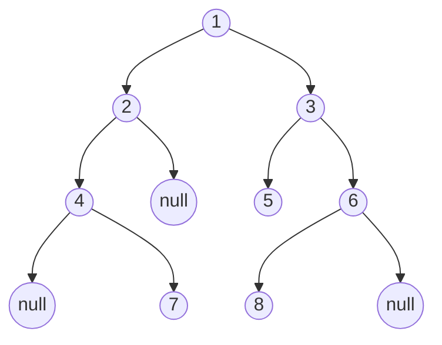

###  Java基础那些事

#### Java基本常识

##### 1.三个发行版本

###### sun和openjdk的区别

- 授权协议的不同
- OpenJDK不包含Deployment（部署）功能
- OpenJDK源代码不完整
- sun把部分源代码用开源代码替换
- openjdk只包含最精简的JDK
- open不能使用Java商标

```
标准版（J2SE） Standard Edition(标准版) J2SE 包含构成Java语言核心的类。
企业版（J2EE） Enterprise Edition(企业版) J2EE 包含J2SE 中的类，并且还包含用于开发企业级应用的类。
微缩版（J2ME） Micro Edition(微缩版) J2ME 包含J2SE中一部分类，用于消费类电子产品的软件开发。
```

##### 2.Java开发使用的工具

```
SDK: software development kit  软件开发包 函数库或者工具等
JDK: java development kit   是面向开发人员的,java开发工具
JRE: java runtime enviroment java运行时环境,是面向应用程序使用者的
	注意:JDK安装后一般都会包含JRE的
API: application program interface 应用程序编程接口
API都会有一个API说明文档
```

##### 3.JDK的内容

```
a. Java虚拟机：负责解析和执行Java程序。Java虚拟机可运行在各种平台(OS)上。一次编译 多次运行 
b. JDK类库(API)：　 提供最基础的Java类及各种实用类。java.lang, java.io, java.util, javax.swing和java.sql包中的类都位于JDK类库中。src.zip
c. 开发工具：  这些开发工具都是可执行程序，主要包括：
javac.exe         编译工具；
javadoc.exe       生成JavaDoc文档的工具
jar.exe           打包工具
```

##### 4.JDK安装的目录结构

```
bin:java的相关命令
java  javac  jar  javadoc
db:java提供的数据库
demo/sample:java代码的一些示例
include:C语言的头文件等内容
jre:java的运行环境
lib:java所用的基本的jar包
jre :
	bin : java 命令
	lib : rt.jar  ---->.class 文件组成 (src.zip 包结构相同)
```

##### 5.Java的垃圾回收机制（GC）

```
Java中垃圾回收处理特点：     
1) 由虚拟机通过垃圾回收器线程自动完成；
2) 只有当对象不再被使用，它的内存才有可能被回收；如果虚拟机认为系统不需要额外的内存(内存够用)，即便对象不再使用，内存也不会回收；(自动)
3) 程序无法显示迫使垃圾回收器立即执行垃圾回收，可以通过java.lang.System.gc()/java.lang.Runtime.gc()建议虚拟机回收对象
4) 垃圾回收器线程在释放无用对象占用内存之前会先行调用该对象的finalize()方法

回收算法：
```

##### 6.了解JVM

```
Jvm是什么？简称java 虚拟机（java virtual machine），是用软件来模拟一个虚拟的环境。 
JMM的全称是Java Memory Model（Java内存模型）
JMM的关键技术点都是围绕着多线程的原子性、可见性和有序性来建立的，这也是Java解决多线程并行机制的环境下，定义出的一种规则，意在保证多个线程间可以有效地、正确地协同工作。

编写.java文件--->编译为.class文件--->类加载-->字节码验证-->JIT运行
运行： 类加载-->字节码验证-->JIT运行

字节码验证的内容:
代码要符合JVM的规范 语法 
代码破坏计算机的系统或者硬件
栈不能溢出  内存  
方法的参数类型要正确(java 强类型语言 js:弱类型语言)
类型转换要正确

类加载:  双亲委托机制
把写好并编译成的.class字节码文件从硬盘中加载到内存

JVM使用类加载器来完成类加载的过程
类加载器:从一个指定路径下面去加载代码运行时需要用到的java类
三个类装载器依次完成
1、启动类装载器：bootstrap class loader
	从jdk的安装目录下  jdk/jre/lib/rt.jar
	rt.jar 是个包，放的是Java作为开发环境的所有的库
2、扩展类装载器：extensible class loader
	从jdk的安装目录下 jdk/jre/lib/ext/*.jar
	jdk下的所有的.jar 文件
3、系统类装载器：system class loader
	$CLASSPATH
	环境变量中配置的classpath   

JIT运行：Java程序最初是通过解释器进行解释执行的，当虚拟机发现某个方法或代码块运行的特别频繁时，会把这些代码认定为“热点代码”（Hot Spot Code）。为了提高热点代码的执行效率，在运行时，虚拟机会把这些代码编译成本地平台相关的机器码，并进行各种层次的优化，完成这个任务的编译器称为即时编译器Just In Time简称JIT
```

##### 7.java文件中的三个顶级元素

```
package
	1.最终会是以文件夹的形式体现出来(有什么包,就必须有什么文件夹,运行的时候.class文件必须在这个文件夹下面)
	2..java文件中有多个package的时候,用.分割并且结尾用;号结束 例如:(com.kaikai.test;)
	3.包也是java中类的标识的一部分,确定某一个类是通过包名加类名来唯一确定的 比较运行java类的时候:
	java package.类名 (java com.briup.test.HelloPackage)
import
	1.导包用的关键字
	2.如果你想在当前这个类使用其他的类,那么就必须通过这个关键字,把那个类导入进来
	3.java.lang包下面的类可以直接使用,不用导入.
	4.和当前这个类位于同一个包下面的类,也不需要导入,可以直接使用 
class
	java中标识一个类的关键字
	(java类中可以没有package,也可以没有import,但是一定会有class) 
```

##### 8.注释

```java
作用：使部分内容只为程序员可见，不为编译器所编译虚拟机所执行
位置：类声明前后、方法声明前后、属性声明前后、方法体中。几乎可以在一个源文件任意位置，但不能在一个关键字字符中插入注释
类型:
1) 单行注释：
	//text    ——从 // 到本行结束的所有字符均作为注释而被编译器忽略(反编译)
2) 多行注释：
	/*text*/   ——从 /* 到 */ 间的所有字符会被编译器忽略
3) 文档注释：
	/**test*/   ——从"/**"到"*/"间的所有字符会被编译器忽略。当这类注释出现在任何声明(如类的声明、类的成员变量的声明或者类的成员方法的声明)之前时，会作为JavaDoc文档的内容；
@author		类的作者
@version	类的版本
@since		从什么时候开始使用的
@see		另外参照...
@param		方法的参数
@return		方法的返回类型
@exception	方法抛出的异常
```

##### 9.标识符

```
类、方法和变量的名字
1) 由字母、数字、下划线“_”、美元符号“$”组成，第一个字符不能是数字
2) 不能是java中的关键字
3) 大小写敏感 cd  CD   test Test
4) 没有长度限制。 
```

##### 10.关键字（详细解释）

```
Java语言的关键字是程序代码中的特殊字符。包括：
	类和接口的声明——class, extends, implements, interface
	包引入和包声明——import, package
	数据类型——boolean, byte, char, double, float, int, long, short
	某些数据类型的可选值——false, true, null
	流程控制——break, case, continue, default, do, else, for, if, return, switch, while
	异常处理——catch, finally, throw, throws, try
	修饰符——abstract, final, native, private, protected, public, static, synchronized, transient, volatile
	操作符——instanceof
	创建对象——new
	引用——this, super
	方法返回类型——void
Java语言的保留字是指预留的关键字，它们虽然现在没有作为关键字，但在以后的升级版本中有可能作为关键字: goto const 所有关键字都是小写,并且程序中标识符不能以关键字命名
```

#### Java的数据类型

```
Java语言中的数据类型分为基本类型和引用类型
		基本类型:float double byte short int long char boolean
		引用类型:类类型 接口类型 数组类型
变量分为 基本类型变量和引用类型变量
```

##### 0.基本数据类型占用的空间

```
计算机中的 1字节=8位 0000 0001 内存地址，由于C的指针的影响，下标从0开始。
基本数据类型又可以分为:整型 浮点类型 布尔类型 字符类型
整型
	byte		8位	1字节
	short		16位	2字节
	int			32位	4字节
	long		64位	8字节
浮点类型
	float		32位	4字节
	double		64位	8字节
布尔类型
	boolean		8位	1字节
字符类型
	char		16位	2字节
注意:java中采用unicode编码,用两个字节表示一个字符,但是在其他字符编码中可能不是使用两个字节表示一个字符
```

##### 1.boolean

```
boolean类型数据的值为true或者false,在JVM中会转换为1或者0
注意:0代表的是false  1代表的是true
```

##### 2.char

	char是字符,String是字符串,String是类类型,而char是基本数据类型
	String类由final修饰所以不可继承，在Java8中String类型由char组成，而在后续版本由byte组成
	
	1)字符编码
		Java语言对文本字符采用Unicode编码。由于计算机内存只能存取二进制数据，因此必须为各个字符进行编码。
			例如:a --编码-->0000 0000 0110 0001
	2)常见的字符编码包括：
		a.ASCII
		  ASCII--Amecian Standard Code for Information Interchange(美国信息交换标准代码). 主用于表达现代英语和其他西欧语言中的字符。它是现今最通用的单字节编码系统，它只用一个字节的7位，一共表示128个字符。
		b.ISO-8859-1
		  又称为Latin-1, 是国际标准化组织(ISO)为西欧语言中的字符制定的编码，用一个字节(8位)来为字符编码，与ASCII字符编码兼容。所谓兼容，是指对于相同的字符，它的ASCII字符编码和ISO-8859-1字符编码相同。
		c.GB2312 中 ----->010101 
		  它包括对简体中文字符的编码，一共收录了7445个字符(6763个汉字+682个其他字符). 它与ASCII字符编码兼容。
		d.GBK  
		  对GB2312字符编码的扩展，收录了21886个字符(21003个字符+其它字符), 它与GB2312字符编码兼容。
		e.Unicode：万国码 统一码 
		  Unicode是一个符号集，可以表示很多符号。
		  由国际Unicode协会编制，收录了全世界所有语言文字中的字符，是一种跨平台的字符编码。
		  UCS(Universal Character Set)是指采用Unicode字符编码的通用字符集。
		  Unicode具有两种编码方案：
		     用2个字节(16位)编码，被称为UCS-2, Java语言采用;
		     用4个字节(32位)编码，被称为UCS-4;
		f. UTF 可变长度编码 
		  有些操作系统不完全支持16位或32位的Unicode编码，UTF(UCS Transformation Format)字符编码能够把Unicode编码转换为操作系统支持的编码，常见的UTF字符编码包括UTF-8, UTF-7和UTF-16.  
	       utf-8 是Unicode的实现方式之一。是互联网上使用最广泛Unicode的实现方式。
	         
	3)字符编码表
		每一种字符编码都有一个与之字符编码表,例如在Unicode编码表中十六进制的数字6136对应的汉字是愶
		例如:
		char c = '\u6136';
		System.out.println(c);
	
	4)char值的形式
		Java语言采用Unicode编码，字符占2个字节。
		字符a
		二进制数据形式为		 0000 0000 0110 0001
		十六进制数据形式为		 0x0061
		十进制数据形式为		 97
		
		char c = 'a';
		//设定"a"的十六进制数据的Unicode编码
		char c = '\u0061';     
		//设定"a"的十六进制数据的Unicode编码 
		//0x开头的数字位十六进制
		char c = 0x0061;     
		//设定"a"的十进制数据的Unicode编码
		char c = 97;            
		//设定"a"的八进制数据的Unicode编码
		//0开头的数字为八进制
		char c = 0141;  
	    //0b开头是整型int
	    int e = 0b11111111;
		注意:一个中文汉字就是一个字符
		char c = '中';
	5)转义字符
		转义字符以反斜杠开头，常用转义字符：
		\n           换行符，将光标定位到下一行的开头
		\r			 回车,把光标移动到行首(和环境有关 linux环境下 回到行首 覆盖当前行以前的输出内容)
		\t           垂直制表符，将光标移到下一个制表符的位置
		\\           反斜杠字符
		\'           单引号字符
		\"           双引号字符
	6)空字符串和\u0000
		键盘上任何一个按键都是一个字符,例如回车键、空格键、Esc键、Shift键等等	
		//空格字符
		char c1 = ' ';
		//字符串s1包含了一个空格字符
		String s1 = " ";
		//字符串s2不包含任何字符,即空字符串(不是null)
		String s2 = "";	
		//这样表示是错误的，没有空字符
		char c2 = '';	
		//char类型的默认值，只是会占一个字符的位置
		char c3 = 0;
		char c4 = \u0000;
##### 3.整数类型

```
byte, short, int，long都是整数类型，并且都是有符号整数(正负)。与有符号整数对应的是无符号整数，两者的区别在于把二进制数转换为十进制整数的方式不一样。
	转换规则

	有符号整数把二进制数的首位作为符号数，当首位是0时，对应十进制的正整数，当首位是1时，对应十进制的负整数。对于一个字节(byte)的二进制数, 它对应的十进制数的取值范围是-128~127
	无符号整数把二进制数的所有位转换为正整数。对于一个字节(byte)的二进制数, 它对应的十进制数的取值范围是0~255
	整数类型的默认类型是int,对于给出一个字面值是99的数据,在没有指明这个数据是什么具体的类型的情况下,那么java默认认为是int类型。
byte  a1 = 1;	(内存中占8位) 1字节
short a2 = 1;	(内存中占16位)2字节
int   a3 = 1;	(内存中占32位)4字节
long  a4 = 1L;	(内存中占64位)8字节
使用long类型数据的时候后面要加大写L或者小写l,建议加上大写的L,因为小写的l和数字1很像似。

四种整型类型的表示范围
byte	 8位  范围:负2的7次方~2的7次方减1  
short	16位  范围:负2的15次方~2的15次方减1
int		32位  范围:负2的31次方~2的31次方减1
long	64位  范围:负2的63次方~2的63次方减1
```

##### 4.浮点型

```java
float和double都是java中的浮点型,浮点型可以用来表示小数.
	float是(32位)4字节, 1符号位+8指数位+23尾数位
	double是(64位)8字节,1符号位+11指数位+52尾数位

float和double的精度是由尾数的位数来决定的。浮点数在内存中是按科学计数法来存储的.
	float的精度为7位左右有效数字
	double的精度为16位左右有效数字

    浮点型的默认类型是double,对于给出一个字面值是10.8的数据,在没有指明这个数据是什么具体的类型的情况下,那么java默认认为是double类型。
点型数据的声明 10.5
//后面加f或者F
float f = 10.5f;
//后面加d或者D
double d = 10.5d;

浮点型的二进制形式 参考样例:
float f = 10.5f;
int b = Float.floatToIntBits(f);
System.out.println(Integer.toBinaryString(b));

Java中的简单浮点数类型float和double不能够进行精确运算，因为大多数情况下是正常的，但是偶尔会出现如上所示的问题。这个问题其实不是JAVA的bug，因为计算机本身是二进制的，而浮点数实际上只是个近似值，所以从二进制转化为十进制浮点数时，精度容易丢失，导致精度下降。要保证精度就要使用BigDecimal类，而且不能直接从double直接转BigDecimal,要将double转string再转BigDecimal。也就是不能使用BigDecimal(double val)方法,而是需要使BigDecimal(String val)方法。例如:
BigDecimal d1 = new BigDecimal("1.0");
BigDecimal d2 = new BigDecimal("0.66");
double result = d1.subtract(d2).doubleValue();
System.out.println(result);
输出结果:0.34 
```

##### 5.原码反码补码

```
正数和负数的符号位不参与反码补码运算。
正数的原码反码补码都是原码
负数的反码是取反，补码是反码+1
```

#### Java变量

##### 1.实例变量(全局变量,属性,成员变量)

```
默认值是JVM给的
基本类型的实例变量默认值
    整型	:默认值为 0
    浮点型	:默认值为 0.0
    布尔型	:默认值为 false
    字符型	:默认值为 0 或者 '\u0000'
引用类型的实例变量:
    默认值都是 null
生命周期:实例变量是属于对象的,一个对象被创建出来的时候,这个对象中的实例变量就有了,直到这个对象被GC当做垃圾回收之后,这个实例变量也就没有了。
作用范围:和修饰符有关
```

##### 2.局部变量

```
默认值:局部变量是"没有"默认值的,我们只能显式的赋值之后才能使用该变量,否则会编译报错
生命周期:当方法被调用,代码执行到局部变量的声明这一刻开始,这个局部变量就出现了,直到局部变量"直接"位于的大括号内中的代码执行结束的时候,该变量在内存中也就释放消失了。
作用范围:
	1)如果是定义在方法的参数列表中,那么在当前方法的任何位置都可以访问该局部变量
	2)如果是定义在方法中,那么就要看这个局部变量是"直接"位于哪一对大括号内
```

#### 操作符

##### 1.赋值操作符

```
1)赋值操作符：
		=   例如:   int x=0,i=1,j=1;
		*=  例如:   a*=b 等价于 a=a*b
		/=  例如:   a/=b 等价于 a=a/b;
		%=  例如:   a%=b 等价于 a=a%b;
		+=	例如:   a+=b 等价于 a=a+b;
		-=  例如:   a-=b 等价于 a=a-b;
		其他的都是类似情况
```

##### 2.比较操作符

```
>   :   大于
>=  :   大于等于
<   :   小于
<=  :   小于等于
注意:以上操作符只适用于整数类型和浮点数类型；
instanceof: 判断一个引用类型变量所指向的对象是不是属于某个类型。
最终判断的是s所指向对象的类型是不是属于某类型,而不是判断变量s的类型是不是属于某个类型.
```

##### 3.相等操作符

```
==  :   判断俩个数据 是否 等于
!=  :   判断俩个数据 是否 不等于
既可以应用在基本类型的比较，也可以应用在引用类型的比较
equals方法要看调用该方法的类是否重写equals方法

引用的对象在堆，变量在栈。
```

##### 4.算数运算符

```
+   :   数据类型值相加或字符串连接
/   :   整除, 如操作数均为整数，运算结果为商的整数部分
浮点数/0不一定崩溃
1.0/0表示正无穷大
-1.0/0表示负无穷大

%   :   取模操作符, 如操作数均为整数，运算结果为商的整数部分，还有取余
Java中%是取余
计算方法
对于整数 a，b 来说，取模运算和取余运算的过程相同：
取模和取余在第一步求商的方法上有所不同：取余运算在取 c 的值时，向 0 方向舍入( fix() 函数)；而取模运算在计算 c 的值时，向负无穷方向舍入( floor() 函数)。
求整数商：c=a/b
计算模或者余数：r=a−c×b
取模运算结果的符号和 b 一致，取余运算结果的符号和 a 一致。
```

##### 5.移位操作符

```
>>  :  算术右移位运算，也称做带符号右移位运算。注意:正数取反加1得到其对应的负数,负数取反加1得到其对应的正数
int a1 = 12 >> 1;  //6;
...0000 1100    12
-----------
....0000 110    >>1
-----------
...0000 0110    补位 因为是正数所以补0  结果为6

int a5 = -12 >> 1;//-6; 
...0000 1100    12
---------
...1111 0011    取反
---------
...1111 0100    +1  这个就是-12的二进制形式
----------
...1111 010    >>1
...1111 1010    补位 因为是负数所以补1  这个负数就是最终结果
---------
...0000 0101    取反	
---------
...0000 0110    +1 结果为6 所以上面的最终结果是 -6

>>> :  逻辑右移位运算，也称为不带符号右移位运算。
int a1 = 12 >>> 1;//6;
int a2 = -12 >>> 2;//1073741821;                   
注：
a. 对12逻辑右移一位的过程为：舍弃二进制数的最后一位，在二进制数的开头增加一个0;
b. 对-12逻辑右移二位的过程为：舍弃二进制数的最后二位，在二进制数的开头增加二个0;

<< :  左移位运算，也称为不带符号左移位运算。
int a1 = 12  << 1;//24;
int a2 = -12 << 2;//-48;                   
int a3 = 128 << 2;//512;
int a4 = 129 << 2;//516;    
注：
a. 对12左移一位的过程为：舍弃二进制数的开头一位，在二进制数的尾部增加一个0;
b. 对-12左移二位的过程为：舍弃二进制数的开头二位，在二进制数的尾部增加二个0;
```

##### 7.位运算操作符 

```
& 与运算
	1&1->1, 1&0->0, 0&1->0, 0&0->0;   
| 或运算
	1|1->1, 1|0->1, 0|1->1, 0|0->0;
^ 异或运算
	1^1->0, 0^0->0，1^0->1, 0^1->1; 
	相同为0 不同为1  
	运算特点: a^0=a; a^a=0;
~ 取反运算
	~1->0, ~0->1;
```

##### 8.逻辑操作符

	短路操作符，如果能根据操作左边的布尔表达式就能推算出整个表达式的布尔值，将不执行操作符右边的布尔表达式；
	短路与
	&& 左边的布尔表达式的值为false, 整个表达式值肯定为false, 此时会忽略执行右边的布尔表达式。
	    false&&true
	    int a = 1;
	    int b = 2;
	    int c = 3;
	    a>b&&c>b
		//没有短路功能
	    a>b&c>b
	短路或
	|| 左边的布尔表达式的值为true, 整个表达式值肯定为true, 此时会忽略执行右边的布尔表达式。  
	OR或,
	AND与,
	XOR异或,
	NOR或非,
	NAND与非,
	XNOR异或非，
##### 9.三目运算符

```
boolean表达式 ? 表达式1 : 表达式2
```

##### 10.逻辑

###### 1.递归的底层实现

```
递归调用在底层其实是对线程栈的压栈和出栈操作，每调用一次都会压栈一次，并记录相关的局部变量信息。
递归算法的第一步是分治，把复杂的大的问题，拆分成一个一个小问题，直到不能再拆解（自顶往下），通过退出条件retrun，然后再从最小的问题开始解决，只到所有的子问题解决完毕（自底向上）。
```

#### 类型转换

##### 1.基本类型的转换

```
隐式转换 特点:小的可以自动转换(隐式转换)为大的,因为无非就是在前面多补几个0而已,不会影响数据值
显式转换 特点:大的值给小的变量,需要强制转换,但是转换后的结果JVM不会保证还正确
```

##### 2.引用类型的转换

```
隐式转换 特点:子类类型的变量可以自动转换(隐式转换)为父类类型
显式转换 加强转
```

##### 流程控制语句拓展

##### label标签

```java
在循环嵌套的时候,使用label可以让break或者continue作用到指定的循环上,否则break或者continue只会默认作用到当前所处的循环上。
例如:这个break跳出的是外循环(因为使用了label)
f1:for(int i=0;i<3;i++){
	for(int j=0;j<5;j++){
		if(j==3){
			break f1;
		}
		System.out.println("j = "+j);
	}
}
输出结果:
j = 0
j = 1
j = 2
```

#### 数组

##### main里的数组

```
public static void main(String[] args){
	// args----->数组对象(jvm 创建 并传递过来) 
}
其中 String[] 就是一个数组类型,args就是这个数组类型的变量,它所指向的数组对象中只能存放String类型的数据。
注:main方法是由JVM负责调用,那么args所指向的数组对象也是由JVM负责创建并传过来.
```

#### 数组对象

##### 1.数组对象的拷贝

```java
数组对象的长度确定之后便不能修改,但我们可以通过复制数组的内容变通实现改变数组长度。
在java.lang.System类中提供一个名为arraycopy的方法可以实现复制数组中元素的功能
//该方法的声明
public static void arraycopy(
Object src,
int srcPos,
Object dest,
int destPos,
int length
)
参数1,需要被复制的目标数组
参数2,从这个数组的那个一个位置开始复制
参数3,需要把数据复制到的另外的那一个新的数组对象
参数4,复制到新数组里面哪个位置(从这个位置开始算)
参数5,复制的目标数组的长度

例如:
写一个方法,接收一个数组对象,把这个数组对象的长度扩大到原来的2倍并返回。
public int[] test(int[] a){
	int[] b = new int[a.length*2];
	System.arraycopy(a, 0, b, 0, a.length);
	return b;
}
```

##### 2.数组的工具类java.util.Arrays

```
toString方法,把数组转换位字符串形式并返回
binarySearch方法,在数组中查找指定元素并返回其下标
copyOf方法,复制或者截取指定数组并返回
copyOfRange方法,将数组中指定范围复制新数组并返回
equals方法,比较俩个数组是否相等
fill方法,用指定值去填充数组对象
sort方法,把数据中的元素进行排序
asList方法,可以把数组转换为List集合
```

##### 3.排序算法

```java
冒泡排序 跑n-1轮循环
相邻的俩个元素比较,让值较大的数据逐渐向数组的底部(即朝最后一个元素)移动。
    原理：比较两个相邻的元素，将值大的元素交换到右边。
public void sort(int[] a) {
    for(int i=0;i<a.length-1;i++) {
        for(int j=0;j<a.length-i-1;j++) {
            if(a[j]>a[j+1]) {
                int temp = a[j];
                a[j] = a[j+1];
                a[j+1] = temp;
            }
        }
    }
}
```

##### 4.二维数组

```
数组声明大小时左边[]是高阶的
```

##### 5.可变参数 jdk1.5以上

```
可变参数其实就是指可单个也可数组也可多个
public void test(int...a){
}
那么调用的时候传入的参数类型及形式就会比较多样
int[] a = {1,2,3,4};
t.test2(a);
t.test2();
t.test2(1);
t.test2(1,2,3,4,5,6,7);
```

##### 6.格式化输出（了解）

```
// "%"表示进行格式化输出，"%"之后的内容为格式的定义。 
// "f"表示格式化输出浮点数。 
System.out.printf("%f", d); //345.678000
// "9.2"中的9表示输出的长度，2表示小数点后的位数。 
System.out.printf("%9.2f", d);//   345.68
// "+"表示输出的数带正负号。  
// "-"表示输出的数左对齐（默认为右对齐）。  
// "+-"表示输出的数带正负号且左对齐。  
// "d"表示输出十进制整数。
// "o"表示输出八进制整数。 
// "x"表示输出十六进制整数。  
// "#x"表示输出带有十六进制标志的整数。  
```

### Java语言高级特性

#### native修饰符

#### static修饰符

##### 1.static变量

```
静态变量和非静态变量的区别
	静态变量数属于类的,"可以"使用类名来访问,非静态变量是属于对象的,"
	静态变量对于类而言在内存中只有一个,能被类的所有实例所共享。实例变量对于类的每个实例都有一份,它们之间互不影响.
在加载类的过程中为静态变量分配内存,实例变量在创建对象时分配内存。所以静态变量可以使用类名来直接访问,而不需要使用对象来访问.
```

##### 2.static方法	

	静态方法和非静态方法的区别
		静态方法数属于类的,"可以"使用类名来调用,非静态方法是属于对象的,"必须"使用对象来调用.
		静态方法"不可以"直接访问类中的非静态变量和非静态方法,但是"可以"直接访问类中的静态变量和静态方法
		注意:this和super在类中属于非静态的变量.(静态方法中不能使用)
	非静态方法"可以"直接访问类中的非静态变量和非静态方法,也"可以"直接访问类中的静态变量和静态方法
	父类的静态方法可以被子类继承,但是不能被子类重写
	父类的非静态方法不能被子类重写为静态方法	
##### 3.静态代码块

```
匿名代码块和静态代码块的执行
	因为没有名字,在程序并不能主动调用这些代码块。匿名代码块是在创建对象的时候自动执行的,并且在构造器执行之前。同时匿名代码块在每次创建对象的时候都会自动执行.静态代码块是在类加载完成之后就自动执行,并且只执行一次.
注:每个类在第一次被使用的时候就会被加载,并且一般只会加载一次.
匿名代码块和静态代码块的作用
    匿名代码块的作用是给对象的成员变量初始化赋值,但是因为构造器也能完成这项工作,所以匿名代码块使用的并不多。
    静态代码块的作用是给类中的静态成员变量初始化赋值。
注:在构造器中给静态变量赋值,并不能保证能赋值成功,因为构造器是在创建对象的时候才指向,但是静态变量可以不创建对象而直接使用类名来访问.假如在未创建对象的时候就要使用静态变量则，会显示初始值
```

##### 4.类加载过程

```
1类加载,同时默认初始化类中静态的属性
2执行静态代码块
3分配内存空间,同时初始化非静态的属性(赋默认值,0/false/null)
4调用Student的父类构造器
5对Student中的属性进行显示赋值(如果有的话)
6执行匿名代码块
7执行构造器
8返回内存地址
下次创建对象的时候只需要从3开始
注:子类中非静态属性的显示赋值是在父类构造器执行完之后和子类中的匿名代码块执行之前的时候
```

##### 5.静态导入

```
静态导入
静态导入是JDK5.0引入的新特性。
例如:
import static java.lang.Math.random;
import static java.lang.Math.PI;
public class Test {
public static void main(String[] args) {
	//之前是需要Math.random()调用的
	System.out.println(random());
	System.out.println(PI);
	}
}
```

#### final修饰符

##### 1.修饰类----绝育

```
用final修饰的类不能被继承,没有子类。
例如:我们是无法写一个类去继承String类,然后对String类型扩展的,因为API中已经被String类定义为final
```

##### 2.修饰方法

```
用final修饰的方法可以被继承,但是不能被子类的重写。和用static修饰的方法效果类似
```

##### 3.修饰变量（搞常量）

```
用final修饰的变量表示常量,只能被赋一次值.其实final修饰的变量成了常量了,即值不会再变了。(Math.PI)
```

##### 4.修饰引用变量（可搞单例）

```
其指向的值无法改变，但指向的对象本身不受影响
```

#### abstract修饰符

##### 1.抽象类和抽象方法的关系

	abstract修饰符可以用来修饰方法也可以修饰类,如果修饰方法,那么该方法就是抽象方法;如果修饰类,那么该类就是抽象类。抽象类中可以没有抽象方法,但是有抽象方法的类一定要声明为抽象类。
##### 2.特点及作用

	抽象类,不能使用new关键在来创建对象,它是用来让子类继承的。
	抽象方法,只有方法的声明,没有方法的实现,它是用来让子类实现的。
	注:子类继承抽象类后,需要实现抽象类中没有实现的抽象方法,否则这个子类也要声明为抽象类。
	注:子类继承抽象类,那么就必须要实现抽象类没有实现的抽象方法,否则该子类也要声明为抽象类。
	抽象类是有自己的构造器的，抽象类的子类可以通过super调用

#### interface接口

##### 1.接口和抽象类区别

```
抽象类也是类,除了可以写抽象方法以及不能直接new对象之外和普通类一样的。
接口不是类
抽象类是用来被继承的,java中的类是单继承。
    类A继承了抽象类B,那么类A的对象就属于B类型了,可以使用多态
    一个父类的引用,可以指向这个父类的任意子类对象
注:继承的关键字是extends
接口是用来被类实现的,java中的接口可以被多实现。
    类A实现接口B、C、D、E..,那么类A的对象就属于B、C、D、E等类型了,可以使用多态
    一个接口的引用,可以指向这个接口的任意实现类对象
注:实现的关键字是implements
```

##### 2.接口中的方法都是抽象方法

```
接口中可以不写任何方法,但如果写方法了,该方法必须是抽象方法，接口中的方法默认被abstract修饰
```

##### 3.接口中的变量都是静态常量(public static final修饰)

```
接口中可以不写任何属性,但如果写属性了,该属性必须是public static final修饰的静态常量。
注:可以直接使用接口名访问其属性。因为是public static修饰的
```

##### 4.一个类可以实现多个接口

```
当多实现时。能否使用多个父类的方法要看引用变量的类型
```

##### 5.一个接口可以继承多个父接口

```
注:
System.out.println(o instanceof X);
如果o是一个接口类型声明的变量,那么只要X不是一个final修饰的类,该代码就能通过编译,至于其结果是不是true,就要看变量o指向的对象的实际类型,是不是X的子类或者实现类了。
```

#### transient修饰符

##### 1.修饰符的作用

> 被修饰的属性不会参与到序列化中

```
即经过序列化反序列后该属性会是默认值
```

##### 2.序列化版本号

```
在 序列化存储/反序列化读取 或者是 序列化传输/反序列化接收 时，JVM 会把传来的字节流中的serialVersionUID与本地相应实体（类）的serialVersionUID进行比较，如果相同就认为是一致的，可以进行反序列化，否则就会出现序列化版本不一致的异常。

在对实体类进行不影响业务流程的升级时，比如只追加了一个附加信息字段，可以不改变序列化版本号，来实现新旧实体类的兼容性（接收方的类里没有的字段被舍弃；多出来的字段赋初始值）。
```


#### 访问控制

##### 1.设定

```
public protected default private是java中的访问控制修饰符.
注:这里的default的意思是什么都不写
```

##### 2.修饰符用来修饰类

```
1.普通类
只能使用public和default来修饰源文件中编写的java类
public表示其他任何地方都有权限访问这个类
default表示只有和当前类在同一个包的类才有权限访问
2.内部类
四个修饰符可以修饰特定的内部类 出来匿名内部类
```

##### 3.修饰属性和方法

```java
四个修饰都可以修饰类中的属性和方法,那么就以修饰属性为例来说明.(效果和修饰方法是一样的)
public class Person{
    public	  String pubStr = "pubStr";
    protected String proStr = "proStr";
    String defStr = "defStr";
    private   String priStr = "priStr";
}
从四个地方测试这些属性的可见性:
注:这里的子类中默认指的是不同包下面的子类
```
|           | 类中 | 同包类中 | 不同包子类中 | 不同包类中 |
| :-------: | :--: | :------: | :----------: | :--------: |
|  public   |  Y   |    Y     |      Y       |     Y      |
| protected |  Y   |    Y     |      Y       |     N      |
|  default  |  Y   |    Y     |      N       |     N      |
|  private  |  Y   |    N     |      N       |     N      |

#### 包装类(Wrapper)

##### 1.常见包装类

> 都是lang包下的，所以不需要导入即可直接使用.

```
在java中,有八种基本的数据类,这八种类型所表示的数据只是一些简单的数值(8/16/32/64位的数字),它们都不是对象,所以在API又针对这八种类型提供了对于的类类型,也就是包装类型,它们分别是:	
Primitive-Type   Wrapper-Class
    byte			Byte
    short			Short
    int				Integer
    long			Long
    float			Float
    double			Double
    boolean			Boolean
    char			Character
```

##### 2.==和equals方法的区别

```
==是比较变量的内存地址值
equals方法看对象的重写形式默认是==
```

##### 3.toString方法hashCode方法

```
toString和hashCode都是Object类中的方法,所以每个对象都可以直接调用。
hashCode方法,返回该对象的哈希码值,Object中的实现一般是通过将该对象的内存地址转换成一个整数。
toString方法,返回该对象的字符串表示。
其形式为:
类的全限定名@hashCode方法返回值的十六进制形式
即:
o.getClass().getName() + "@" + Integer.toHexString(o.hashCode())
```

#### 集合

> java.util包下

##### 1.集合的特点

**1) 数据结构**
`List`列表、`Queue`队列、`Deque`双端队列、`Set`集合、`Map`映射
**2) 比较器**
`Comparator`比较器接口(不修改实体类在创建集合时使用`选择排序`)、`Comparable`排序接口(集合中存储的对象类要继承的接口`自然排序`)

注:比较器排序的优先级比自然排序的高

**3) 算法**
`Collections`常用算法类、`Arrays`静态数组的排序、查找算法
**4) 迭代器**
`Iterator`通用迭代器、`ListIterator`针对 `List` 特化的迭代器

```
集合中不能存放基本类型数据,而只能存放对象的引用，集合容量是不固定的。
1.可存放不同类型的对象(必须是对象)
数组只能存放同一类型数据,但是可以存放基本类型数据
2.集合的长度可以自动增加
数组的长度一旦确定,就不能再改变
3.集合对象中有众多方法可以直接调用进行元素(数据)操作
数组对象中没有方法可以对数据进行操作
4.java.util包中的辅助工具类Colletions,也能对集合中的元素进行操作
java.util包中的辅助工具类Arrays,是用来对数组中的元素进行操作的。
```

##### 2.集合框架图

##### 框架总览

##### collocation大类                                       

##### map大类

##### 3.集合的遍历

###### 1.collocation集合的遍历

```java
1.通用方式: 使用集合中提供的迭代器（set和list,除了queen）
Collection c = new ..;
Iterator iterator = c.iterator();
while(iterator.hasNext()){
	Object obj = iterator.next();
}

2.List集合的特有方式:get方法通过下标访问元素(注:Set集合不可用)
List list = new ArrayList();
for(int i=0;i<list.size();i++){
    System.out.println(list.get(i));
}
3.foreach循环(增强for循环)（set和list,除了queen）
Collection c = new ..;
for(Object o:c){
    System.out.println(o);
}
注:foreach循环也可以遍历数组
```

###### 2.map集合的遍历

```java
1.使用.keySet()方法,将该Map集合中的所有key值作为set类型集合返回后使用set的方式遍历
Map map = new HashMap();
for(Object key:map.keySet()){
	System.out.println(key+" : "+map.get(key));
}
2.使用.values()方法,将该Map集合中所有value值作为Collection类型集合返回后遍历
Map map = new HashMap();
for(Object value:map.values()){
	System.out.println(value);
}
3.使用entrySet方法,将该Map集合中的所有键值以Entry类型对象为元素作为Set集合返回
Set<Map.Entry<K,V>> entrySet();
注:Entry是声明Map接口中的内部接口(看API或源码可知),一个Entry类型对象就表示Map中的一组键值对(K-V)
Map map = new HashMap();
Set entrySet = map.entrySet();
for(Object obj:entrySet){
	Entry entry = (Entry)obj;
	System.out.println(entry.getKey());
	System.out.println(entry.getValue());
}
```

##### 一、有序列表（List）

> List集合的特点就是存取有序，可以存储重复的元素，可以用下标进行元素的操作

`List`主要实现类：`ArrayList`、`LinkedList`、`Vector`、`Stack`。

###### 1、ArrayList

```
ArrayList是动态数组结构，支持随机存取(通过下标)，尾部插入删除方便，内部插入删除效率低（因为要移动数组元素）；如果内部数组容量不足则自动扩容，因此当存储量很大时，效率较低。
```

###### 2、LinkedList

```
LinkedList是双向链表结构，在任意位置插入删除都很方便，但不支持随机取值，每次都只能从一端开始遍历，直到找到查询的对象，不像ArrayList那样需要进行内存拷贝，效率较高，内存占用比 ArrayList 多(额外的前驱和后继节点指针)
```

###### 3、Vector

```
Vector也是一个动态数组结构，一个元老级别的类，jdk1.1引入,jdk1.2引入ArrayList，ArrayList大部分方法和Vector相似，Vector允许同步访问且操作是线程安全但效率低，而ArrayList所有的操作都是异步，执行效率高，不安全
Vector现在用的很少，因为get、set、add等方法都加synchronized执行效率会比较低
如果需要在多线程中使用，可以采用下面语句创建ArrayList对象
List<Object> list =Collections.synchronizedList(new ArrayList<Object>());
也可以考虑使用复制容器 java.util.concurrent.CopyOnWriteArrayList进行操作，例如：
final CopyOnWriteArrayList<Object> cowList = new CopyOnWriteArrayList<String>(Object);
```

###### 4、Stack

```
Stack是Vector的一个子类，本质也是动态数组结构，不同的是，它的数据结构是先进后出，取名叫栈,Stack用的少，ArrayDeque双端队列可以替代Stack所有的功能，且执行效率高
peek 不改变栈的值(不删除栈顶的值)，pop会把栈顶的值删除。二者都是返回栈顶元素。
```

##### 二、集(Set)

> Set集合的特点：元素不重复，存取无序，无下标；
>
> 基本都是基于Map中的键，Map中键不能重复、无序的特性！

`Set`主要实现类：`HashSet`、`LinkedHashSet`和`TreeSet`。

###### 1、HashSet

```
HashSet底层是基于HashMap的k实现的，元素不可重复，特性同 HashMap。
```

###### 2、LinkedHashSet

```
LinkedHashSet底层基于 LinkedHashMap 的k实现的，一样元素不可重复，特性同 LinkedHashMap。
```

###### 3、TreeSet

```
TreeSet也是基于 TreeMap 的k实现的，元素不可重复，特性同 TreeMap；
```

##### 三、映射表(Map)

> Map是一个双列集合，其中保存的是键值对，键要求保持唯一性，值可以重复。

`Map`主要实现类:`HashMap`、`LinkedHashMap`、`TreeMap`、`IdentityHashMap`、`WeakHashMap`、`Hashtable`、`Properties`。

##### 1、HashMap

```
继承自AbstractMap，key不可重复，使用哈希表存储元素，输入的数据与输出的数据顺序基本不一致，HashMap最多只允许一条记录的key 为null。不保证元素顺序，根据需要该容器可能会对元素重新哈希，元素的顺序也会被重新打散，不同时间遍历同一个HashMap的顺序可能会不同。
```

###### 1.HashMap本质

[hash冲突的解决方式详解](https://www.cnblogs.com/gongcheng-/p/10894205.html)

[HashMap详解参考](https://www.cnblogs.com/dxflqm/p/11994380.html)

```
HashMap容器，实质还是一个哈希数组结构(存储的是内存地址的hash值)，但是在元素插入的时候，存在发生hash冲突的可能性；
解决冲突的方式：
1.开放定址法(再散列法)，就是以冲突的为基础一直算，直到不冲突。
2.再哈希法，就是准备几套hash函数，直到有一个hash函数能算出不冲突的值。这种方法不易产生聚集，但增加了计算时间。
3.链地址法(拉链法)，将所有哈希地址下标为i的元素构成一个称为同义词链的单链表，并将单链表的头指针存储在哈希表的第i个单元中，因而查找、插入和删除主要在同义词链中进行。链地址法适用于经常进行插入和删除的情况。
4.建立公共溢出区，将哈希表分为基本表和溢出表两部分，凡是和基本表发生冲突的元素，一律填入溢出表。

Java的HashMap采用的就是拉链法。
在jdk1.7中，HashMap主要是由数组+链表组成，当发生hash冲突的时候，就将冲突的元素放入链表中。
从jdk1.8开始，HashMap主要是由数组+链表+红黑树实现的，相比jdk1.7而言，多了一个红黑树实现。当链表长度超过8的时候，就将链表变成红黑树，如图所示。
```

`HashMap结构示意图`

###### 2.HashMap源码分析

> - **threshold：表示容器所能容纳的key-value对极限。**
>
> - **loadFactor：负载因子。**
>
> - **modCount：记录修改次数。**
>
> - **size：表示实际存在的键值对数量。**
>
> - **table：一个哈希桶数组，键值对就存放在里面。**
>
>   `方法`
>
> - **通过K获取数组下标；**
>
> - **put方法的详细执行；**
>
> - **resize扩容过程；**
>
> - **get方法获取参数值；**
>
> - **remove删除元素；**

```java
public class HashMap<K,V> extends AbstractMap<K,V> implements Map<K,V>, Cloneable, Serializable {   
    /*常量*/
    //默认的初始容量
    static final int DEFAULT_INITIAL_CAPACITY = 1 << 4; // aka 16
    //扩容能够阔的最大容量
    static final int MAXIMUM_CAPACITY = 1 << 30;
    //默认的负载因子
    static final float DEFAULT_LOAD_FACTOR = 0.75f;
    //链表变树的条件，链表长度大于8
    static final int TREEIFY_THRESHOLD = 8;
    //低位链表长度是否小于默认值6，小于就从树变链表
    static final int UNTREEIFY_THRESHOLD = 6;
    //当链表数组长度达到64时，链表转红黑树
    static final int MIN_TREEIFY_CAPACITY = 64;
    
    /*成员属性*/
    //所能容纳的key-value对极限(当前容器总容量)
    int threshold;   
    //负载因子
    final float loadFactor;   
    //记录修改次数
    int modCount;  
    //实际存在的键值对数量(当前容器已经在使用的容量)
    int size;  
    //哈希桶数组
    transient Node<K,V>[] table;
	......
}

影响HashMap的两个参数
初始容量（inital capacity）是指table的初始长度length（默认值是16）；
负载因子（load factor）用指自动扩容的临界值（默认值是0.75）；
HashMap
threshold = capacity(默认16) * Load factor(默认0.75) 
    大体是说，能存那么多，但table数组没必要那么大
扩容后是table数组的长度乘2

指定参数
Map map = new HashMap(int initialCapacity, float loadFactor);
```

###### 3.node节点源码解释

```java
static class Node<K,V> implements Map.Entry<K,V> {
        final int hash;//hash值
        final K key;//k键
        V value;//value值
        Node<K,V> next;//链表中下一个元素
}
```

###### 4.通过K值获取数组下标值

> 增加删除查找键值对都要定位到数组的位置，通过`key`获取数组下标，其中`length`指的是容器数组的大小。

`步骤图(与运算而不是取模)`

```java
/**获取hash值方法*/
static final int hash(Object key) {
     int h;
     // h = key.hashCode() 为第一步 取hashCode值（jdk1.7）
     // h ^ (h >>> 16)  为第二步 高位参与运算（jdk1.7） int 32位，逻辑右移将高位移到低位再与自己进行异或操作，相当于高位取反，高位与低位进行异或
     return (key == null) ? 0 : (h = key.hashCode()) ^ (h >>> 16);//jdk1.8
}
/**获取数组下标方法*/(jdk1.7的源码，jdk1.8没有这个方法被写进怎删查的逻辑方法里了)
static int indexFor(int h, int length) {
     return h & (length-1);  //第三步 得到的便是该节点归属的链表在数组的下标
}
```

###### 5.put方法的详细执行

`put操作`

###### 6.扩容

> - **1、判断键值对数组table[i]是否为空或为null，否则执行resize()进行扩容；**
> - **2、根据键值key计算hash值得到插入的数组索引i，如果table[i]==null，直接新建节点添加；**
> - **3、当table[i]不为空，判断table[i]的首个元素是否和传入的key一样，如果相同直接覆盖value；**
> - **4、判断table[i] 是否为treeNode，即table[i] 是否是红黑树，如果是红黑树，则直接在树中插入键值对；**
> - **5、遍历table[i]，判断链表长度是否大于8，大于8的话把链表转换为红黑树，在红黑树中执行插入操作，否则进行链表的插入操作；遍历过程中若发现key已经存在直接覆盖value即可；**
> - **6、插入成功后，判断实际存在的键值对数量size是否超多了最大容量threshold，如果超过，进行扩容操作；**

`扩容逻辑`

###### 扩容后节点的重新存放规则

> 存放逻辑是通过判断节点hash值(该hash值是重新计算的)与原数组大小与的结果是否为0来决定位置不动还是移动到扩容的部分去。下图中的最下面的oldtable数据标错了。仅仅是作为演示

`存放逻辑`


##### 红黑树

> 避免在最极端的情况下冲突链表变得很长，导致查询效率非常慢。
>
> - 红黑树查询：其访问性能近似于折半查找，时间复杂度O(logn)；
> - 链表查询：这种情况下，需要遍历全部元素才行，时间复杂度O(n)；

###### 二叉查找数的进化史

```
二叉查找树容易变成链表于是有了平衡二叉树，平衡二叉树对子树高度差太严格以至于每次都要调整数结构于是有了红黑树。
```

###### B树的那些变种——B+树多用于做文件系统的索引。

```
B树是多叉树又叫平衡多路查找树，B树可以多路存储，文件查找时可每次只加载一个节点的内容存入内存来查找。
一棵m阶的B树的满足条件：
（1）每个节点至多有m棵子树
（2）根节点除外，其它每个分支节点至少有【m/2】棵子树
（3）根节点至少有两棵子树（除非B树只包含一个节点）
（4）所有叶子节点在同一层上，B树的叶子节点可以看成一种外部节点，不包含任何信息。
（5）有j个孩子的非叶结点恰好有j-1个关键码，关键码按递增次序排列。

B+树是B树的变种，有着比B树更高的查询效率。
叶子节点之间还加了指针形成链表。B+树多用于数据库中的索引。
（1）有 k 个子树的中间节点包含有 k 个元素（B 树中是 k-1 个元素），每个元素不保存数据，只用来索引，所有数据都保存在叶子节点。
（2）所有的叶子结点中包含了全部元素的信息，及指向含这些元素记录的指针，且叶子结点本身依关键字的大小自小而大顺序链接。
（3）所有的中间节点元素都同时存在于子节点，在子节点元素中是最大（或最小）元素。

B*树是B+树的变体，在B+树的非根和非叶子结点再增加指向兄弟的指针；

B-树：
多路搜索树，每个结点存储M/2到M个关键字，非叶子结点存储指向关键字范围的子结点；所有关键字在整颗树中出现，且只出现一次，非叶子结点可以命中；
B+树：
在B-树基础上，为叶子结点增加链表指针，所有关键字都在叶子结点中出现，非叶子结点作为叶子结点的索引；B+树总是到叶子结点才命中；
B*树：
在B+树基础上，为非叶子结点也增加链表指针，将结点的最低利用率从1/2提高到2/3；
```


###### 红黑树的样子

 `红黑树的大致结构`

###### 1.红黑树的特点

> 红黑树是一种近似平衡的二叉查找树，其主要的优点就是“平衡“，即左右子树高度几乎一致，以此来防止树退化为链表，通过这种方式来保障查找的时间复杂度为log(n)。

```
1、每个节点要么是红色，要么是黑色，但根节点永远是黑色的
2、每个红色节点的两个子节点一定都是黑色
3、红色节点不能连续（也即是，红色节点的孩子和父亲都不能是红色）
4、从任一节点到其子树中每个叶子节点的路径都包含相同数量的黑色节点
5、所有的叶节点都是是黑色的（注意这里说叶子节点其实是上图中的 NIL 节点）
NIL和null的区别，NIL是无值的意思不是空

（插入或者删除操作），往往会破坏条件3或条件4，需要通过调整使得查找树重新满足红黑树的条件。
颜色调整，即改变某个节点的颜色，直接将节点颜色进行转换即可
结构调整，改变检索树的结构关系。结构调整主要包含两个基本操作：左旋（Rotate Left），右旋（RotateRight）。
从冲突的节点出发，能调整结构就先调整结构，再变色结局问题，有冲突继续解决冲突。
```

###### 2.左旋和右旋

```
左旋的过程是将p的右子树绕p逆时针旋转，使得p的右子树成为p的父亲，同时修改相关节点的引用，使左子树的深度加1，右子树的深度减1。
右旋的过程是将p的左子树绕p顺时针旋转，使得p的左子树成为p的父亲，同时修改相关节点的引用，使右子树的深度加1，左子树的深度减1。
```

###### 3.插入示例

`插入节点后的树结构调整流程`


###### 4.删除示例

`删除的两种调整逻辑方式`

###### 5.查询过程

`查询过程`

##### 二叉树

###### 0.树结构

```
有序树:树中任意节点的子结点之间有顺序关系
无序树:树中任意节点的子结点之间没有顺序关系,也称为自由树
```

###### 1.二叉树的遍历

`简单的二叉树例子`

```
1、先序遍历二叉树顺序：根节点 –> 左子树 –> 右子树，即先访问打印根节点再访问打印是左节点（如果左节点不是叶子节点则作为根节点再先序遍历），最后是右子树（规则同左节点）。
先序遍历结果：1 2 4 5 7 8 3 6
2、中序遍历二叉树顺序：左子树 –> 根节点 –> 右子树，即先访问左子树，然后是根节点，最后是右子树。 
中序遍历结果：4 2 7 5 8 1 3 6
3、后序遍历二叉树顺序：左子树 –> 右子树 –> 根节点，即先访问左子树，然后是右子树，最后是根节点。 
后序遍历结果：4 7 8 5 2 6 3 1
前三种遍历方式都是迭代的
4、层序遍历二叉树顺序：从最顶层的节点开始，从左往右依次遍历，之后转到第二层，继续从左往右遍历，持续循环，直到所有节点都遍历完成 
层序遍历结果为：1 2 3 4 5 6 7 8
```

##### 2、LinkedHashMap

```
HashMap的子类，内部使用链表数据结构来记录插入的顺序使输入的记录顺序和输出的记录顺序相同的。LinkedHashMap与HashMap最大的不同处是LinkedHashMap输入的记录和输出的记录顺序是相同的
```

##### 3、IdentityHashMap

```
继承自AbstractMap，与HashMap有些不同，在获取元素的时候，通过==代替equals ()来进行判断。
```

##### 4、TreeMap

```java
能够把它保存的记录根据键排序，默认是按键值的升序排序，也可以指定排序的比较器，当用 Iterator 遍历时，得到的记录是排过序的。如需使用排序的映射使用TreeMap。TreeMap实际使用的少
Set set = new TreeSet(new Comparator() {
    @Override
    public int compare(Object o1, Object o2) {
    Student s1 = (Student) o1;
    Student s2 = (Student) o2;
    return (int)(s1.getId()-s2.getId());
	}
});
```

##### 5、WeakHashMap

```
WeakHashMap继承自AbstractMap，被称为缓存Map，向WeakHashMap中添加元素，再次通过键调用方法获取元素方法时，不一定获取到元素值，因为WeakHashMap中的Entry随时可能被 GC 回收。有啥用？
```

##### 6、Hashtable

```
Hashtable，一个元老级的类，键值不能为空，方法都加了synchronized同步锁，线程安全，但没有HashMap快
HashMap是HashTable的轻量级实现，他们都实现了Map接口，区别在于HashMap允许K和V为空，而HashTable不允许K和V为空
如果需要在多线程环境下使用HashMap，可以使用如下的同步器来实现或者使用并发工具包中的ConcurrentHashMap类
Map<String, Object> map =Collections.synchronizedMap(new HashMap<>());
```

##### 7、Properties

```
Properties继承自HashTable，Properties新增了load()和和store()方法，可以直接导入或者将映射写入文件，Properties的键和值都是String类型。
```

##### 四、队列(Queue)

> Queue是一个队列集合，队列通常是指“先进先出”（FIFO）的容器。新元素插入（offer）到队列的尾部，访问元素（poll）操作会返回队列头部的元素。通常，队列不允许随机访问队列中的元素。

`Queue`主要实现类：`ArrayDeque`、`LinkedList`、`PriorityQueue`。

###### 1、ArrayDeque

```
ArrayQueue是一个基于数组实现的双端队列，在队列中存在两个指针，一个指向头部，一个指向尾部，因此它具有“FIFO队列(First Input First Output)”及“栈”的方法特性。
```

###### 2、LinkedList

```
LinkedList是List接口的实现类，也是Deque的实现类，底层是一种双向链表的数据结构，LinkedList可以根据索引来获取元素，增加或删除元素的效率较高，如果查找的话需要遍历整合集合，效率较低，LinkedList同时实现了stack、Queue、PriorityQueue(除了自带排序)的所有功能。
```

###### 3、PriorityQueue

```
PriorityQueue也是一个队列的实现类，此实现类中存储的元素排列并不是按照元素添加的顺序进行排列，而是内部会按元素的大小顺序进行排列，是一种能够自动排序的队列。[默认自然排序] 
```

###### 4.队列的方法

```
1. queue的增加元素方法add和offer的区别在于，add方法在队列满的情况下将选择抛异常的方法来表示队列已经满了，而offer方法通过返回false表示队列已经满了；在有限队列的情况，使用offer方法优于add方法
2. remove方法和poll方法都是删除队列的头元素，remove方法在队列为空的情况下将抛异常，而poll方法将返回null
3. element和peek方法都是返回队列的头元素，但是不删除头元素，区别在与element方法在队列为空的情况下，将抛异常，而peek方法将返回null
```

#### 数组与集合的工具类

##### 一、Collections类

> java.util.Collections工具类为集合框架提供了很多有用的方法，这些方法都是静态的，在编程中可以直接调用。整个Collections工具类源码差不多有4000行，这里只针对一些典型的方法进行阐述。

##### 1、addAll

```java
addAll：向指定的集合c中加入特定的一些元素elements
源码：
public static <T> boolean addAll(Collection<? super T> c, T… elements)
```

##### 2、binarySearch

```java
利用二分法在指定的集合中查找元素
源码：
#集合元素T实现Comparable接口的方式，进行查询
public static <T> int binarySearch(List<? extends Comparable<? super T>> list, T key)
#元素以外部实现Comparator接口的方式，进行查询
public static <T> int binarySearch(List<? extends T> list, T key, Comparator<? super T> c)
```

##### 3、sort

```java
源码：
#集合元素T实现Comparable接口的方式，进行排序
public static <T extends Comparable<? super T>> void sort(List<T> list)
#元素以外部实现Comparator接口的方式，进行排序
public static <T> void sort(List<T> list, Comparator<? super T> c)
```

##### 4、shuffle

```java
混排，随机打乱原来的顺序,相当于排列组合，每种结果的几率是相等的
源码：
#方法一 [使用默认随机源]
public static void shuffle(List<?> list) 
#方法二，指定随机源  可能指的是自定义一个math.random吧
public static void shuffle(List<?> list, Random rnd)
```

##### 5、reverse

```java
reverse：集合排列反转
源码：
#直接反转集合的元素
public static void reverse(List<?> list)
#返回可以使集合反转的比较器Comparator
public static <T> Comparator<T> reverseOrder()
#集合的反转的反转，如果cmp不为null，返回cmp的反转的比较器，如果cmp为null，效果等同于第二个方法.
public static <T> Comparator<T> reverseOrder(Comparator<T> cmp)
```

##### 6、synchronized系列

```
确保所封装的集合线程安全（强同步）
#同步Collection接口下的实现类
public static <T> Collection<T> synchronizedCollection(Collection<T> c)
#同步SortedSet接口下的实现类
public static <T> SortedSet<T> synchronizedSortedSet(SortedSet<T> s)
#同步List接口下的实现类
public static <T> List<T> synchronizedList(List<T> list)
#同步Map接口下的实现类
public static <K,V> Map<K,V> synchronizedMap(Map<K,V> m)
#同步SortedMap接口下的实现类
public static <K,V> SortedMap<K,V> synchronizedSortedMap(SortedMap<K,V> m)
```

##### 二、Arrays类

> java.util.Arrays工具类也为集合框架提供了很多有用的方法，这些方法都是静态的，在编程中可以直接调用。整个Arrays工具类源码有3000多行，这里只针对一些典型的方法进行阐述。

##### 1、asList

```java
asList：将一个数组转变成一个List，准确来说是ArrayList
源码：
public static <T> List<T> asList(T... a) {
        return new ArrayList<>(a);
}
注意：返回的List是定长的，企图添加或者删除数据都会报错java.lang.UnsupportedOperationException真是有病
```

##### 2、sort

```java
sort：对数组进行排序，适合byte,char,double,float,int,long,short等基本类型，还有Object类型
#基本数据类型，例子int类型数组
public static void sort(int[] a)
#Object类型数组
#如果使用Comparable进行排序，Object需要实现Comparable
#如果使用Comparator进行排序，可以使用外部比较方法实现
public static void sort(Object[] a)
```

##### 3、binarySearch

```java
通过二分查找法对已排序的数组进行查找。如果数组没有经过Arrays.sort排序，那么检索结果未知。
适合byte,char,double,float,int,long,short等基本类型，还有Object类型和泛型。
#基本数据类型，例子int类型数组，key为要查询的参数
public static int binarySearch(int[] a, int key)
#Object类型数组，key为要查询的参数
#如果使用Comparable进行排序，Object需要实现Comparable
#如果使用Comparator进行排序，可以使用外部比较方法实现
public static int binarySearch(Object[] a, Object key)
```

##### 4、copyOf

```java
copyOf：数组拷贝，底层采用System.arrayCopy（native方法）实现。
适合byte,char,double,float,int,long,short等基本类型，还有泛型数组。
#基本数据类型，例子int类型数组，newLength新数组长度
public static int[] copyOf(int[] original, int newLength)
#T为泛型数组，newLength新数组长度
public static <T> T[] copyOf(T[] original, int newLength)
```

##### 5、copyOfRange

```
数组拷贝，指定一定的范围，底层采用System.arrayCopy（native方法）实现。
适合byte,char,double,float,int,long,short等基本类型，还有泛型数组。
#基本数据类型，例子int类型数组，from：开始位置，to：结束位置
public static int[] copyOfRange(int[] original, int from, int to)
#T为泛型数组，from：开始位置，to：结束位置
public static <T> T[] copyOfRange(T[] original, int from, int to)
```

##### 6、equals和deepEquals

```
equals：判断两个数组的每一个对应的元素是否相等
#基本数据类型，例子int类型数组，a为原数组，a2为目标数组
public static boolean equals(int[] a, int[] a2)
#Object数组，a为原数组，a2为目标数组
public static boolean equals(Object[] a, Object[] a2)

deepEquals：主要针对一个数组中的元素还是数组的情况(多维数组比较)
#Object数组，a1为原数组，a2为目标数组
public static boolean deepEquals(Object[] a1, Object[] a2)
```

##### 7、toString和deepToString

```
toString：将数组转换成字符串，中间用逗号隔开
#基本数据类型，例子int类型数组，a为数组
public static String toString(int[] a)
#Object数组，a为数组
public static String toString(Object[] a)
deepToString：当数组中又包含数组，就不能单纯的利用Arrays.toString()了，使用此方法将数组转换成字符串
#Object数组，a为数组
public static String deepToString(Object[] a)
```

#### 泛型(Generics)

>JDK 1.5的新特性,本质是参数化类型(Parameterized Type),所操作的数据类型被指定为一个参数,在用到的时候在指定具体的类型。
>参数类型可以用在类、接口和方法的创建中,分别称为泛型类、泛型接口和泛型方法。
>泛型的类型只能是引用类型。集合的声明也可以使用泛型
>
>java中的泛型只是在编辑期间起作用的,在编译运行时会把泛型信息擦除。

##### 1.泛型类

```java
类的属性的类型由类后的参数决定,可以多个参数，为属性设置不同的类型
Point<Double> p = new Point<Double>();
public class Point<T> {
    private T x;
    private T y;
    public T getX() {
    return x;
    }
    public void setX(T x) {
    this.x = x;
    }
    public T getY() {
    return y;
    }
    public void setY(T y) {
    this.y = y;
    }
}
```

##### 2.泛型接口

> 一个泛型接口就是具有一个或多个类型变量的接口。参数设置方式同泛型类

```java
public interface Action<T,U>{  
	void doSomeThing(T t,U u);  
}  
public class ActionTest implements Action<String,Date>{  
	public void doSomeThing(String str,Date date) {  
	}  
}  
```

##### 3.泛型方法

> 在方法上直接声明泛型,该方法就是泛型方法
>
> 方法的返回值由参数决定		

```java
public class Test{
    public <T> void run1(T t){
    }
    public <T> T run2(T t){
    return t;
    }
    public <T,S> void run3(T t,S s){ 
    }
}
```
##### 4.泛型中的通配符

```
泛型中?是通配符,它可以表示所有泛型的父类型:
List<?> list = new ArrayList<任意>();
泛型无法通过字面值判断类型
```

##### 5.泛型中的extends和super关键字

> 在泛型中可以使用extends和super关键字来表示将来用户所传的泛型参数的上限和下限。

```java
extends
这样表示泛型参数是Number的子类
public class Point<T extends Number> {
    private T x;
    private T y;    
}
例如:在声明泛型类型变量时使用extends
List<? extends Number> list = new ArrayList<Integer>();

super
?最低也是Number或者number的父类
List<? super Number> list = new ArrayList<Object>();
//声明泛型类或泛型接口以及泛型方法时不能使用super
```

##### 6.泛型中的&

```java
//不管该限定是类还是接口,统一都使用关键字extends
//可以使用&符号给出多个限定
//如果限定既有接口也有类,那么类必须只有一个,并且放在首位置
public class Point<T extends A&B> {
}	
```

#### 枚举类型(enum)

> JDK1.5增加了枚举类型,可以使用enum来定义：语法糖 

##### 1.枚举类型

```java
public enum Gender{
	MALE,FEMALE;
}
其中每一个枚举元素都是该枚举类型的一个实例,并且默认是用public static final修饰的，像个常量。
    注:enum是java中的一个关键字,Enum是java中的一个类
```

##### 2.枚举类型和类的关系

> 通过反编译枚举类型的.class文件可知

```java
public final class com.briup.test.Gender extends java.lang.Enum<com.briup.test.Gender> {
    public static final com.briup.test.Gender MALE;
    public static final com.briup.test.Gender FEMALE;
    static {};
    private com.briup.test.Gender(java.lang.String, int);
    public static com.briup.test.Gender[] values();
    public static com.briup.test.Gender valueOf(java.lang.String);
}
枚举类型本质还是一个类,而且默认就是fianl修饰以及默认继承父类java.lang.Enum。
同时构造器是自动生成的且是私有的,表示不可再创建对象。(使用反射也不行)
private Gender(String name,int ordinal)
name   : 枚举对象的名字
ordinal: 枚举元素的编号,默认从0开始
枚举中所写的MALE和FEMALE其实就是Gender类型的俩个固定的对象。(public static final)

枚举类默认的两个方法
```

##### 3.枚举类类型作为类该有的东西

```
1.枚举类型的属性:枚举类型中可以定义属于自己的属性
2.枚举类型的构造器:在枚举类型中定义其构造器,但是必须是私有的,默认也是私有的
3.枚举类型的方法:枚举对象默认只能调用到父类Enum中的方法以及Object中的方法.如果想调用自己的方法,也可以在枚举类型中定义出属于自己的方法。注:枚举是一种特殊的类,所以在枚举类型中可以定义很多东西,同类。
4.枚举类型的抽象方法:枚举类型中可以编写抽象方法,但是这时候其每个对象都必须去实现这个抽象方法,否则编译报错。形式上很像匿名内部类对象。
public enum Gender {
	MALE(){
	public void run() {
		}
	},
	FEMALE(){
    	public void run() {
`		}
	};
	public abstract void run();
}
5.枚举类型可以实现接口:枚举类型不能指定继承其他父类,但是可以实现其他接口，此时可以该枚举类型实现接口的方法，也可以枚举类里的对象实现接口的方法
```

#### 反射(Reflection)

> 反射机制是在运行状态中,对于任意一个类,都能够知道这个类的所有属性和方法。对于任意一个对象,都能够调用它的任意一个方法和属性。这种动态获取的信息以及动态调用对象的方法的功能称为java语言的反射机制。

##### 1.Class类型 java.lang.Class类

>Class是对java中所有类型的抽象。即一个Class类型对象可以表示出java中任意一种类型。每种类型在加载到内存后,内存中都会生产一个与之对应的Class类型对象(有且只有一个),用来表示该类型。每个类型都有且只有一个Class类型对象与之对应,通过这个Class类型对象就可以获得到该类型中的各种信息。Class类是Java反射的入口。类类型

```
类名.class
对象.getClass();
```

##### 2.获得Class对象的方式

```
1.使用对象调用getClass方法获得
getClass是Object中的final修饰的方法,每个对象都可以调用而且不能重写
2.使用类名获得
Class c = Student.class;
3.使用Class类中的forName方法获得
//这种方法很灵活,只需一个String类型参数即可，String类型的数据改变起来很容易
//该方法会抛出异常，需要包名
Class c = Class.forName("com.briup.test.Student");
注:以上三种方法获得的同一个对象(==比较),因为每个类型内存都有且只有一个Class类型对象
```

##### 3.反射机制中的常见类的含义

> java.lang包下

|  类名   | 类/接口 |             描述             |
| :-----: | :-----: | :--------------------------: |
| Package |   类    |  对java中所有包抽象而得来的  |
|  Class  |   类    | 对java中所有类型抽象而得来的 |

>java.lang.reflect包下

|       类名        | 类/接口 |                             描述                             |
| :---------------: | :-----: | :----------------------------------------------------------: |
|     Modifier      |   类    |                对java中所有修饰符抽象而得来的                |
|       Field       |   类    |                 对java中所有属性抽象而得来的                 |
|      Method       |   类    |                 对java中所有方法抽象而得来的                 |
|    Constructor    |   类    |                对java中所有构造器抽象而得来的                |
|     Parameter     |   类    |                对java中方法的形参抽象而得来的                |
|       Array       |   类    |                  提供了对数组对象的动态访问                  |
| ParameterizedType |  接口   | 在反射中表示参数化类型。例如:List<String> Point<Long,Long>等这种带泛型的类型 |

##### 4.类类型对象可以使用的方法可参见API

```

```

##### 5.注解和注释

###### 1.两者之间的区别和联系

```
注解在使用时用@              给程序看
注释在使用时可通过@申明一些信息 给使用者看
```

###### 2.注解的分类

```
1.自定义的注解
2.JDK自带的注解
常见注解
    @Deprecated  -- @Deprecated 所标注内容，不再被建议使用。
    @Override    -- @Override 只能标注方法，表示该方法覆盖父类中的方法。
    @Documented  -- @Documented 所标注内容，可以出现在javadoc中。
    @Inherited   -- @Inherited只能被用来标注“Annotation类型”，它所标注的Annotation具有继承性。
    @Retention   -- @Retention只能被用来标注“Annotation类型”，而且它被用来指定Annotation的RetentionPolicy属性。
    @Target      -- @Target只能被用来标注“Annotation类型”，而且它被用来指定Annotation的ElementType属性。
    @SuppressWarnings -- @SuppressWarnings 所标注内容产生的警告，编译器会对这些警告保持静默。
3.框架中的注解
```

###### 3.注解的本质

```java
编写一个注解，不做任何声明
public @interface MyAnnotation {	
}
使用反编译工具将其class文件反编译得到
import java.lang.annotation.Annotation;
public interface MyAnnotation extends Annotation{
}
可知注解其实就是继承自Annotation的接口
```

###### 4.源码

```java
//所有注解的祖先
package java.lang.annotation;
public interface Annotation {
    boolean equals(Object obj);
    int hashCode();
    String toString();
    Class<? extends Annotation> annotationType();
}
//声明注解的类型
package java.lang.annotation;
public enum ElementType {
    TYPE,               /* 类、接口（包括注释类型）或枚举声明  */
    FIELD,              /* 字段声明（包括枚举常量）  */
    METHOD,             /* 方法声明  */
    PARAMETER,          /* 参数声明  */
    CONSTRUCTOR,        /* 构造方法声明  */
    LOCAL_VARIABLE,     /* 局部变量声明  */
    ANNOTATION_TYPE,    /* 注释类型声明  */
    PACKAGE             /* 包声明  */
}
//声明注解的作用阶段，策略
package java.lang.annotation;
public enum RetentionPolicy {
    SOURCE,    /* Annotation信息仅存在于编译器处理期间，编译器处理完之后就没有该Annotation信息了  */
    CLASS,     /* 编译器将Annotation存储于类对应的.class文件中。默认行为  */
    RUNTIME    /* 编译器将Annotation存储于class文件中，并且可由JVM读入 */
}
```

###### 5.元注解

> 标记注解的注解

```java
定义一个通用的注解
@Documented
@Target(ElementType.TYPE)
@Retention(RetentionPolicy.RUNTIME)
public @interface MyAnnotation {
}
@interface 意味着实现了 java.lang.annotation.Annotation 接口，即该注解就是一个Annotation
@Documented 表示该注解会写进javadoc里
@Target(ElementType.TYPE) 可有可无。若有则该注解只能用于它所指定的地方；若没有则该注解可以用于任何地方。
@Retention可有可无。若没有 @Retention，则默认是 RetentionPolicy.CLASS。
```

###### 6.自定义注解

```
@Documented
@Target(ElementType.METHOD)
@Retention(RetentionPolicy.RUNTIME)
public @interface MyAnnotation {
	String value();//该方法名即使用时传入的参数名
	String va() default "";
}
使用
@MyAnnotation(value="哈哈哈")
@MyAnnotation("哈哈哈") 当有多个参数时，该值默认传给value,应该是第一个
```


#### I/O流

>不管流的分类是多么的丰富和复杂，其根源来自于四个基本的父类。注:这四个父类都是抽象类，都在java.io包中
>
>字节输入流:InputStream
>
>字节输出流:OutputStream 
>
>字符输入流:Reader 
>
>字符输出流:Writer

##### 1.字节流的节点流

> InputStream的子类负责读数据的工作
>
> OutputStream的子类负责写数据的工作
>
> 几乎都是成对出现的

###### 1.InputStream

```java
//从输入流中读取数据的下一个字节，如果到达流的末尾则返回 -1
public abstract int read();
//把读到的字节存到字节数组b中,并返回本次读到了多少个字节
public int read(byte[] b){..}
//把读到的字节存到字节数组b中,同时指定开始存的位置以及最大字节数,并返回本次读到了多少个字节
public int read(byte[] b,int off,int len){..}
//返回此输入流下一个方法调用可以不受阻塞地从此输入流读取(或跳过)的估计字节数
public int available(){..}
//跳过此输入流中数据的 n 个字节
public long skip(long n){..} 
//关闭此输入流并释放与该流关联的所有系统资源
public void close(){..}
//测试此输入流是否支持 mark 和 reset 方法
public boolean markSupported(){..}
//在此输入流中标记当前的位置
public void mark(int readlimit){..}
//将此流重新定位到最后一次对此输入流调用mark方法时的位置
public void reset(){..}
```

###### 2.OutputStream

```java
//将指定的字节写入此输出流
public abstract void write(int b);
//将字节数组b中的所有字节写入此输出流
public void write(byte[] b){..}
//将字节数组b中的字节写入此输出流,指定开始位置及最大字节数
public void write(byte[] b,int off,int len){..}
//刷新此输出流并强制写出所有缓冲的输出字节
public void flush(){..}
//关闭此输出流并释放与此流有关的所有系统资源
public void close(){..}
```

###### System类下的I/O

```java
System.out和System.in
System类的部分源码:
public final class System{
	//标准输入流
	public final static InputStream in = null;
	//标准输出流。
	public final static PrintStream out = null;
	//标准错误输出流
    public final static PrintStream err = null;
    //方法
    public static void setIn(InputStream in){..}
    public static void setOut(PrintStream out){..}
    public static void setErr(PrintStream err){..}
}
标准输入流会默认从控制台读取数据
标准输出流会默认把数据输出到控制台
System.out.println(System.in.getClass());
System.out.println(System.out.getClass());
输出结果为:
class java.io.BufferedInputStream
class java.io.PrintStream

Scanner是Iterator接口和Closeable接口(AutoCloseable的子接口)的实现类
Scanner sc=new Scanner(System.in);
```

###### 3.ByteArrayInputStream

```
ByteArrayInputStream可以从数组中读取字节
数据流向：开辟数组内存------>开辟IO流对象内存 
```

###### 4.ByteArrayOutputStream

```
ByteArrayOutputStream可以把字节写到对象中的缓冲区里面,本质是字节数组
数据流向：开辟IO流对象内存 ------>开辟数组内存
```

###### 5.FileInputStream

```
FileInputStream可以读取文件中的字节
数据流向 : 文件---程序内存
```

###### 6.FileOutputStream

```
FileOutputStream可以向文件中写进去字节
数据流向 ：程序内存---文件
结合使用时流向：a文件----程序----b文件
			 a文件----输入流---输出流---b文件
```

> 注:使用时需要把俩个管道进行对接,多线程使用该类

###### 7.PipedInputStream

```
PipedInputStream管道字节输入流
```

###### 8.PipedOutputStream

```
PipedOutputStream管道字节输出流
```

> 序列化中的对象输入流和对象输出流,
>
> 只有实现了java.io.Serializable接口的类的对象才可以被序列化,否则序列化时会报错

###### 9.ObjectInputStream

```
ObjectInputStream类中的方法可以完成对象的反序列化:
public final Object readObject(){..}
```

###### 10.ObjectOutputStream

```
ObjectOutputStream类中的方法可以完成对象的序列化:
public final void writeObject(Object obj){..}
```

###### 11.java.io.File类

```
File类型对象可以表示一个文件也可以表示一个目录.
```

##### 2.字节流中的处理流

> 也叫功能流或者包装流,是对节点流进行包装增加节点流的功能。但是处理流本身并不能直接读写数据

	1)BufferedInputStream和BufferedOutputStream
		可以给字节流中的节点流提供代码缓冲区的输入/输出流
	2)DataInputStream和DataOutputStream
		可以给字节流中的节点流提供输入/输出java中不同类型的数据
	3)PrintStream
		PrintStream为其他输出流添加了功能，使它们能够方便地打印各种数据值表示形式
##### 3.字符流中的处理流

```
BufferedReader和BufferedWriter
属于处理流/包装流,本身不能读取数据，作用是包装其他节点流,为其提供额外的功能
```

##### 4.字符流

###### 1.Reader和Writer

> 抽象类，子类是这些字符流

###### 2.CharArrayReader

```
读取字符数组中的内容
```

###### 3.CharArrayWriter

```
向字符数组中写内容
```

###### 4.FileReader

```
读取文件内容的便捷类,是InputStreamReader(Reader的子类)
```

###### 5.FileWriter

```
写入文件内容的便捷类,是OutputStreamWriter(Writer的子类)的子类
```

> 结合多线程

###### 6.PipedReader

```
PipedReader管道字符输入流
```

###### 7.PipedWriter

```
PipedWriter管道字符输出流
```

###### 8.PrintWriter

```
BufferedReader和PrintWriter配合在一起使用,因BufferedReader可以一次读一行字符串,而PrintWriter可以一次写一行字符串(自动换行)。
```

##### 5.随机访问流

>java.io.RandomAccessFile类
>public class RandomAccessFile extends Object{..}
>这是个特殊的流,它不属于以上流的体系。

```java
这个流的既可以用来读文件,也可以用来给文件中写内容,并且该类中的方法可以用来定位文件中的位置:
public native void seek(long pos);
构造器中需要设置该流的操作模式:
//对文件只读
RandomAccessFile r = new RandomAccessFile(filePath,"r");
//对文件即可读又可写
//但是一旦确定了读或者写,那么就不能再改变
RandomAccessFile rw = new RandomAccessFile(filePath,"rw");
```

##### 6.网络中的I/O流

###### 1.网络协议

```
进程/应用层     Telnet FTP SMTP HTTP DNS
主机-主机层    TCP    UDP
intenet层     IP ICMP ARP

1.进程/应用层协议，每个协议都由客程序和服务程序两部分组成，服务器与客户机交互而工作。
2.主机-主机层协议，建立并且维护连接，用于保证主机间数据传输的安全性
	TCP（Transmission Control Protocol:传输控制协议；面向连接，可靠传输
	UDP（User Datagram Protocol）:用户数据报协议；面向无连接，不可靠传输
3.Internet层协议，负责数据的传输，在不同网络和系统间寻找路由、分段和重组数据报文、设备寻址。
	IP（Internet Protocol）:Internet协议,负责TCP/IP主机间提供数据报服务,进行数据封装并产生协议头,TCP与UDP协议的基础。
	ICMP（Internet Control Message Protocol）:Internet控制报文协议。ICMP协议其实是IP协议的的附属协议，IP协议用它来与其它主机或路由器交换错误报文和其它的一些网络情况，在ICMP包中携带了控制信息和故障恢复信息。
	ARP（Address Resolution Protocol）协议：地址解析协议。
	RARP（Reverse Address Resolution Protocol）：逆向地址解析协议
```

###### 2.七层结构 OSI模型

```
名称           层次                功能

物理层          1               实现计算机系统与网络间的物理连接

数据链路层       2               进行数据打包与解包，形成信息帧

网络层          3               提供数据通过的路由

传输层          4               提供传输顺序信息与响应

会话层          5               建立和中止连接

表示层          6               数据转换、确认数据格式

应用层          7               提供用户程序接口
```

#### 异常(Exception)

> `Throwable`子类:`Exception`(捕获异常对象并抛出)和`Error`(程序无法处理)
>
> java.lang.Throwable
> java.lang.Error
> java.lang.Exception

##### 1.异常的抛出和捕获

###### 1.异常的抛出:

```java
异常可以主动抛出，new异常对象即可
在类中编写方法的时候,这个方法中将来被执行的代码如果有可能出现异常情况,那么就"可以"在方法的参数列表后声明该方法中可能会抛出的异常类型.
public class Test{
	public void run()throws IOException,SQLException{
	//..
	}
}
1)如果有多个异常类型要抛出,那么需要使用逗号隔开.
2)所声明抛出的异常是该方法执行后"可能"会出现异常类型
3)异常抛给了方法的调用者,谁调用的这个方法谁就负责处理这些异常
```

###### 2.编译异常和运行时异常

```
Exception有一个特殊的子类:RuntimeException 
RuntimeException类型及其子类型都是属于运行时异常
其他类型的异常只要不是继承了RuntimeException类的,都属于编译异常
编译异常又称checked异常,运行时异常又称unchecked异常
因为编译器在编译期间如果遇到了checked异常,那么是一定会提示我们,让我们去处理的。但是如果遇到了unchecked异常,编译器是不做任何事情的。
```

	常见的运行时异常:unchecked
	java.lang.ArithmeticException  
	算术异常
	java.lang.NullPointerException  
	空指针引用
	java.lang.ArrayIndexoutofBoundsException  
	数组越界
	java.lang.ClassCastException 
	强制类型转换异常
	java.lang.NumberFormatException  
	数据格式异常
	java.lang.NegativeArraySizeException 
	数组长度为负数异常 


	常见的编译异常:checked
	编译器提示你需要处理的都为编译异常
	java.lang.ClassNotFoundException
	java.lang.DataFormatException
	java.lang.NoSuchMethodException
	java.io.IOException
	java.sql.SQLException
##### 2.自定义异常

> 在需要的情况下,可以通过扩展Exception类或RuntimeException类来创建自定义的异常(一般是扩展Exception类)。异常类包含了和异常相关的信息,这有助于负责捕获异常的catch代码块，正确地分析并处理异常

```java
例如:我们任务在系统中用户要登录的账号和密码不匹配就是一种异常情况,但是JDK中并没有定义这种异常,所以我们可以进行自定义。
例如: 只需继承Exception即可.一般还会加入和父类中匹配的构造器
public class UserPasswordException extends Exception{
	public UserPasswordException() {
		super();
	}
	public UserPasswordException(String message, Throwable cause, boolean enableSuppression,
			boolean writableStackTrace) {
		super(message, cause, enableSuppression, writableStackTrace);
	}
	public UserPasswordException(String message, Throwable cause) {
		super(message, cause);
	}
	public UserPasswordException(String message) {
		super(message);
	}
	public UserPasswordException(Throwable cause) {
		super(cause);
	}
}
```
#### 线程

> java.lang.Thread类

##### 1.进程和线程的概述

```
1)进程和线程定义
进程是具有一定独立功能的程序关于某个数据集合上的一次运行活动,进程是系统进行资源分配和调度的一个独立单位.线程是进程的一个实体,是CPU调度和分派的基本单位,它是比进程更小的能独立运行的基本单位.线程自己基本上不拥有系统资源,只拥有一点在运行中必不可少的资源(如程序计数器,一组寄存器和栈),但是它可与同属一个进程的其他的线程共享进程所拥有的全部资源.
2)进程和线程关系
一个线程可以创建和撤销另一个线程,同一个进程中的多个线程之间可以并发执行.相对进程而言,线程是一个更加接近于执行体的概念,它可以与同进程中的其他线程共享数据,并且线程拥有自己的栈空间.一个程序至少有一个进程,一个进程至少有一个线程,同时线程不能脱离进程而单独存在
3)进程和线程区别
进程和线程的主要区别在于它们是操作系统不同的资源管理方式。进程有独立的地址空间,一个进程崩溃后,一般是不会对其它进程产生影响;而线程只是一个进程中的不同执行路径,线程有自己的堆栈和局部变量,但线程没有单独的地址空间.
4)操作系统中的进程和线程
在操作系统中,以多进程形式,允许多个任务同时运行(其实是进程之间切换运行的);以多线程形式,允许单个任务分成不同的部分运行(每个部分的代码由一个线程来负责执行)。
注:可以看出来一个应用程序的代码,主要是由线程负责在内存中执行,同时这些代码可以分为不同的部分交给多个线程分别执行,在线程执行代码过程中,如果需要用到计算的机资源,那么就可以从线程所属的进程中获取,而进程则是操作系统进行资源分配和调度的独立单位。
```

##### 2.线程的分类

>用户线程 (User   Thread) 也可以称为前台线程、执行线程
>守护线程 (Daemon Thread) 也可以称为后台线程、精灵线程(Daemon有精灵的意思)	
>
>`jconsole`是JDK自带的监测java程序运行的工具

	守护线程,是指程序运行的时候在后台提供一种通用服务的线程,比如垃圾回收线程就是一个很称职的守护者,并且这种线程并不属于程序中不可或缺的部分。因此,当所有的非守护线程结束时,程序也就终止了,同时会杀死进程中的所有守护线程。反过来说,只要任何非守护线程还在运行,程序就不会终止。
	用户线程和守护线程两者几乎没有区别,唯一的不同之处就在于虚拟机的退出: 如果用户线程已经全部处于死亡状态,虚拟机也就退出了,这是也不用管守护线程是否还存在了
	注:java中创建出来的线程默认是用户线程,但是在启动线程前可以通过特定方法(setDaemon)把该线程转为守护线程
##### 3.多线程程序

```
为了提高程序执行效率,很多应用中都会采用多线程模式,这样可以将任务分解以及并行执行,从而提高程序的运行效率。但这都是代码级别的表现,而硬件上需要使用CPU的时间片模式来提供支持。程序的任何指令的执行都要竞争CPU这个最宝贵的资源,不论程序分成了多少个线程去执行各自的任务,这些线程都必须通过一定的方式来获取时间片,从而得到CPU的使用权进行代码的执行。
注:时间片就是CPU分配程序的使用时间,每个线程获得一个时间片后,在此段时间内是可以使用CPU进行运算的,但时间用完后就要交出CPU的使用权.
注:不同操作系统中,或者同类操作系统的不同算法中,时间片的大小是不一样的,但是不论哪种情况,对象我们来讲,这个时间片都是一个极短的一段时间.	
让线程获得时间片的算法有多种,但是现在一般都是"抢占式",就是默认情况下,多个线程具有同等几率抢占到CPU的下一个时间片,最终谁能抢到那么这个时间片就算是谁的,使用完之后再退出来重新再争夺一下CPU的时间片
```

##### 4.Thread类和Runnable接口

```java
Thread类是Runnable接口的实现类,大致代码如下:
public class Thread implements Runnable{
    private Runnable target;
    public Thread(){}
    public Thread(Runnable target) {
    this.target = target;
    }
    public void run(){
        if (target != null) {
        target.run();
        }
    }
}
```

###### 1.方法

```
1)Thread类中的run方法
线程对象中的run方法,就是线程独立运行之后,必须要执行的方法,如果我们有什么代码要交给一个线程独立运行,那么就需要把这些代码放到run中.
2)Thread类中的start方法
不能直接调用一个线程对象的run方法,而且需要调用线程对象的start方法来启动(修改状态)这个线程,然后这个线程类会自动的调用run方法的,如果直接调用了run方法,那就不是多线程代码了(main调用的run)
3)Thread类和Runnable接口的关系
Runnable接口中只有一个方法:
public interface Runnable{
	public void run();
}
```

##### 5.线程对象的状态

###### 1.线程状态的枚举类

```java
在java中使用枚举类型Thread.State可以表示出一个线程对象当前的状态,调用线程对象的getState()方法可以获得线程的当前状态
java.lang.Thread.State枚举类型
public class Thread implements Runnable{
	public enum State {
		NEW,RUNNABLE,BLOCKED,WAITING,TIMED_WAITING,TERMINATED;
	}
}
```

###### 2.枚举类里对象的含义

	NEW(新建尚未运行/启动)
		A thread that has not yet started is in this state.
		还没调用start方法，刚刚调用了start方法,start方法不一定"立即"改变线程状态
	RUNNABLE(可运行状态: 包括正在运行或准备运行)
		A thread executing in the Java virtual machine is in this state.
		start方法调用结束,线程由NEW变成RUNNABLE.线程存活并尝试抢占CPU资源、抢占到CPU资源正在运行的状态都显示为RUNNABLE
	BLOCKED(等待获取锁时进入的状态)
		A thread that is blocked waiting for a monitor lock is in this state.
		线程A和线程B都要执行方法test,而且方法test被加了锁,线程A先拿到了锁去执行test方法,线程B这时候需要等待线程A把锁释放。这时候线程B就是处理BLOCKED
	
	WAITING(通过wait方法进入"无限期"的等待)
		A thread that is waiting indefinitely for another thread to perform a particular action is in this state.
		线程A和线程B都要执行方法test,而且方法test被加了锁,线程A先拿到了锁去执行test方法,线程B这时候需要等待线程A把锁释放(线程B处于BLOCKED状态),如果这时候线程A调用了wait方法,那么线程A就会马上交出CPU的使用权以及刚才拿到的锁,从而进入到WAITING状态,而线程B发现锁已经被释放了,线程B就从BLOCKED状态进入到了RUNNABLE,如果线程B拿到了锁之后在运行期间,调用了notify或者notifyAll方法,这时候线程A就会从WAITING状态进入到BLOCKED状态,从而等待锁的是释放.
	
	TIMED_WAITING(通过sleep或wait等方法进入的"有限期"等待的状态)  sleep();不能传无参
		A thread that is waiting for another thread to perform an action for up to a specified waiting time is in this state.
		线程对象的sleep或wait等方法都可以传一个时间参数,表示就算没有其他线程调用特定方法来改变自己状态的时候,也可以通过这个时间参数让自己自动改变状态(因为时间到了)。
	
	TERMINATED(线程终止状态)
	A thread that has exited is in this state.
	线程结束了,就处于这种状态,也就是run方法运行结束了。

###### 3.线程生命周期

`生命周期`

##### 6.hreadGroup线程组

> Java中使用ThreadGroup来表示线程组,它可以对一批线程进行分类管理,对线程组的控管理,即同时控制线程组里面的这一批线程

	用户创建的所有线程都属于指定线程组,如果没有显示指定属于哪个线程组,那么该线程就属于默认线程组(即名字叫"main"的线程组)
	默认情况下,子线程和父线程处于同一个线程组
###### 1.创建线程组

>java.lang.ThreadGroup类

	创建线程组的时候需要指定一个线程组的名字,或者创建线程组的时候指定名字和它的父线程组。
	创建线程组的时候需要指定线程组名字和它的父线程组,如果不指定其父线程组,那么默认是父线程组是当前线程组。(类中提供俩种构造器)
	public ThreadGroup(String name);
	public ThreadGroup(ThreadGroup parent, String name);
	//获得当前线程的所属的线程组
	ThreadGroup currentGroup = Thread.currentThread().getThreadGroup();
	//默认其父线程组是currentGroup
	ThreadGroup tg1 = new ThreadGroup("线程组1");
	//指定其父线程组tg1
	ThreadGroup tg2 = new ThreadGroup(tg1,"线程组1");
##### 7.Thread类中常用方法

###### 1.静态方法

```java
public static int activeCount()
返回当前线程的线程组中活动线程的数目
public static Thread currentThread()
返回当前正在执行的线程对象的引用
public static int enumerate(Thread[] tarray)
将当前线程的线程组及其子组中的每一个活动线程复制到指定的数组中
public static void sleep(long millis)
让当前线程在指定的毫秒数内休眠
public static void yield()
暂停当前运行的线程,让给其他线程使用CPU执行
public static boolean holdsLock(Object obj)
判断当前线程先是否拿着指定的锁
```

###### 2.非静态方法

```java
public void run()
线程要执行的代码在此方法中
注:我们并不能直接调用run方法,而且启动线程后让线程自动调用run方法
public void start()
线程启动时必须调用的方法
public long getId()
返回该线程的标识符,线程ID是一个正的long数,在创建该线程时生成。线程ID是唯一的,线程终止时,该线程ID可以被重新使用 
public void setName(String name)
设置该线程的名称
public String getName()
返回该线程的名称
public int setPriority()
设置线程的优先级
public int getPriority()
返回线程的优先级
public Thread.State getState()
返回该线程的状态
public ThreadGroup getThreadGroup()
返回该线程所属的线程组
public boolean isAlive()
测试线程是否处于活动状态
public void setDaemon(boolean on)
将该线程标记为守护线程或用户线程,默认false表示用户线程
public boolean isDaemon()
测试该线程是否为守护线程
public void join()
当前线程等待某个线程执行结束
public void join(long millis)
给定一个等待的限定时间
```
###### 3.易混淆的方法

```java
public void interrupt()
中断线程 
    如果线程a对象是处于阻塞状态的话,在线程b中调用a.interrupt()是会打断线程a的阻塞状态的(后抛出打断异常)
	但是如果线程a对象是处于就绪等状态,在线程b中调用a.interrupt()只是会改变对象a内部的一个boolean类型标识,用来表示线程b想打断线程a
public boolean isInterrupted()
测试线程是否被中断
public static boolean interrupted()
测试当前线程是否被中断
isInterrupted和interrupted的返回值就是这个boolean类型的值。区别在于静态方法interrupted在返回boolean值后,会把这个打断的标示符给清理掉,而且非静态方法isInterrupted不会清理
```

##### 8.线程之间的数据共享

两个或多个线程可以共享对象中的数据

##### 9.线程同步的实现

##### 10.线程通信

> wait()与notify()/notifyAll()方法
>
> 三个方法只能是在synchronized关键字使用时,被用来充当锁的对象才能调用,并且只能在加锁的范围内调用,否则其他情况调用会抛出异常。

###### 1.wait方法

```java
当一个线程拿到锁,进入到被锁的代码中执行代码时候,突然调用了锁的wait方法,那么这个线程这时候就交出CPU使用权,并且把锁方法原出,然后由运行状态进入到等待池中,进行"无限期"的等待,直到有其他线程对象调用了特定的打断/唤醒方法后,这个线程才能从等待池中出来。注:如果使用有参数的wait方法,那就是"有限期"的等待
例如:
//默认使用this充当这把锁
public synchronized void test(){
	int a = 1;
	if(a>0){
		try {
			//只能使用锁调用wait方法
			this.wait();
		} catch (InterruptedException e) {
			e.printStackTrace();
		}
	}
}
```
###### 2.notify()方法

```java
当一个线程在被锁的点中使用锁调用了notify()方法,那么可以随机唤醒在等待池等待这把锁的一个线程(如果有多个随机都等这同一把锁的话),这个被唤醒的线程就会从等待池进入到锁池中,如果之后某个时刻这个线程发现等待的池已经被其他线程释放了,那么它就会从锁池进入到就绪状态,准备争夺CPU的使用权并且争取这把锁。
例如:
//默认使用this充当这把锁
public synchronized void test(){
    int a = 1;
    if(a>0){
    try {
//只能使用锁调用notify方法
        this.notify();
		} catch (InterruptedException e) {
			e.printStackTrace();
		}
	}
}
```

###### 3.notifyAll()方法

```java
与notify类似,不同之处在于,notifyAll()方法会叫醒等待池中等待同一把锁的所有线程对象。
例如:
//默认使用this充当这把锁
public synchronized void test(){
    int a = 1;
    if(a>0){
    try {
	//只能使用锁调用notifyAll方法
	this.notifyAll();
	} catch (InterruptedException e) {
		e.printStackTrace();
		}
	}
}
```

##### 死锁

```java
在程序中是不允许出现死锁情况,一旦发生那么只能手动停止JVM的运行,然后查找并修改产生死锁的问题代码。
简单的描述死锁就是:俩个线程t1和t2,t1拿着t2需要等待的锁不释放,而t2又拿着t1需要等待的锁不释放。
public class ThreadDeadLock extends Thread{
	private Object obj1;
	private Object obj2;
public ThreadDeadLock(Object obj1,Object obj2) {
    this.obj1 = obj1;
    this.obj2 = obj2;
}
public void run() {
String name = Thread.currentThread().getName();
    if("Thread-0".equals(name)){
    while(true){
    	synchronized (obj1) {
    		synchronized (obj2) {
    			System.out.println(name+" 运行了..");
    			}
    		}
    	}
    }
    else{
    while(true){
    	synchronized (obj2) {
   			synchronized (obj1) {
    			System.out.println(name+" 运行了..");
    			}
    		}
    	}
    }
}
public static void main(String[] args) {
    Object obj1 = new Object();
    Object obj2 = new Object();
    Thread t1 = new ThreadDeadLock(obj1,obj2);
    Thread t2 = new ThreadDeadLock(obj1,obj2);
    t1.start();
    t2.start();
	}
}
```


### 剑指offer题Java

##### 审题逻辑

```。
1.思考普适规律，尤其是返回值为单一值时，要思考数学公式
2.思考递归，递归要从递推公式（n和n+1的关系）出发，即从宏观推出公式，从不可再分的情况推出递推出口。
3.动态规划基于递推公式，循环过程中用dp记录和更新前n项的计算结果。「自顶向下的递归」改为「自底向上的递推」。直接从小问题到大问题。
```

##### 常见数列

###### 等差数列

```
通项公式 an=a1+(n−1)*d
前n项和 Sn=n*(a1+an)/2=n*a1+n(n−1)*d/2
```

###### 等比数列

```
通项公式 an=a1*q^(n−1)
前n项和 Sn=a1*(1−q^n)/(1−q)=(a1−an*q)/(1−q)  (q≠1)
```

##### 时间复杂度

[时间复杂度参考](https://www.baidu.com/link?url=t_ys635eA86uvZM_Q5MQvtPWkU7hwaIL4PdsT9WFEqLQR5W3SiprejCzlB5MBj03PEyTJLIdgjV9pp0Rp7EQTDq8MBKp1H7oIhPU2FZfPDG&ck=779.5.63.425.146.428.299.286&shh=www.baidu.com&sht=98010089_dg&wd=&eqid=dffc78250002655a000000065f1f9faf)

```
基本操作函数T(n)
渐进时间复杂度，简称时间复杂度。可通过T(n)推导出时间复杂度。渐进时间复杂度用大写O来表示，所以也被称为大O表示法。
转换规则：
如果运行时间是常数量级，用常数1表示；
只保留时间函数中的最高阶项；
如果最高阶项存在，则省去最高阶项前面的系数。
```

|   分类   |          T(n)          |                        流程                         |     时间复杂度     |
| :------: | :--------------------: | :-------------------------------------------------: | :----------------: |
| 线性时间 |        T(n)=3n         |    最高阶项为3n，省去系数3，转化的时间复杂度为：    |  T（n） = O（n）   |
| 对数时间 |     T（n） = 5logn     |  最高阶项为5logn，省去系数5，转化的时间复杂度为：   | T（n） = O（logn） |
| 常数时间 |       T（n） = 2       |         只有常数量级，转化的时间复杂度为：          |  T（n） = O（1）   |
| 指数时间 | T（n） = 0.5n^2 + 0.5n | 最高阶项为0.5n^2，省去系数0.5，转化的时间复杂度为： | T（n） = O（n^2）  |

##### 1.二维数组中的查找

> 在一个二维数组中（每个一维数组的长度相同），每一行都按照从左到右递增的顺序排序，每一列都按照从上到下递增的顺序排序。请完成一个函数，输入这样的一个二维数组和一个整数，判断数组中是否含有该整数。

```java
public boolean Find(int target, int [][] array) {
    //可从左下角开始找
    int row = array.length-1;//行
    int column = 0;//列
	//当行数大于0，当前列数小于总列数时循环条件成立
	while((row >= 0)&& (column< array[0].length)){
		if(array[row][column] > target){
			row--;
		}else if(array[row][column] < target){
			column++;
		}else{
			return true;
		}
	}
	return false;
}
```

##### 2.替换空格

> 请实现一个函数，将一个字符串中的每个空格替换成“%20”。例如，当字符串为We Are Happy.则经过替换之后的字符串为We%20Are%20Happy。

```java
public String replaceSpace(StringBuffer str) {
	StringBuffer out=new StringBuffer();
	for (int i = 0; i < str.toString().length(); i++) {
		char b=str.charAt(i);
		if(String.valueOf(b).equals(" ")){
			out.append("%20");
		}else{
			out.append(b);
		}
	}
	return out.toString();     
}

public String replaceSpace(StringBuffer str) {
    //return str.toString().replaceAll(" ", "%20");
    //public String replaceAll(String regex,String replacement)
    //正则表达式
    return str.toString().replaceAll("\\s", "%20");
}
```

##### 3.从尾到头打印链表

> 输入一个链表，按链表从尾到头的顺序返回一个ArrayList。

```java
对于递归来说，参数和返回类型是同一个的话可以递归
//递归的方式要逆序打印链表 1->2->3（3,2,1)，可以先逆序打印链表 2->3(3,2)，最后再打印第一个节点 1。而链表 2->3 可以看成一个新的链表，要逆序打印该链表可以继续使用求解函数，也就是在求解函数中调用自己
public ArrayList<Integer> printListFromTailToHead(ListNode listNode) {
    ArrayList<Integer> ret = new ArrayList<>();
    if (listNode != null) {
        ret.addAll(printListFromTailToHead(listNode.next));//分治
        //递归完成后再自底而上将节点添加到ret里
        ret.add(listNode.val);
    }
    return ret;
}
//头插法
//栈stack
```

##### 4.重建二叉树

>输入某二叉树的前序遍历和中序遍历的结果，请重建出该二叉树。假设输入的前序遍历和中序遍历的结果中都不含重复的数字。例如输入前序遍历序列{1,2,4,7,3,5,6,8}和中序遍历序列{4,7,2,1,5,3,8,6}，则重建二叉树并返回。

###### 1.树



###### 取巧版本(不建议记忆)

```
操作数租下标
public class Solution {
    public TreeNode reConstructBinaryTree(int [] pre,int [] in) {
        TreeNode root=reConstructBinaryTree(pre,0,pre.length-1,in,0,in.length-1);
        return root;
    }
    //前序遍历{1,2,4,7,3,5,6,8}和中序遍历序列{4,7,2,1,5,3,8,6}
    private TreeNode reConstructBinaryTree(int [] pre,int startPre,int endPre,int [] in,int startIn,int endIn) {    
        if(startPre>endPre||startIn>endIn)
            return null;
        TreeNode root=new TreeNode(pre[startPre]);         
        for(int i=startIn;i<=endIn;i++)
            if(in[i]==pre[startPre]){
                root.left=reConstructBinaryTree(pre,startPre+1,startPre+(i-startIn)  ,  in,startIn,i-1);
                //两个迭代分支，之间的参数没关系
                root.right=reConstructBinaryTree(pre,(i-startIn)+startPre+1,endPre   ,  in,i+1,endIn);
                break;
            }              
        return root;
    }
}
```

###### 逻辑易懂版本

```java
前序遍历的第一个为根节点的值，以此分开中序遍历
import java.util.Arrays;
public class Solution {
	public TreeNode reConstructBinaryTree(int [] pre,int [] in) {
		//数组长度为0的时候要处理
    if(pre.length == 0){
     	return null;
    }
	int rootVal = pre[0];//每次迭代的根节点的值
	//pre[]长度仅为1的时候直接返回该节点
	if(pre.length == 1){
		return new TreeNode(rootVal);
	}
	//我们先找到root所在的位置，确定好前序和中序中左子树和右子树序列的范围
    TreeNode root = new TreeNode(rootVal);
    int rootIndex = 0;
    for(int i=0;i<in.length;i++){
        if(rootVal == in[i]){
            rootIndex = i;
            break;
        }
    }
    //递归，假设root的左右子树都已经构建完毕，那么只要将左右子树赋值到root左右即可
    //对于in[]来说root节点左边就是左子树，右边是右子树
    //这里注意Arrays.copyOfRange(int[],start,end)是[)的区间
    //假设总共三个节点{123}，先序遍历为{123}，中序遍历为{213}则前一个参数为{23}后一个参数为{21}以root节点作为界限，
	root.left = reConstructBinaryTree(Arrays.copyOfRange(pre,1,rootIndex+1),
				Arrays.copyOfRange(in,0,rootIndex));
    //假设总共三个节点{123}，先序遍历为{123}，中序遍历为{213}则前一个参数为{3}后一个参数为{13}以root节点作为界限，    
	root.right = reConstructBinaryTree(Arrays.copyOfRange(pre,rootIndex+1,pre.length),
			 	 Arrays.copyOfRange(in,rootIndex+1,in.length));
	return root;
	}
}
```

##### 5.双栈实现队列

> 用两个栈来实现一个队列，完成队列的Push和Pop操作。 队列中的元素为int类型。

```java
//数据存栈一里，一pop就全pop到栈二里
import java.util.Stack;
public class Solution {
    Stack<Integer> stack1 = new Stack<Integer>();
    Stack<Integer> stack2 = new Stack<Integer>();  
    public void push(int node) {
    stack1.push(node);
}
public int pop(){
    if (stack2.isEmpty())
        while (!stack1.isEmpty())
            stack2.push(stack1.pop());
    return stack2.pop();
    }
}
```

##### 6.旋转数组的最小数

>`二分查找法`
>
>把一个数组最开始的若干个元素搬到数组的末尾，我们称之为数组的旋转。
>输入一个非递减排序的数组的一个旋转，输出旋转数组的最小元素。
>例如数组{3,4,5,1,2}为{1,2,3,4,5}的一个旋转，该数组的最小值为1。
>NOTE：给出的所有元素都大于0，若数组大小为0，请返回0。

```java
public int minNumberInRotateArray(int[] nums) {
    if (nums.length == 0)
        return 0;
    int l = 0, h = nums.length - 1;
    while (l < h) {
        //m为下标为中间的值
        int m = l + (h - l) / 2;
        //极端情况为除最小数外所有的数都相等
        if (nums[l] == nums[m] && nums[m] == nums[h])
            return minNumber(nums, l, h);
        //满足此条件则前半段为排序的，否则为后半段
        else if (nums[m] <= nums[h])
            h = m;
        else
            l = m + 1;
    }
    return nums[l];
}
//顺序查找的方法
private int minNumber(int[] nums, int l, int h) {
    for (int i = l; i < h; i++)
        if (nums[i] > nums[i + 1])
            return nums[i + 1];
    return nums[l];
}
```

##### 7.斐波那契数列

>`递归`-->`动态规划`解决递归带来的空间复杂度高的问题
>
>大家都知道斐波那契数列，现在要求输入一个整数n，请你输出斐波那契数列的第n项（从0开始，第0项为0，第1项是1）。n<=39

```java
public class Solution {
    //不适用递归，将每次计算量存在数组里
    private int[] fib = new int[40];
    public Solution() {
        fib[1] = 1;
        for (int i = 2; i < fib.length; i++)
            fib[i] = fib[i - 1] + fib[i - 2];
    }
    public int Fibonacci(int n) {
        return fib[n];
    }
}
```

##### 8.跳台阶

> `递归之前应该先求递归公式`
>
> 一只青蛙一次可以跳上1级台阶，也可以跳上2级。求该青蛙跳上一个n级的台阶总共有多少种跳法（先后次序不同算不同的结果）。

```java
/*
跳 n 阶台阶，可以先跳 1 阶台阶，再跳 n-1 阶台阶；或者先跳 2 阶台阶，再跳 n-2 阶台阶。而 n-1 和 n-2 阶台阶的跳法可以看成子问题
*/
public int JumpFloor(int n) {
    if (n <= 2)
        return n;
    int pre2 = 1, pre1 = 2;
    int result = 0;
    for (int i = 2; i < n; i++) {
        result = pre2 + pre1;
        pre2 = pre1;
        pre1 = result;//等价于把之前的加起来循环以后再做一次 result = pre2 + pre1;
    }
    return result;
}
```

##### 9.跳台阶变种

> 一只青蛙一次可以跳上1级台阶，也可以跳上2级……它也可以跳上n级。求该青蛙跳上一个n级的台阶总共有多少种跳法。

```java
//动态规划版本
public int JumpFloorII(int target) {
    int[] dp = new int[target];
    Arrays.fill(dp, 1);
    for (int i = 1; i < target; i++)
        for (int j = 0; j < i; j++)
            dp[i] += dp[j];
    return dp[target - 1];
}
/*
数学归纳法
跳上 n-1 级台阶，可以从 n-2 级跳 1 级上去，也可以从 n-3 级跳 2 级上去...，那么
f(n-1) = f(n-2) + f(n-3) + ... + f(0)
同样，跳上 n 级台阶，可以从 n-1 级跳 1 级上去，也可以从 n-2 级跳 2 级上去... ，那么
f(n) = f(n-1) + f(n-2) + ... + f(0)
综上可得
f(n) - f(n-1) = f(n-1) 即f(n) = 2*f(n-1)
所以 f(n) 是一个等比数列
*/
public int JumpFloorII(int target) {
    return (int) Math.pow(2, target - 1);
}

```

##### 10.矩形覆盖

>`递归`我们可以用2乘1的小矩形横着或者竖着去覆盖更大的矩形。请问用n个2乘1的小矩形无重叠地覆盖一个2乘n的大矩形，总共有多少种方法？比如n=3时，2乘3的矩形块有3种覆盖方法

```java
当 n 为 1 时，只有一种覆盖方法
当 n 为 2 时，有两种覆盖方法
要覆盖 2*n 的大矩形，可以先覆盖 2*1 的矩形，再覆盖 2*(n-1) 的矩形；或者先覆盖 2*2 的矩形，再覆盖 2*(n-2) 的矩形。而覆盖 2*(n-1) 和 2*(n-2) 的矩形可以看成子问题。可得递归公式
public int RectCover(int n) {
    if (n <= 2)
        return n;
    int pre2 = 1, pre1 = 2;
    int result = 0;
    for (int i = 3; i <= n; i++) {
        result = pre2 + pre1;
        pre2 = pre1;
        pre1 = result;
    }
    return result;
}
```

##### 11.二进制中1的个数

> 输入一个整数，输出该数32位二进制表示中1的个数。其中负数用补码表示。

```java
方法一:用n&(n-1)可以将最低的1置为0
n       : 10110100
n-1     : 10110011
n&(n-1) : 10110000
public int NumberOf1(int n) {
    int cnt = 0;
    while (n != 0) {
        cnt++;
        n &= (n - 1);
    }
    return cnt;
}
方法二:Integer.bitCount()
public int NumberOf1(int n) {
    return Integer.bitCount(n);
}
```

##### 12.数值的整数次方

>`递归`给定一个double类型的浮点数base和int类型的整数exponent。求base的exponent次方。保证base和exponent不同时为0

```java
每次递归都要使exponent变为他的一半
public double Power(double base, int exponent) {
    if (exponent == 0)
        return 1;
    if (exponent == 1)
        return base;
    boolean isNegative = false;
    if (exponent < 0) {
        exponent = -exponent;
        isNegative = true;
    }
    double pow = Power(base * base, exponent / 2);//int值会四舍五入，所以n是奇数则/2变偶数
    if (exponent % 2 != 0)
        pow = pow * base;
    return isNegative ? (1 / pow) : pow;//由于返回值是pow所以会阻塞返回
}
```

##### 13.调整数组顺序使奇数位于偶数前面

> `冒泡` `数组遍历`输入一个整数数组，实现一个函数来调整该数组中数字的顺序，使得所有的奇数位于数组的前半部分，所有的偶数位于数组的后半部分，并保证奇数和奇数，偶数和偶数之间的相对位置不变。

```java
方法一：创建一个新数组，以奇数的个数为下标将新数组分为两段再遍历旧数组按条件放入新数组，时间复杂度 O(N)，空间复杂度 O(N)。
public void reOrderArray(int[] nums) {
    // 奇数个数
    int oddCnt = 0;
    for (int x : nums)
        if (!isEven(x))
            oddCnt++;
    int[] copy = nums.clone();
    int i = 0, j = oddCnt;
    for (int num : copy) {
        if (num % 2 == 1)
            nums[i++] = num;
        else
            nums[j++] = num;
    }
}
private boolean isEven(int x) {
    return x % 2 == 0;
}
方法二：使用冒泡思想，每次都进行一次冒泡，冒泡过程中只是交换相邻奇偶数的位置。时间复杂度 O(N2)，空间复杂度 O(1)，时间换空间。
public void reOrderArray(int[] nums) {
    int N = nums.length;
    for (int i = N - 1; i > 0; i--) {
        //每轮冒泡
        for (int j = 0; j < i; j++) {
            if (isEven(nums[j]) && !isEven(nums[j + 1])) {
                swap(nums, j, j + 1);
            }
        }
    }
}
private boolean isEven(int x) {
    return x % 2 == 0;
}
private void swap(int[] nums, int i, int j) {
    int t = nums[i];
    nums[i] = nums[j];
    nums[j] = t;
}
```

##### 14.链表中倒数第k个节点

>输入一个链表，输出该链表中倒数第k个结点。

```java
利用指针移动的时间差为k得到位置。设链表的长度为 N。设置两个指针 P1 和 P2，先让 P1 移动 K 个节点，则还有 N - K 个节点可以移动。此时让 P1 和 P2 同时移动，可以知道当 P1 移动到链表结尾时，P2 移动到第 N - K 个节点处，该位置就是倒数第 K 个节点。
public ListNode FindKthToTail(ListNode head, int k) {
    if (head == null)
        return null;//长度为0
    ListNode P1 = head;
    while (P1 != null && k-- > 0)
        P1 = P1.next;
    if (k > 0)
        return null;//长度短与k
    ListNode P2 = head;
    while (P1 != null) {//直到p1到达终点
        P1 = P1.next;
        P2 = P2.next;
    }
    return P2;
}
```

##### 15.反转链表

> 输入一个链表，反转链表后，输出新链表的表头。

```java
递归，相当于通过线程栈对链表进行了一次逆序，把节点分到每个线程里
public ListNode ReverseList(ListNode head) {
    if (head == null || head.next == null)
        return head;//直到最后一个返回他自己
    ListNode next = head.next;
    head.next = null;//删除当前头结点释放空间
    ListNode newHead = ReverseList(next);//分治，先解决后面的倒序问题
    next.next = head;
    return newHead;
}
头插法
public ListNode ReverseList(ListNode head) {
    ListNode newList = new ListNode(-1);//方便操作而创建
    while (head != null) {
        ListNode next = head.next;
        head.next = newList.next;
        newList.next = head;
        head = next;
    }
    return newList.next;//返回辅助节点指向的节点
}
```

##### 16.合并两个排序的链表

> 输入两个单调递增的链表，输出两个链表合成后的链表，当然我们需要合成后的链表满足单调不减规则。

```java
//递归，总是寻找规律，分配任务给线程然后从最后一个线程开始到第一个线程
public ListNode Merge(ListNode list1, ListNode list2) {
    if (list1 == null)
        return list2;
    if (list2 == null)
        return list1;
    if (list1.val <= list2.val) {
        list1.next = Merge(list1.next, list2);
        return list1;
    } else {
        list2.next = Merge(list1, list2.next);
        return list2;
    }
}
//迭代
public ListNode Merge(ListNode list1, ListNode list2) {
    ListNode head = new ListNode(-1);
    ListNode cur = head;
    while (list1 != null && list2 != null) {
        if (list1.val <= list2.val) {
            cur.next = list1;
            list1 = list1.next;
        } else {
            cur.next = list2;
            list2 = list2.next;
        }
        cur = cur.next;
    }
    if (list1 != null)
        cur.next = list1;
    if (list2 != null)
        cur.next = list2;
    return head.next;
}
```

##### 17.判断树的子结构

> 输入两棵二叉树A，B，判断B是不是A的子结构。（ps：我们约定空树不是任意一个树的子结构）

```
//递归
public boolean HasSubtree(TreeNode root1, TreeNode root2) {
    if (root1 == null || root2 == null)
        return false;
    return isSubtreeWithRoot(root1, root2) 
    	|| HasSubtree(root1.left, root2) 
    	|| HasSubtree(root1.right, root2);//同一根节点||左子树||右子树
}

private boolean isSubtreeWithRoot(TreeNode root1, TreeNode root2) {
    if (root2 == null)
        return true;
    if (root1 == null)
        return false;
    if (root1.val != root2.val)
        return false;
    return isSubtreeWithRoot(root1.left, root2.left) && isSubtreeWithRoot(root1.right, root2.right);
}
```

##### 18.二叉树的镜像

> `迭代`操作给定的二叉树，将其变换为源二叉树的镜像。
>
> ```
> 二叉树的镜像定义：源二叉树 
>     	    8
>     	   /  \
>     	  6   10
>     	 / \  / \
>     	5  7 9 11
>     	镜像二叉树
>     	    8
>     	   /  \
>     	  10   6
>     	 / \  / \
>     	11 9 7  5
> ```

```java
public void Mirror(TreeNode root) {
    if (root == null)
        return;//不需要转换
    swap(root);//交换当前根节点的左右节点
    Mirror(root.left);
    Mirror(root.right);
}

private void swap(TreeNode root) {
    TreeNode t = root.left;
    root.left = root.right;
    root.right = t;
}
```

##### 19.顺时针打印矩阵

> 输入一个矩阵，按照从外向里以顺时针的顺序依次打印出每一个数字，例如，如果输入如下4 X 4矩阵： 1 2 3 4 5 6 7 8 9 10 11 12 13 14 15 16 则依次打印出数字1,2,3,4,8,12,16,15,14,13,9,5,6,7,11,10.

```
public ArrayList<Integer> printMatrix(int[][] matrix) {
    ArrayList<Integer> ret = new ArrayList<>();
    int r1 = 0, r2 = matrix.length - 1, c1 = 0, c2 = matrix[0].length - 1;
    while (r1 <= r2 && c1 <= c2) {
        for (int i = c1; i <= c2; i++)
            ret.add(matrix[r1][i]);
        for (int i = r1 + 1; i <= r2; i++)
            ret.add(matrix[i][c2]);
        if (r1 != r2)
            for (int i = c2 - 1; i >= c1; i--)
                ret.add(matrix[r2][i]);
        if (c1 != c2)
            for (int i = r2 - 1; i > r1; i--)
                ret.add(matrix[i][c1]);
        r1++; r2--; c1++; c2--;
    }
    return ret;
}
```

##### 20.包含min函数的栈

> 定义栈的数据结构，请在该类型中实现一个能够得到栈中所含最小元素的min函数（时间复杂度应为O（1））。

```
private Stack<Integer> dataStack = new Stack<>();
private Stack<Integer> minStack = new Stack<>();

public void push(int node) {
    dataStack.push(node);
    //每次push都会更新minStack里的值
    minStack.push(minStack.isEmpty() ? node : Math.min(minStack.peek(), node));
}
public void pop() {
    dataStack.pop();
    minStack.pop();
}
public int top() {
    return dataStack.peek();
}
public int min() {
    return minStack.peek();
}
```

##### 21.栈的压入弹出序列

> 输入两个整数序列，第一个序列表示栈的压入顺序，请判断第二个序列是否可能为该栈的弹出顺序。假设压入栈的所有数字均不相等。例如序列1,2,3,4,5是某栈的压入顺序，序列4,5,3,2,1是该压栈序列对应的一个弹出序列，但4,3,5,1,2就不可能是该压栈序列的弹出序列。（注意：这两个序列的长度是相等的）

```
//通过模拟栈的操作
public boolean IsPopOrder(int[] pushSequence, int[] popSequence) {
    int n = pushSequence.length;
    Stack<Integer> stack = new Stack<>();
    for (int pushIndex = 0, popIndex = 0; pushIndex < n; pushIndex++) {
        stack.push(pushSequence[pushIndex]);
        while (popIndex < n && !stack.isEmpty() 
                && stack.peek() == popSequence[popIndex]) {
            stack.pop();
            popIndex++;
        }
    }
    return stack.isEmpty();
}
```

##### 22.从上往下打印二叉树

> `层序遍历`从上往下打印出二叉树的每个节点，同层节点从左至右打印。

```
public ArrayList<Integer> PrintFromTopToBottom(TreeNode root) {
    Queue<TreeNode> queue = new LinkedList<>();//同于遍历的队列
    ArrayList<Integer> ret = new ArrayList<>();//存储遍历结果
    queue.add(root);
    while (!queue.isEmpty()) {
        int cnt = queue.size();
        //下面的循环结束后会将下层节点加入到队列中后面，而上层节点在上层节点之前出队。保证了次序
        while (cnt-- > 0) {
            TreeNode t = queue.poll();
            if (t == null)
                continue;
            ret.add(t.val);
            queue.add(t.left);
            queue.add(t.right);
        }
    }
    return ret;
}
```

##### 23.二叉搜索树的后续遍历序列

> 输入一个整数数组，判断该数组是不是某二叉搜索树的后序遍历的结果。如果是则输出Yes,否则输出No。假设输入的数组的任意两个数字都互不相同。

```java
public boolean VerifySquenceOfBST(int[] sequence) {
    if (sequence == null || sequence.length == 0)
        return false;
    return verify(sequence, 0, sequence.length - 1);
}
//利用规律进行递归判断
private boolean verify(int[] sequence, int first, int last) {
    if (last - first <= 1)
        return true;
    int rootVal = sequence[last];
    int cutIndex = first;
    while (cutIndex < last && sequence[cutIndex] <= rootVal)
        cutIndex++;
    for (int i = cutIndex; i < last; i++)
        if (sequence[i] < rootVal)
            return false;
    return verify(sequence, first, cutIndex - 1) && verify(sequence, cutIndex, last - 1);
}
```

##### 24.二叉树中和为某一值的路径

> 输入一颗二叉树的根节点和一个整数，按字典序打印出二叉树中结点值的和为输入整数的所有路径。路径定义为从树的根结点开始往下一直到叶结点所经过的结点形成一条路径。

```java
//全局变量，存储所有的路径
private ArrayList<ArrayList<Integer>> ret = new ArrayList<>();

public ArrayList<ArrayList<Integer>> FindPath(TreeNode root, int target) {
    backtracking(root, target, new ArrayList<>());
    return ret;
}

private void backtracking(TreeNode node, int target, ArrayList<Integer> path) {
    if (node == null)
        return;
    path.add(node.val);
    target -= node.val;
    if (target == 0 && node.left == null && node.right == null) {
        ret.add(new ArrayList<>(path));//满足条件才会将路径保存到ret
    } else {
        backtracking(node.left, target, path);
        backtracking(node.right, target, path);
    }
    path.remove(path.size() - 1);//删除最后一个值为null的节点
}
```

##### 25.复杂链表的复制

> 输入一个复杂链表（每个节点中有节点值，以及两个指针，一个指向下一个节点，另一个特殊指针random指向一个随机节点），请对此链表进行深拷贝，并返回拷贝后的头结点。（注意，输出结果中请不要返回参数中的节点引用，否则判题程序会直接返回空）

```java
//链表元素
public class RandomListNode {
    int label;
    RandomListNode next = null;
    RandomListNode random = null;

    RandomListNode(int label) {
        this.label = label;
    }
}
//思路第一步，在每个节点的后面插入复制的节点。第二步，对复制节点的 random 链接进行赋值。第三步，拆分。
public RandomListNode Clone(RandomListNode pHead) {
    if (pHead == null)
        return null;
    // 插入新节点
    RandomListNode cur = pHead;
    while (cur != null) {
        //插入新节点
        RandomListNode clone = new RandomListNode(cur.label);
        clone.next = cur.next;
        cur.next = clone;
        //下一个节点来复制
        cur = clone.next;
    }
    // 建立 random 链接
    cur = pHead;
    while (cur != null) {
        RandomListNode clone = cur.next;
        if (cur.random != null)
            clone.random = cur.random.next;
        cur = clone.next;
    }
    // 拆分，指向间隔1个
    cur = pHead;
    RandomListNode pCloneHead = pHead.next;
    while (cur.next != null) {
        RandomListNode next = cur.next;
        cur.next = next.next;
        cur = next;
    }
    return pCloneHead;
}
```

##### 26.二叉搜索树与双向链表

> 输入一棵二叉搜索树，将该二叉搜索树转换成一个排序的双向链表。要求不能创建任何新的结点，只能调整树中结点指针的指向。

```
//全局变量
private TreeNode pre = null;
private TreeNode head = null;

public TreeNode Convert(TreeNode root) {
    inOrder(root);
    return head;
}

private void inOrder(TreeNode node) {
    if (node == null)
        return;
    inOrder(node.left);
    node.left = pre;
    if (pre != null)
        pre.right = node;
    pre = node;
    if (head == null)
        head = node;
    inOrder(node.right);
}
```

##### 27.字符串的排列

> 输入一个字符串,按字典序打印出该字符串中字符的所有排列。例如输入字符串abc,则按字典序打印出由字符a,b,c所能排列出来的所有字符串abc,acb,bac,bca,cab和cba。

```java
private ArrayList<String> ret = new ArrayList<>();

public ArrayList<String> Permutation(String str) {
    if (str.length() == 0)
        return ret;
    char[] chars = str.toCharArray();
    Arrays.sort(chars);
    backtracking(chars, new boolean[chars.length], new StringBuilder());
    return ret;
}

private void backtracking(char[] chars, boolean[] hasUsed, StringBuilder s) {
    if (s.length() == chars.length) {
        ret.add(s.toString());
        return;
    }
    for (int i = 0; i < chars.length; i++) {
        if (hasUsed[i])
            continue;
        if (i != 0 && chars[i] == chars[i - 1] && !hasUsed[i - 1]) /* 保证不重复 */
            continue;
        hasUsed[i] = true;
        s.append(chars[i]);
        backtracking(chars, hasUsed, s);
        s.deleteCharAt(s.length() - 1);
        hasUsed[i] = false;
    }
}
```

##### 28.数组中出现次数超过一半的数字

> `多数投票问题`数组中有一个数字出现的次数超过数组长度的一半，请找出这个数字。例如输入一个长度为9的数组{1,2,3,2,2,2,5,4,2}。由于数字2在数组中出现了5次，超过数组长度的一半，因此输出2。如果不存在则输出0。

```java
/*
多数投票问题，可以利用 Boyer-Moore Majority Vote Algorithm 来解决这个问题，使得时间复杂度为 O(N)。
使用 cnt 来统计一个元素出现的次数，当遍历到的元素和统计元素相等时，令 cnt++，否则令 cnt--。如果前面查找了 i 个元素，且 cnt == 0，说明前 i 个元素没有 majority，或者有 majority，但是出现的次数少于 i / 2 ，因为如果多于 i / 2 的话 cnt 就一定不会为 0 。此时剩下的 n - i 个元素中，majority 的数目依然多于 (n - i) / 2，因此继续查找就能找出 majority。
*/
public int MoreThanHalfNum_Solution(int[] nums) {
    int majority = nums[0];
    for (int i = 1, cnt = 1; i < nums.length; i++) {
        cnt = (nums[i] == majority) ? (cnt + 1) : (cnt - 1);
        if (cnt == 0) {
            majority = nums[i];
            cnt = 1;
        }
    }
    //找到最多的数字，然后看是否超过一半
    int cnt = 0;
    for (int val : nums)
        if (val == majority)
            cnt++;
    return cnt > nums.length / 2 ? majority : 0;
}
```

##### 29.最小的k个数

> 输入n个整数，找出其中最小的K个数。例如输入4,5,1,6,2,7,3,8这8个数字，则最小的4个数字是1,2,3,4。

```java
public ArrayList<Integer> GetLeastNumbers_Solution(int[] nums, int k) {
    if (k > nums.length || k <= 0)
        return new ArrayList<>();
    PriorityQueue<Integer> maxHeap = new PriorityQueue<>((o1, o2) -> o2 - o1);
    for (int num : nums) {
        maxHeap.add(num);
        if (maxHeap.size() > k)
            maxHeap.poll();//由于PriorityQueue是排序的，所以队列最后一个是最大的
    }
    return new ArrayList<>(maxHeap);
}
```

##### 30.连续子数组的最大和

> HZ偶尔会拿些专业问题来忽悠那些非计算机专业的同学。今天测试组开完会后,他又发话了:在古老的一维模式识别中,常常需要计算连续子向量的最大和,当向量全为正数的时候,问题很好解决。但是,如果向量中包含负数,是否应该包含某个负数,并期望旁边的正数会弥补它呢？例如:{6,-3,-2,7,-15,1,2,2},连续子向量的最大和为8(从第0个开始,到第3个为止)。给一个数组，返回它的最大连续子序列的和，你会不会被他忽悠住？(子向量的长度至少是1)

```java
public int FindGreatestSumOfSubArray(int[] nums) {
    if (nums == null || nums.length == 0)
        return 0;
    int greatestSum = Integer.MIN_VALUE;
    int sum = 0;
    for (int val : nums) {
        sum = (sum <= 0) ? val : (sum + val);//规律为当有一个数使得2之前的和小于0，则从该数开始重新加
        greatestSum = Math.max(greatestSum, sum);
    }
    return greatestSum;
}
```

##### 31.整数中1出现的次数，无视位数

>求出1到13的整数中1出现的次数,并算出100到1300的整数中1出现的次数？为此他特别数了一下1~13中包含1的数字有1、10、11、12、13因此共出现6次,但是对于后面问题他就没辙了。ACMer希望你们帮帮他,并把问题更加普遍化,可以很快的求出任意非负整数区间中1出现的次数（从1 到 n 中1出现的次数）。

```java
//看不懂规律可以背下来
public int NumberOf1Between1AndN_Solution(int n) {
    int cnt = 0;
    for (int m = 1; m <= n; m *= 10) {
        int a = n / m, b = n % m;
        cnt += (a + 8) / 10 * m + (a % 10 == 1 ? b + 1 : 0);
    }
    return cnt;
}
```

##### 32.把数组排成一个最小的数

> 输入一个正整数数组，把数组里所有数字拼接起来排成一个数，打印能拼接出的所有数字中最小的一个。例如输入数组{3，32，321}，则打印出这三个数字能排成的最小数字为321323。

```java
/*
可以看成是一个排序问题，在比较两个字符串 S1 和 S2 的大小时，应该比较的是 S1+S2 和 S2+S1 的大小，如果 S1+S2 < S2+S1，那么应该把 S1 排在前面，否则应该把 S2 排在前面。
*/
public String PrintMinNumber(int[] numbers) {
    if (numbers == null || numbers.length == 0)
        return "";
    int n = numbers.length;
    String[] nums = new String[n];
    for (int i = 0; i < n; i++)
        nums[i] = numbers[i] + "";//可以避免使用stringbuffer而添加的""
    Arrays.sort(nums, (s1, s2) -> (s1 + s2).compareTo(s2 + s1));
    String ret = "";
    for (String str : nums)
        ret += str;
    return ret;
}
```

##### 33.找丑数

> `枚举` `动态规划`把只包含质因子2、3和5的数称作丑数（Ugly Number）。例如6、8都是丑数，但14不是，因为它包含质因子7。 习惯上我们把1当做是第一个丑数。求按从小到大的顺序的第N个丑数。

```java
public int GetUglyNumber_Solution(int N) {
    if (N <= 6)
        return N;
    int i2 = 0, i3 = 0, i5 = 0;
    int[] dp = new int[N];
    dp[0] = 1;
    for (int i = 1; i < N; i++) {
        int next2 = dp[i2] * 2, next3 = dp[i3] * 3, next5 = dp[i5] * 5;
        dp[i] = Math.min(next2, Math.min(next3, next5));
        //动态更新分别是235的倍数，每次循环都向丑数逼近
        if (dp[i] == next2)
            i2++;
        if (dp[i] == next3)
            i3++;
        if (dp[i] == next5)
            i5++;
    }
    return dp[N - 1];
}
```

##### 34.第一个只出现一次的数

> 在一个字符串(0<=字符串长度<=10000，全部由字母组成)中找到第一个只出现一次的字符,并返回它的位置, 如果没有则返回 -1（需要区分大小写）.（从0开始计数）

```java
public int FirstNotRepeatingChar(String str) {
    int[] cnts = new int[256];//字符可存为int类型
    for (int i = 0; i < str.length(); i++)
        cnts[str.charAt(i)]++;//该字符的个数+1
    for (int i = 0; i < str.length(); i++)
        if (cnts[str.charAt(i)] == 1)
            return i;
    return -1;
}
```

##### 35.数组中的逆序对

> 在数组中的两个数字，如果前面一个数字大于后面的数字，则这两个数字组成一个逆序对。输入一个数组,求出这个数组中的逆序对的总数P。并将P对1000000007取模的结果输出。 即输出P%1000000007

```java
private long cnt = 0;
private int[] tmp;  // 在这里声明辅助数组，而不是在 merge() 递归函数中声明

public int InversePairs(int[] nums) {
    tmp = new int[nums.length];
    mergeSort(nums, 0, nums.length - 1);
    return (int) (cnt % 1000000007);
}

private void mergeSort(int[] nums, int l, int h) {
    if (h - l < 1)
        return;
    int m = l + (h - l) / 2;
    mergeSort(nums, l, m);
    mergeSort(nums, m + 1, h);
    merge(nums, l, m, h);
}

private void merge(int[] nums, int l, int m, int h) {
    int i = l, j = m + 1, k = l;
    while (i <= m || j <= h) {
        if (i > m)
            tmp[k] = nums[j++];
        else if (j > h)
            tmp[k] = nums[i++];
        else if (nums[i] <= nums[j])
            tmp[k] = nums[i++];
        else {
            tmp[k] = nums[j++];
            this.cnt += m - i + 1;  // nums[i] > nums[j]，说明 nums[i...mid] 都大于 nums[j]
        }
        k++;
    }
    for (k = l; k <= h; k++)
        nums[k] = tmp[k];
}
```

##### 36.两个链表的公共节点

> 输入两个链表，找出它们的第一个公共结点。（注意因为传入数据是链表，所以错误测试数据的提示是用其他方式显示的，保证传入数据是正确的）

```java
//当访问链表 A 的指针访问到链表尾部时，令它从链表 B 的头部重新开始访问链表 B；同样地，当访问链表 B 的指针访问到链表尾部时，令它从链表 A 的头部重新开始访问链表 A。这样就能控制访问 A 和 B 两个链表的指针能同时访问到交点。
//A:4-->5-->3-->2-->1 
//B:    6-->3-->2-->1
A连B 453216321
B连A 632145321
public ListNode FindFirstCommonNode(ListNode pHead1, ListNode pHead2) {
    ListNode l1 = pHead1, l2 = pHead2;
    while (l1 != l2) {
        l1 = (l1 == null) ? pHead2 : l1.next;
        l2 = (l2 == null) ? pHead1 : l2.next;
    }
    return l1;
}
```

##### 37.数字在排序数组中出现的次数

> 统计一个数字在排序数组中出现的次数。

```java
public int GetNumberOfK(int[] nums, int K) {
    //找到连续区间的下标
    int first = binarySearch(nums, K);
    int last = binarySearch(nums, K + 1);
    //找不到k或者没有连续的
    return (first == nums.length || nums[first] != K) ? 0 : last - first;
}

//二分查找
private int binarySearch(int[] nums, int K) {
    int l = 0, h = nums.length;
    while (l < h) {
        int m = l + (h - l) / 2;
        if (nums[m] >= K)
            h = m;
        else
            l = m + 1;//找不到的话，l到最后会变成数组的长度
    }
    return l;
}
//写不出来就遍历统计
```

##### 38.二叉树的深度

>`递归`输入一棵二叉树，求该树的深度。从根结点到叶结点依次经过的结点（含根、叶结点）形成树的一条路径，最长路径的长度为树的深度。

```java
public int TreeDepth(TreeNode root) {
    return (root == null) ? 0 : 1 + Math.max(TreeDepth(root.left), TreeDepth(root.right));
}
```

##### 39.平衡二叉树

>`递归`输入一棵二叉树，判断该二叉树是否是平衡二叉树。在这里，我们只需要考虑其平衡性，不需要考虑其是不是排序二叉树

```
//全局变量
private boolean isBalanced = true;

public boolean IsBalanced_Solution(TreeNode root) {
    height(root);
    return isBalanced;
}

private int height(TreeNode root) {
    if (root == null || !isBalanced)
        return 0;
    int left = height(root.left);
    int right = height(root.right);
    if (Math.abs(left - right) > 1)//取绝对值，integer.min_value即-2147483648不会处理
        isBalanced = false;
    return 1 + Math.max(left, right);//将自己这层也加入
}
```

##### 40.数组中只出现一次的数字

>两个不相等的元素在位级表示上必定会有一位存在不同，将数组的所有元素异或得到的结果为不存在重复的两个元素异或的结果。diff &= -diff 得到出 diff 最右侧不为 0 的位，也就是不存在重复的两个元素在位级表示上最右侧不同的那一位，利用这一位就可以将两个元素区分开来。

```
public void FindNumsAppearOnce(int[] nums, int num1[], int num2[]) {
    int diff = 0;
    for (int num : nums)
        diff=diff^num;//将所有的数异或，两个相同的数异或会抵消等效于0
    diff = diff&(-diff);//diff的取值为最右侧不为0的位的int值
    for (int num : nums) {
        if ((num & diff) == 0)
            num1[0] ^= num;
        else
            num2[0] ^= num;
    }
}
建议背
```

##### 41.和为S的连续正数序列

> 小明很喜欢数学,有一天他在做数学作业时,要求计算出9~16的和,他马上就写出了正确答案是100。但是他并不满足于此,他在想究竟有多少种连续的正数序列的和为100(至少包括两个数)。没多久,他就得到另一组连续正数和为100的序列:18,19,20,21,22。现在把问题交给你,你能不能也很快的找出所有和为S的连续正数序列? Good Luck!

```
输出所有和为S的连续正数序列。序列内按照从小至大的顺序，序列间按照开始数字从小到大的顺序
public ArrayList<ArrayList<Integer>> FindContinuousSequence(int sum) {
    ArrayList<ArrayList<Integer>> ret = new ArrayList<>();
    int start = 1, end = 2;
    int curSum = 3;
    while (end < sum) {//小于S的范围内通过右移两端使和一直逼近S
        if (curSum > sum) {
            curSum -= start;//换起点
            start++;
        } else if (curSum < sum) {
            end++;
            curSum += end;//换终点
        } else {//相等的时候添加序列
            ArrayList<Integer> list = new ArrayList<>();
            for (int i = start; i <= end; i++)
                list.add(i);
            ret.add(list);
            //继续得到更多的序列
            curSum -= start;
            start++;
            end++;
            curSum += end;
        }
    }
    return ret;
}
```

##### 42.和为S的两个数字

>输入一个递增排序的数组和一个数字S，在数组中查找两个数，使得他们的和正好是S，如果有多对数字的和等于S，输出两个数的乘积最小的。输出描述:
>
>```
>对应每个测试案例，输出两个数，小的先输出。
>```

```java
使用双指针，一个指针指向元素较小的值，一个指针指向元素较大的值。指向较小元素的指针从头向尾遍历，指向较大元素的指针从尾向头遍历。
如果两个指针指向元素的和 sum == target，那么得到要求的结果；
如果 sum > target，移动较大的元素，使 sum 变小一些；
如果 sum < target，移动较小的元素，使 sum 变大一些。
public ArrayList<Integer> FindNumbersWithSum(int[] array, int sum) {
    int i = 0, j = array.length - 1;
    while (i < j) {
        int cur = array[i] + array[j];
        if (cur == sum)
            return new ArrayList<>(Arrays.asList(array[i], array[j]));
        if (cur < sum)
            i++;
        else
            j--;
    }
    return new ArrayList<>();
}
```

##### 43.左旋转字符串

> 汇编语言中有一种移位指令叫做循环左移（ROL），现在有个简单的任务，就是用字符串模拟这个指令的运算结果。对于一个给定的字符序列S，请你把其循环左移K位后的序列输出。例如，字符序列S=”abcXYZdef”,要求输出循环左移3位后的结果，即“XYZdefabc”。是不是很简单？OK，搞定它！

```java
abcXYZdef n=3 先将 "abc" 和 "XYZdef" 分别翻转，得到 "cbafedZYX"，然后再把整个字符串翻转得到 "XYZdefabc"。
public String LeftRotateString(String str, int n) {
    if (n >= str.length())
        return str;
    char[] chars = str.toCharArray();
    reverse(chars, 0, n - 1);
    reverse(chars, n, chars.length - 1);
    reverse(chars, 0, chars.length - 1);
    return new String(chars);
}

private void reverse(char[] chars, int i, int j) {
    while (i < j)
        swap(chars, i++, j--);
}
//两端反转位置
private void swap(char[] chars, int i, int j) {
    char t = chars[i];
    chars[i] = chars[j];
    chars[j] = t;
}
```

##### 44.翻转单词顺序列

> 牛客最近来了一个新员工Fish，每天早晨总是会拿着一本英文杂志，写些句子在本子上。同事Cat对Fish写的内容颇感兴趣，有一天他向Fish借来翻看，但却读不懂它的意思。例如，“student. a am I”。后来才意识到，这家伙原来把句子单词的顺序翻转了，正确的句子应该是“I am a student.”。Cat对一一的翻转这些单词顺序可不在行，你能帮助他么？

```java
//先旋转每个单词，再旋转整个字符串。
public String ReverseSentence(String str) {
    int n = str.length();
    char[] chars = str.toCharArray();
    int i = 0, j = 0;
    while (j <= n) {
        if (j == n || chars[j] == ' ') {
            reverse(chars, i, j - 1);
            i = j + 1;//标记下标为后一个单词
        }
        j++;
    }
    reverse(chars, 0, n - 1);
    return new String(chars);
}

private void reverse(char[] c, int i, int j) {
    while (i < j)
        swap(c, i++, j--);
}

private void swap(char[] c, int i, int j) {
    char t = c[i];
    c[i] = c[j];
    c[j] = t;
}
```

##### 45.扑克牌顺子

> LL今天心情特别好,因为他去买了一副扑克牌,发现里面居然有2个大王,2个小王(一副牌原本是54张^_^)...他随机从中抽出了5张牌,想测测自己的手气,看看能不能抽到顺子,如果抽到的话,他决定去买体育彩票,嘿嘿！！“红心A,黑桃3,小王,大王,方片5”,“Oh My God!”不是顺子.....LL不高兴了,他想了想,决定大\小 王可以看成任何数字,并且A看作1,J为11,Q为12,K为13。上面的5张牌就可以变成“1,2,3,4,5”(大小王分别看作2和4),“So Lucky!”。LL决定去买体育彩票啦。 现在,要求你使用这幅牌模拟上面的过程,然后告诉我们LL的运气如何， 如果牌能组成顺子就输出true，否则就输出false。为了方便起见,你可以认为大小王是0。

```java
public boolean isContinuous(int[] nums) {
    if (nums.length < 5)
        return false;
    Arrays.sort(nums);
    // 统计癞子数量
    int cnt = 0;
    for (int num : nums)
        if (num == 0)
            cnt++;
    // 使用癞子去补全不连续的顺子
    for (int i = cnt; i < nums.length - 1; i++) {
        if (nums[i + 1] == nums[i])
            return false;//有对子就不能顺子
        cnt = cnt-(nums[i + 1] - nums[i] - 1);//补全相邻的两数差
    }
    return cnt >= 0;
}
```

##### 46.圆圈中最后剩下的数

> 让小朋友们围成一个大圈。然后，随机指定一个数 m，让编号为 0 的小朋友开始报数。每次喊到 m-1 的那个小朋友要出列唱首歌，然后可以在礼品箱中任意的挑选礼物，并且不再回到圈中，从他的下一个小朋友开始，继续 0...m-1 报数 .... 这样下去 .... 直到剩下最后一个小朋友，可以不用表演。

```java
//约瑟夫环，圆圈长度为 n 的解可以看成长度为 n-1 的解再加上报数的长度 m。因为是圆圈，所以最后需要对 n 取余。
public int LastRemaining_Solution(int n, int m) {
    if (n == 0)     /* 特殊输入的处理 */
        return -1;
    if (n == 1)     /* 递归返回条件 */
        return 0;
    return (LastRemaining_Solution(n - 1, m) + m) % n;
}
直接背
```

##### 47.奇怪的方式求等差数列和

> 求1+2+3+...+n，要求不能使用乘除法、for、while、if、else、switch、case等关键字及条件判断语句（A?B:C）。

```java                  
/*
条件与 && 具有短路原则，即在第一个条件语句为 false 的情况下不会去执行第二个条件语句。利用这一特性，将递归的返回条件取非然后作为 && 的第一个条件语句，递归的主体转换为第二个条件语句，那么当递归的返回条件为 true 的情况下就不会执行递归的主体部分，递归返回。本题的递归返回条件为 n <= 0，取非后就是 n > 0；递归的主体部分为 sum += Sum_Solution(n - 1)，转换为条件语句后就是 (sum += Sum_Solution(n - 1)) > 0。
*/
public int Sum_Solution(int n) {
    int sum = n;
    boolean b = (n > 0) && ((sum += Sum_Solution(n - 1)) > 0);
    return sum;
}
记忆
```

##### 48.奇怪的加法

> 写一个函数，求两个整数之和，要求在函数体内不得使用+、-、*、/四则运算符号。

```java
/*
a ^ b 表示没有考虑进位的情况下两数的和，(a & b) << 1 就是进位。
递归会终止的原因是 (a & b) << 1 最右边会多一个 0，那么继续递归，进位最右边的 0 会慢慢增多，最后进位会变为 0，递归终止。
*/
public int Add(int a, int b) {
    return b == 0 ? a : Add(a ^ b, (a & b) << 1);
}
记忆
```

##### 49.字符串转换成整数

> 将一个字符串转换成一个整数，要求不能使用字符串转换整数的库函数。 数值为0或者字符串不是一个合法的数值则返回0

```java
public int StrToInt(String str) {
    if (str == null || str.length() == 0)
        return 0;
    boolean isNegative = str.charAt(0) == '-';
    int ret = 0;
    for (int i = 0; i < str.length(); i++) {
        char c = str.charAt(i);
        if (i == 0 && (c == '+' || c == '-'))  /* 符号判定 */
            continue;
        if (c < '0' || c > '9')                /* 非法输入 */
            return 0;
        ret = ret * 10 + (c - '0');
    }
    return isNegative ? -ret : ret;
}
```

##### 50.数组中重复的数字

> 在一个长度为n的数组里的所有数字都在0到n-1的范围内。 数组中某些数字是重复的，但不知道有几个数字是重复的。也不知道每个数字重复几次。请找出数组中任意一个重复的数字。 例如，如果输入长度为7的数组{2,3,1,0,2,5,3}，那么对应的输出是第一个重复的数字2。找到的值赋值给`duplication[0]`

```java
//新开一个数组用来存放对应数字的个数，新开数组的下标对应目标数组
public boolean duplicate(int numbers[],int length,int [] duplication) {
    int[] assist = new int [length];
    for(int i = 0; i < length; i++){
        if(assist[numbers[i]] == 0){
        assist[numbers[i]] ++;
        }else{
            duplication[0] = numbers[i];
            return true;
        }
    }
    return false;
}
```

##### 51.构建乘积数组

>给定一个数组A[0,1,...,n-1],请构建一个数组B[0,1,...,n-1],其中B中的元素B[i]=A[0]*A[1]*...*A[i-1]*A[i+1]*...*A[n-1]。不能使用除法。（注意：规定B[0] = A[1] * A[2] * ... * A[n-1]，B[n-1] = A[0] * A[1] * ... * A[n-2];）对于A长度为1的情况，B无意义，故而无法构建，因此该情况不会存在。

```java
public int[] multiply(int[] A) {
    int n = A.length;
    int[] B = new int[n];
    for (int i = 0, product = 1; i < n; product *= A[i], i++)       /* 从左往右累乘 */
        B[i] = product;
    for (int i = n - 1, product = 1; i >= 0; product *= A[i], i--)  /* 从右往左累乘 */
        B[i] = B[i]*product;
    return B;
}
//这样两轮下来就会跳过自己不累乘
```

##### 52.正则表达式匹配

>请实现一个函数用来匹配包括'.'和'*'的正则表达式。模式中的字符'.'表示任意一个字符，而'*'表示它前面的字符可以出现任意次（包含0次）。 在本题中，匹配是指字符串的所有字符匹配整个模式。例如，字符串"aaa"与模式"a.a"和"ab*ac*a"匹配，但是与"aa.a"和"ab*a"均不匹配

```java
public static boolean matchDP1(char[] str, char[] pattern) {
        if(str == null || pattern == null)
            return false;
        boolean [][] dp = new boolean[str.length + 1][pattern.length + 1];
        dp[str.length][pattern.length] = true;
        //开始循环
        for (int i = str.length; i >= 0; i--) {//外循环：从空串开始匹配
           for (int j = pattern.length - 1; j >= 0; j--) {//内循环：从最后一个字符开始匹配
               if(j < pattern.length - 1 && pattern[j + 1] == '*') {
                   //1.1：当前相等
                   if(i < str.length && (str[i] == pattern[j] || pattern[j] == '.'))
                       dp[i][j] = dp[i][j + 2] || dp[i + 1][j];
                   else//1.2当前不等
                       dp[i][j] = dp[i][j + 2];
               }else {//若不是"*",看当前是否相等
                    if(i != str.length && (str[i] == pattern[j] || pattern[j] == '.')) {//当前相等
                        dp[i][j] = dp[i + 1][j + 1];
                    }
               }
            }
        }
        return dp[0][0];
    } 
```

##### 53.表示数值的字符串

>请实现一个函数用来判断字符串是否表示数值（包括整数和小数）。例如，字符串"+100","5e2","-123","3.1416"和"-1E-16"都表示数值。 但是"12e","1a3.14","1.2.3","+-5"和"12e+4.3"都不是。

```
//正则表达式解法
public class Solution {
    public boolean isNumeric(char[] str) {
        String string = String.valueOf(str);
        return string.matches("[\\+\\-]?\\d*(\\.\\d+)?([eE][\\+\\-]?\\d+)?");
    }
}
/*
以下对正则进行解释:
[\\+\\-]?            -> 正或负符号出现与否
\\d*                 -> 整数部分是否出现，如-.34 或 +3.34均符合
(\\.\\d+)?           -> 如果出现小数点，那么小数点后面必须有数字；
                        否则一起不出现
([eE][\\+\\-]?\\d+)? -> 如果存在指数部分，那么e或E肯定出现，+或-可以不出现，
                        紧接着必须跟着整数；或者整个部分都不出现
*/
//参见剑指offer
public class Solution {
    private int index = 0; 
    public boolean isNumeric(char[] str) {
        if (str.length < 1)
            return false;       
        boolean flag = scanInteger(str);       
        if (index < str.length && str[index] == '.') {
            index++;
            flag = scanUnsignedInteger(str) || flag;
        }       
        if (index < str.length && (str[index] == 'E' || str[index] == 'e')) {
            index++;
            flag = flag && scanInteger(str);
        }     
        return flag && index == str.length;        
    }   
    private boolean scanInteger(char[] str) {
        if (index < str.length && (str[index] == '+' || str[index] == '-') )
            index++;
        return scanUnsignedInteger(str);    
    }   
    private boolean scanUnsignedInteger(char[] str) {
        int start = index;
        while (index < str.length && str[index] >= '0' && str[index] <= '9')
            index++;
        return start < index; //是否存在整数
    }
}
```

##### 54.字符流中第一不重复的值

>请实现一个函数用来找出字符流中第一个只出现一次的字符。例如，当从字符流中只读出前两个字符"go"时，第一个只出现一次的字符是"g"。当从该字符流中读出前六个字符“google"时，第一个只出现一次的字符是"l"。输出描述:如果当前字符流没有存在出现一次的字符，返回#字符。

```
private int[] cnts = new int[256];
private Queue<Character> queue = new LinkedList<>();
public void Insert(char ch) {
    cnts[ch]++;
    queue.add(ch);
    while (!queue.isEmpty() && cnts[queue.peek()] > 1)
        queue.poll();
}
public char FirstAppearingOnce() {
    return queue.isEmpty() ? '#' : queue.peek();
}
```

##### 55.链表中环的入口节点

> 给一个链表，若其中包含环，请找出该链表的环的入口结点，否则，输出null。

```
快慢指针，入环后会追赶，快的是慢的的两倍速
快指针路程=a+(b+c)k+b ，k>=1  其中b+c为环的长度，k为绕环的圈数（k>=1,即最少一圈，不能是0圈，不然和慢指针走的一样长，矛盾）。
慢指针路程=a+b
快指针走的路程是慢指针的两倍，所以：
（a+b）*2=a+(b+c)k+b
化简可得：
a=(k-1)(b+c)+c 这个式子的意思是： 链表头到环入口的距离=相遇点到环入口的距离+（k-1）圈环长度。其中k>=1,所以k-1>=0圈。所以两个指针分别从链表头和相遇点出发，最后一定相遇于环入口。
public class Solution {
    public ListNode EntryNodeOfLoop(ListNode pHead)
    {
        ListNode fast=pHead;
        ListNode low=pHead;
        while(fast!=null&&fast.next!=null){
            fast=fast.next.next;
            low=low.next;
            if(fast==low)
                break;
        }
        if(fast==null||fast.next==null)
            return null;
        low=pHead;
        while(fast!=low){
            fast=fast.next;
            low=low.next;
        }
        return low;
    }
}
```

##### 56.删除链表中的重复节点

>在一个排序的链表中，存在重复的结点，请删除该链表中重复的结点，重复的结点不保留，返回链表头指针。 例如，链表1->2->3->3->4->4->5 处理后为 1->2->5

```java
public ListNode deleteDuplication(ListNode pHead){
    if (pHead==null || pHead.next==null){return pHead;}
    ListNode Head = new ListNode(0);
    Head.next = pHead;
    ListNode pre  = Head;
    ListNode last = Head.next;
    while (last!=null){
        if(last.next!=null && last.val == last.next.val){
        	// 找到最后的一个相同节点
            while (last.next!=null && last.val == last.next.val){
                last = last.next;
            }
            pre.next = last.next;
            last = last.next;
        }else{
            pre = pre.next;
            last = last.next;
        }
    }
    return Head.next;
}
```

##### 57.二叉树的下一个节点

> 给定一个二叉树和其中的一个结点，请找出中序遍历顺序的下一个结点并且返回。注意，树中的结点不仅包含左右子结点，同时包含指向父结点的指针。

```
TreeLinkNode GetNext(TreeLinkNode node){
    if(node==null) 
        return null;
    if(node.right!=null){    //如果有右子树，则找右子树的最左节点
        node = node.right;
        while(node.left!=null) 
            node = node.left;
        return node;
    }
    while(node.next!=null){ //没右子树，则找第一个当前节点是父节点左孩子的节点
        if(node.next.left==node) 
            return node.next;
        node = node.next;//继续寻找节点
    }
    return null;   //退到了根节点仍没找到，则返回null
}
```

##### 58.对称的二叉树

> 实现一个函数，用来判断一棵二叉树是不是对称的。注意，如果一个二叉树同此二叉树的镜像是同样的，定义其为对称的。

```java
boolean isSymmetrical(TreeNode pRoot){
    return is(pRoot,pRoot);
}
boolean is(TreeNode t1,TreeNode t2){
    if(t1==null&&t2==null){
    	return true;
    }
    if(t1==null||t2==null){
    	return false;
    }
    if(t1.val==t2.val){
    	return is(t1.left,t2.right)&&is(t1.right,t2.left);
    }
    else return false;
}
```

##### 59.按之字形打印二叉树

> 实现一个函数按照之字形打印二叉树，即第一行按照从左到右的顺序打印，第二层按照从右至左的顺序打印，第三行按照从左到右的顺序打印，其他行以此类推。

```java
/**
*（我有一次面试，算法考的就是之字形打印二叉树，用了reverse，
* 不必将每层的数据存进ArrayList中，偶数层时进行reverse操作，直接按打印顺序存入
* 思路：利用Java中的LinkedList的底层实现是双向链表的特点。
*     1)可用做队列,实现树的层次遍历
*     2)可双向遍历,奇数层时从前向后遍历，偶数层时从后向前遍历
*/
    public ArrayList<ArrayList<Integer> > Print(TreeNode pRoot) {
    	ArrayList<ArrayList<Integer>> ret = new ArrayList<>();
    	if (pRoot == null) {
    		return ret;
    	}
    	ArrayList<Integer> list = new ArrayList<>();
    	LinkedList<TreeNode> queue = new LinkedList<>();
    	queue.addLast(null);//层分隔符
    	queue.addLast(pRoot);
    	boolean leftToRight = true;
    	while (queue.size() != 1) {
    		TreeNode node = queue.removeFirst();
    		if (node == null) {//到达层分隔符
    			Iterator<TreeNode> iter = null;
    			if (leftToRight) {
    				iter = queue.iterator();//从前往后遍历
    			} else {
    				iter = queue.descendingIterator();//从后往前遍历 
    			}
    			leftToRight = !leftToRight;
    			while (iter.hasNext()) {
					TreeNode temp = (TreeNode)iter.next();
					list.add(temp.val);
				}
				ret.add(new ArrayList<Integer>(list));
				list.clear();
				queue.addLast(null);//添加层分隔符
				continue;//一定要continue
    		}
    		if (node.left != null) {
    			queue.addLast(node.left);
    		}
    		if (node.right != null) {
    			queue.addLast(node.right);
    		}
    	}
    	
    	return ret;
    }
```

##### 60.二叉树打印成多行

> 从上到下按层打印二叉树，同一层结点从左至右输出。每一层输出一行。

```
ArrayList<ArrayList<Integer>> Print(TreeNode pRoot) {
    ArrayList<ArrayList<Integer>> ret = new ArrayList<>();
    Queue<TreeNode> queue = new LinkedList<>();
    queue.add(pRoot);
    while (!queue.isEmpty()) {
        ArrayList<Integer> list = new ArrayList<>();
        int cnt = queue.size();
        while (cnt-- > 0) {
            TreeNode node = queue.poll();
            if (node == null)
                continue;
            list.add(node.val);
            queue.add(node.left);
            queue.add(node.right);
        }
        if (list.size() != 0)
            ret.add(list);
    }
    return ret;
}
```

##### 61.序列化二叉树

>请实现两个函数，分别用来序列化和反序列化二叉树二叉树的序列化是指：把一棵二叉树按照某种遍历方式的结果以某种格式保存为字符串，从而使得内存中建立起来的二叉树可以持久保存。序列化可以基于先序、中序、后序、层序的二叉树遍历方式来进行修改，序列化的结果是一个字符串，序列化时通过 某种符号表示空节点（#），以 ！ 表示一个结点值的结束（value!）。二叉树的反序列化是指：根据某种遍历顺序得到的序列化字符串结果str，重构二叉树。例如，我们可以把一个只有根节点为1的二叉树序列化为"1,"，然后通过自己的函数来解析回这个二叉树

```
private String deserializeStr;

public String Serialize(TreeNode root) {
    if (root == null)
        return "#";
    return root.val + " " + Serialize(root.left) + " " + Serialize(root.right);
}

public TreeNode Deserialize(String str) {
    deserializeStr = str;
    return Deserialize();
}

private TreeNode Deserialize() {
    if (deserializeStr.length() == 0)
        return null;
    int index = deserializeStr.indexOf(" ");
    String node = index == -1 ? deserializeStr : deserializeStr.substring(0, index);
    deserializeStr = index == -1 ? "" : deserializeStr.substring(index + 1);
    if (node.equals("#"))
        return null;
    int val = Integer.valueOf(node);
    TreeNode t = new TreeNode(val);
    t.left = Deserialize();
    t.right = Deserialize();
    return t;
}
Copy to clipboardErrorCopied

```

##### 62.二叉搜索树的第k个节点

> 利用二叉查找树中序遍历有序的特点。

```
private TreeNode ret;
private int cnt = 0;
public TreeNode KthNode(TreeNode pRoot, int k) {
    inOrder(pRoot, k);
    return ret;
}
private void inOrder(TreeNode root, int k) {
    if (root == null || cnt >= k)
        return;
    inOrder(root.left, k);
    cnt++;
    if (cnt == k)
        ret = root;
    inOrder(root.right, k);
}
```

##### 63.数据流中的中位数

>如何得到一个数据流中的中位数？如果从数据流中读出奇数个数值，那么中位数就是所有数值排序之后位于中间的数值。如果从数据流中读出偶数个数值，那么中位数就是所有数值排序之后中间两个数的平均值。我们使用Insert()方法读取数据流，使用GetMedian()方法获取当前读取数据的中位数。

```
/* 大顶堆，存储左半边元素 */
private PriorityQueue<Integer> left = new PriorityQueue<>((o1, o2) -> o2 - o1);
/* 小顶堆，存储右半边元素，并且右半边元素都大于左半边 */
private PriorityQueue<Integer> right = new PriorityQueue<>();
/* 当前数据流读入的元素个数 */
private int N = 0;

public void Insert(Integer val) {
    /* 插入要保证两个堆存于平衡状态 */
    if (N % 2 == 0) {
        /* N 为偶数的情况下插入到右半边。
         * 因为右半边元素都要大于左半边，但是新插入的元素不一定比左半边元素来的大，
         * 因此需要先将元素插入左半边，然后利用左半边为大顶堆的特点，取出堆顶元素即为最大元素，此时插入右半边 */
        left.add(val);
        right.add(left.poll());
    } else {
        right.add(val);
        left.add(right.poll());
    }
    N++;
}

public Double GetMedian() {
    if (N % 2 == 0)
        return (left.peek() + right.peek()) / 2.0;
    else
        return (double) right.peek();
}
```

##### 64.滑动窗口的最大值

>给定一个数组和滑动窗口的大小，找出所有滑动窗口里数值的最大值。例如，如果输入数组{2,3,4,2,6,2,5,1}及滑动窗口的大小3，那么一共存在6个滑动窗口，他们的最大值分别为{4,4,6,6,6,5}； 针对数组{2,3,4,2,6,2,5,1}的滑动窗口有以下6个： {[2,3,4],2,6,2,5,1}， {2,[3,4,2],6,2,5,1}， {2,3,[4,2,6],2,5,1}， {2,3,4,[2,6,2],5,1}， {2,3,4,2,[6,2,5],1}， {2,3,4,2,6,[2,5,1]}。窗口大于数组长度的时候，返回空

```
public ArrayList<Integer> maxInWindows(int[] num, int size) {
    ArrayList<Integer> ret = new ArrayList<>();
    if (size > num.length || size < 1)
        return ret;
    PriorityQueue<Integer> heap = new PriorityQueue<>((o1, o2) -> o2 - o1);  /* 大顶堆 */
    for (int i = 0; i < size; i++)
        heap.add(num[i]);
    ret.add(heap.peek());
    for (int i = 0, j = i + size; j < num.length; i++, j++) {            /* 维护一个大小为 size 的大顶堆 */
        heap.remove(num[i]);
        heap.add(num[j]);
        ret.add(heap.peek());
    }
    return ret;
}
```

##### 65.矩阵中的路径

> 请设计一个函数，用来判断在一个矩阵中是否存在一条包含某字符串所有字符的路径。路径可以从矩阵中的任意一个格子开始，每一步可以在矩阵中向左，向右，向上，向下移动一个格子。如果一条路径经过了矩阵中的某一个格子，则该路径不能再进入该格子。 例如 \begin{bmatrix} a & b & c &e \\ s & f & c & s \\ a & d & e& e\\ \end{bmatrix}\quad⎣⎡*a**s**a**b**f**d**c**c**e**e**s**e*⎦⎤ 矩阵中包含一条字符串"bcced"的路径，但是矩阵中不包含"abcb"路径，因为字符串的第一个字符b占据了矩阵中的第一行第二个格子之后，路径不能再次进入该格子。

```
使用回溯法（backtracking）进行求解，它是一种暴力搜索方法，通过搜索所有可能的结果来求解问题。回溯法在一次搜索结束时需要进行回溯（回退），将这一次搜索过程中设置的状态进行清除，从而开始一次新的搜索过程。例如下图示例中，从 f 开始，下一步有 4 种搜索可能，如果先搜索 b，需要将 b 标记为已经使用，防止重复使用。在这一次搜索结束之后，需要将 b 的已经使用状态清除，并搜索 c。
本题的输入是数组而不是矩阵（二维数组），因此需要先将数组转换成矩阵。
private final static int[][] next = {{0, -1}, {0, 1}, {-1, 0}, {1, 0}};
private int rows;
private int cols;

public boolean hasPath(char[] array, int rows, int cols, char[] str) {
    if (rows == 0 || cols == 0) return false;
    this.rows = rows;
    this.cols = cols;
    boolean[][] marked = new boolean[rows][cols];
    char[][] matrix = buildMatrix(array);
    for (int i = 0; i < rows; i++)
        for (int j = 0; j < cols; j++)
            if (backtracking(matrix, str, marked, 0, i, j))
                return true;

    return false;
}

private boolean backtracking(char[][] matrix, char[] str,
                             boolean[][] marked, int pathLen, int r, int c) {

    if (pathLen == str.length) return true;
    if (r < 0 || r >= rows || c < 0 || c >= cols
            || matrix[r][c] != str[pathLen] || marked[r][c]) {

        return false;
    }
    marked[r][c] = true;
    for (int[] n : next)
        if (backtracking(matrix, str, marked, pathLen + 1, r + n[0], c + n[1]))
            return true;
    marked[r][c] = false;
    return false;
}

private char[][] buildMatrix(char[] array) {
    char[][] matrix = new char[rows][cols];
    for (int r = 0, idx = 0; r < rows; r++)
        for (int c = 0; c < cols; c++)
            matrix[r][c] = array[idx++];
    return matrix;
}
```

##### 66.机器人的运动范围

> 使用深度优先搜索（Depth First Search，DFS）方法进行求解。回溯是深度优先搜索的一种特例，它在一次搜索过程中需要设置一些本次搜索过程的局部状态，并在本次搜索结束之后清除状态。而普通的深度优先搜索并不需要使用这些局部状态，虽然还是有可能设置一些全局状态。

```
private static final int[][] next = {{0, -1}, {0, 1}, {-1, 0}, {1, 0}};
private int cnt = 0;
private int rows;
private int cols;
private int threshold;
private int[][] digitSum;

public int movingCount(int threshold, int rows, int cols) {
    this.rows = rows;
    this.cols = cols;
    this.threshold = threshold;
    initDigitSum();
    boolean[][] marked = new boolean[rows][cols];
    dfs(marked, 0, 0);
    return cnt;
}

private void dfs(boolean[][] marked, int r, int c) {
    if (r < 0 || r >= rows || c < 0 || c >= cols || marked[r][c])
        return;
    marked[r][c] = true;
    if (this.digitSum[r][c] > this.threshold)
        return;
    cnt++;
    for (int[] n : next)
        dfs(marked, r + n[0], c + n[1]);
}

private void initDigitSum() {
    int[] digitSumOne = new int[Math.max(rows, cols)];
    for (int i = 0; i < digitSumOne.length; i++) {
        int n = i;
        while (n > 0) {
            digitSumOne[i] += n % 10;
            n /= 10;
        }
    }
    this.digitSum = new int[rows][cols];
    for (int i = 0; i < this.rows; i++)
        for (int j = 0; j < this.cols; j++)
            this.digitSum[i][j] = digitSumOne[i] + digitSumOne[j];
}
```

##### 剪绳子

> 给你一根长度为n的绳子，请把绳子剪成整数长的m段（m、n都是整数，n>1并且m>1，m<=n），每段绳子的长度记为k[1],...,k[m]。请问k[1]x...xk[m]可能的最大乘积是多少？例如，当绳子的长度是8时，我们把它剪成长度分别为2、3、3的三段，此时得到的最大乘积是18。

```java
贪心
尽可能多剪长度为 3 的绳子，并且不允许有长度为 1 的绳子出现。如果出现了，就从已经切好长度为 3 的绳子中拿出一段与长度为 1 的绳子重新组合，把它们切成两段长度为 2 的绳子。
证明：当 n >= 5 时，3(n - 3) - n = 2n - 9 > 0，且 2(n - 2) - n = n - 4 > 0。因此在 n >= 5 的情况下，将绳子剪成一段为 2 或者 3，得到的乘积会更大。又因为 3(n - 3) - 2(n - 2) = n - 5 >= 0，所以剪成一段长度为 3 比长度为 2 得到的乘积更大。
public int integerBreak(int n) {
    if (n < 2)
        return 0;
    if (n == 2)
        return 1;
    if (n == 3)
        return 2;
    int timesOf3 = n / 3;
    if (n - timesOf3 * 3 == 1)
        timesOf3--;
    int timesOf2 = (n - timesOf3 * 3) / 2;
    return (int) (Math.pow(3, timesOf3)) * (int) (Math.pow(2, timesOf2));
}

动态规划
public int integerBreak(int n) {
    int[] dp = new int[n + 1];
    dp[1] = 1;
    for (int i = 2; i <= n; i++)
        for (int j = 1; j < i; j++)
            dp[i] = Math.max(dp[i], Math.max(j * (i - j), dp[j] * (i - j)));
    return dp[n];
}
```


### JVM知识点

#### Java内存区域

#### Jvm垃圾回收

#### JDK监控和故障处理工具


